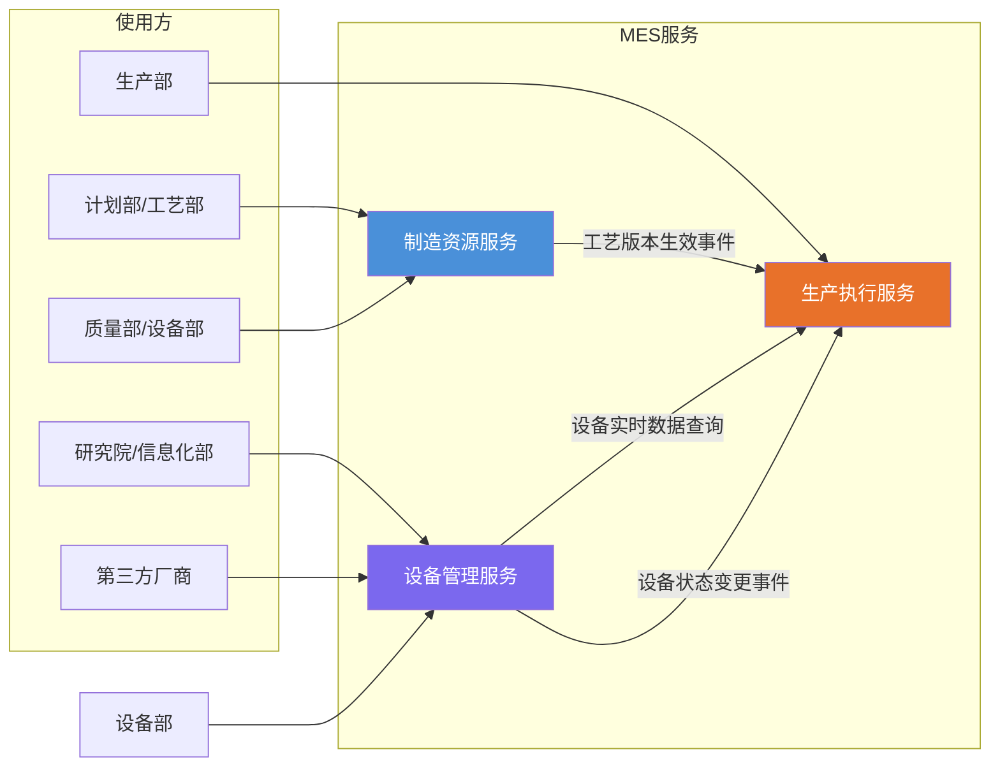

# MES 系统服务拆分方案

## 设计背景

本项目面向**电子制造 + 整机组装**混合型车间的 MES 场景。车间采用典型的**两段式生产架构**：前段为 PCBA 电子制造，后段为整机装配与交付。两类产品在物料形态、工艺路径与质量管控点上存在显著差异，但在工单、批次、设备、人员与质量数据层面需实现统一建模与贯通追溯。

基于"使用者角色"与"数据流向"两个维度，将 MES 系统拆分为 3 个服务，实现职责解耦与独立部署。

---

## 服务总览

| 服务 | 职责范围 | 核心用户 | 变更频率 |
|------|---------|---------|---------|
| **制造资源服务** | 基础台账管理 + 工艺路线管理 | 计划部、质量部、工艺部、设备部 | 台账低频 / 工艺中高频 |
| **设备管理服务** | 设备数据采集 + 点检保养 + 设备状态管理 | 设备部、研究院、信息化部、第三方厂商 | 高频（数据流）+ 低频（任务流） |
| **生产执行服务** | 过点（含工位数据采集）、返修、在制品追踪 | 生产部 | 极高频（生产流） |



---

## 一、制造资源服务

### 1.1 定位

管理 MES 系统中所有基础性、配置性数据，包括产线、工位、人员、物料、供应商、产品规格书、BOM、工艺路线等，是生产执行的数据基座。服务内按领域分两层，兼顾统一治理与独立演进。


| 维度 | 基础台账域 | 工艺管理域 |
|------|-----------|-----------|
| 变更频率 | 低（设备入账、人员入职） | 中高频（新品导入、ECN 变更、工艺优化） |
| 变更影响 | 局部，引用方可缓消化 | 立即影响过点路径、检验规则 |
| 审批流程 | 简单，一级审批 | 复杂，工艺部→质量部→生产部会签 |
| 数据量 | 相对稳定增长 | 随产品型号指数增长 |
| API 前缀 | `/api/master/{entity}` | `/api/master/process/{resource}` |
| 数据库 | 台账库（可独立分库） | 工艺库（可独立分库） |

### 1.4 工艺版本生效机制

工艺数据的核心特征是**写少读多**——写入仅在版本发布时发生，读取则在每次过点时触发。因此设计如下：

```
工艺版本生命周期：
  草稿(DRAFT) → 提交审批(PENDING) → 审批通过(APPROVED) → 生效(ACTIVE) → 归档(ARCHIVED)
                                                       │
                                                       ▼
                                              发布领域事件:
                                          ProcessRouteActivated
                                          {
                                            routeId,
                                            version,
                                            productCode,
                                            steps: [
                                              {
                                                stepCode,
                                                stationCode,
                                                requireAssembly,
                                                requireDeviceData,
                                                qualityGates: [...]
                                              },
                                              ...
                                            ]
                                          }
```

**关键规则**：
- 工艺版本生效仅影响**变更后首次过点**的在制品，已过点的在制品继续沿用旧版本
- 过点记录中记录 `routeVersion`，确保完整追溯
- 事件采用事务发件箱模式（Transactional Outbox），保证至少一次投递

### 1.5 核心用户与操作场景

| 用户 | 操作场景 | 所属域 |
|------|---------|--------|
| 计划部 | 维护产品 BOM、物料主数据、工单基础信息 | 基础台账域 |
| 设备部 | 维护设备台账、线体配置、工位绑定 | 基础台账域 |
| 质量部 | 维护检验标准、缺陷分类体系 | 基础台账域 |
| 采购部 | 维护供应商信息、物料供货关系 | 基础台账域 |
| 工艺部 | 定义工艺路线、配置工序参数、发布版本 | 工艺管理域 |
| 质量部 | 配置质量门禁规则、审批工艺变更 | 工艺管理域 |

---

## 二、设备管理服务

### 2.1 定位

覆盖设备全生命周期管理，包括设备数据采集、点检保养管理、设备状态管理。核心特征是**数据流与生产流解耦**——设备管理服务不感知过点行为，仅按设备维度提供数据与状态；同时通过设备状态事件驱动生产执行服务的工位可用性判定。

### 2.2 内部领域划分

```
设备管理服务
├── 设备数据采集
│   ├── SMT/回流炉/AOI 等设备实时数据采集
│   ├── 第三方厂商数据推送接口
│   └── 时序数据存储与查询
│
├── 点检保养管理
│   ├── 点检项目定义与周期配置
│   ├── 点检任务生成与派发
│   ├── 点检结果录入与判定
│   ├── 保养计划与执行记录
│   └── 异常触发与通知
│
└── 设备状态管理
    ├── 设备运行状态（运行/待机/故障/保养中/点检超期）
    ├── 状态变更事件发布
    └── 工位可用性判定
```

### 2.3 设备数据采集

| 数据类型 | 示例 | 采集方式 |
|---------|------|---------|
| SMT 贴片机数据 | 抛料率、贴装精度、吸嘴状态 | 设备接口自动采集 |
| 回流炉数据 | 炉温曲线、各区温度、链速 | 传感器实时采集 |
| AOI/SPI 检测数据 | 检测结果、缺陷坐标、良率 | 检测设备自动上传 |
| 环境数据 | 温湿度、ESD 监测 | 传感器周期采集 |

设计原则：
1. **数据流与生产流解耦**：采集不依赖过点事件，按设备维度独立采集
2. **第三方友好**：提供标准 API 和数据推送接口，便于设备厂商对接
3. **高吞吐低延迟**：支持时序数据的高频写入，写入延迟 ≤10ms
4. **数据质量管控**：缺失检测、异常值过滤、时间戳校准


### 2.6 核心用户与操作场景

| 用户 | 操作场景 | 所属域 |
|------|---------|--------|
| 设备部 | 维护点检项目、配置点检周期与标准 | 点检保养管理 |
| 设备部 | 执行点检任务、录入点检结果 | 点检保养管理 |
| 设备部 | 制定保养计划、验收保养结果 | 点检保养管理 |
| 设备操作员 | 执行日常点检、报告设备异常 | 点检保养管理 |
| 第三方厂商 | 通过标准接口推送设备数据 | 设备数据采集 |
| 信息化部 | 配置采集点位、监控数据质量 | 设备数据采集 |
| 研究院 | 查询设备历史数据、分析设备性能趋势 | 设备数据采集 |
| 生产执行服务 | 过点校验时查询设备状态与实时数据 | 设备状态管理 |

---

## 三、生产执行服务

### 3.1 定位

车间现场生产活动的执行引擎，处理所有与"在制品流转"直接相关的业务。核心特征是**高频、低延迟、强事务**——过点操作必须在毫秒级响应，且保证数据一致性。

### 3.2 职责范围

| 功能 | 说明 |
|------|------|
| 过点管理 | 扫码过点、工序校验、放行/拦截、过点记录 |
| 工位数据采集 | AOI/SPI 结果关联、装配数据录入（与过点同一事务） |
| 返修管理 | 返修工单创建、返修流程执行、再入点判定 |
| 在制品追踪 | WIP 状态查询、位置追踪、流转历史 |
| 工艺缓存 | 订阅制造资源服务的工艺版本事件，维护本地工艺路线缓存 |

### 3.3 过点校验流程

过点是生产执行服务的核心场景，涉及与制造资源服务、设备采集服务的协作：

```
操作工扫码过点
      │
      ▼
┌─ 从本地缓存读取当前产品的生效工艺路线 ─┐   ← 无网络调用，≤5ms
│                                         │
│  校验1: 当前工位 ∈ 工艺路线允许工位?     │
│  校验2: 关联设备状态是否可用?            │   ← 读本地缓存，≤5ms
│         (点检超期/故障/保养中 → 拦截)    │
│  校验3: 需要装配? → 检查装配数据已录入    │
│  校验4: 需要设备数据?                    │
│         │                                │
│         ▼                                │
│    调用设备管理服务查询                   │   ← 按需调用，≤200ms
│    (炉温曲线 / AOI结果 / 抛料率)         │
│         │                                │
└─────────┘                                │
      │                                    │
      ▼                                    │
  全部通过 ──→ 写入过点记录，放行           │
  任一失败 ──→ 拦截，提示原因               │
```

**缓存降级策略**：本地缓存未命中时，实时查询制造资源服务作为降级路径，避免因缓存延迟导致误拦截。

### 3.4 工位数据采集的归属依据

AOI/SPI 等工位级数据采集**归入生产执行服务**而非设备采集服务，原因：

| 考量 | 说明 |
|------|------|
| 事务一致性 | AOI 结果与过点记录是同一业务事务，拆开则需分布式事务保障 |
| 时序对齐 | AOI 结果需实时回传决定放行/拦截，跨服务延迟不可接受 |
| 业务语义 | 操作工在工位刷条码过点 + AOI 自动关联 = 一个完整用例 |

### 3.5 工艺缓存同步机制

```
制造资源服务                          生产执行服务
    │                                   │
    │  工艺版本生效                      │
    │  发布 ProcessRouteActivated       │
    │ ──────────────────────────────→   │
    │         (可靠消息，Outbox模式)      │
    │                                   │
    │                              消费事件，刷新本地缓存
    │                              更新 routeId → steps 映射
    │                                   │
    │                              过点时读取本地缓存
    │                              缓存未命中 → 查制造资源服务(降级)
```

**一致性保障**：
- 事件采用事务发件箱模式，保证至少一次投递
- 消费端幂等处理，重复消费不产生副作用
- 工艺变更对已过点在制品无影响，仅影响变更后首次过点

### 3.6 过点校验异常处理

#### 设备状态异常

| 场景 | 处理策略 |
|------|---------|
| 设备点检超期 | 拦截，提示"设备点检超期，请联系设备部" |
| 设备故障 | 拦截，提示"设备故障中，不可过点" |
| 设备保养中 | 拦截，提示"设备保养中，不可过点" |
| 设备状态缓存未命中 | 降级查询设备管理服务，仍不可用则拦截 |

#### 设备数据查询异常

| 场景 | 工艺配置 | 处理策略 |
|------|---------|---------|
| 设备管理服务不可用 | 必选（requireDeviceData = true） | 拦截，提示操作工重试 |
| 设备管理服务不可用 | 可选（requireDeviceData = false） | 放行，记录异常日志，后续补采 |
| 设备数据超出阈值 | 必选 | 拦截，触发质量异常流程 |
| 设备数据超出阈值 | 可选 | 放行，记录异常，通知质量部 |

### 3.7 核心用户与操作场景

| 用户 | 操作场景 |
|------|---------|
| 生产操作工 | 扫码过点、录入装配数据、查看在制品状态 |
| 班组长 | 处理过点拦截、审批返修、查看产线 WIP |
| 返修员 | 执行返修操作、记录返修结果 |

---

## 四、跨服务协作矩阵

### 4.1 服务间调用关系

| 调用方 | 被调用方 | 调用方式 | 场景 | 延迟要求 |
|--------|---------|---------|------|---------|
| 生产执行服务 | 制造资源服务 | 事件订阅（异步） | 工艺版本同步 | 秒级 |
| 生产执行服务 | 制造资源服务 | REST 查询（同步） | 缓存未命中降级查询 | ≤500ms |
| 生产执行服务 | 设备管理服务 | REST 查询（同步） | 过点时查询设备实时数据 | ≤200ms |
| 生产执行服务 | 设备管理服务 | 事件订阅（异步） | 设备状态变更同步 | 秒级 |
| 制造资源服务 | 生产执行服务 | 无 | 单向事件发布 | — |
| 设备管理服务 | 制造资源服务 | 无 | 无直接依赖 | — |
| 设备管理服务 | 生产执行服务 | 无 | 单向事件发布 | — |

### 4.2 关键协作场景

| 场景 | 主导服务 | 协作服务 | 协作方式 |
|------|---------|---------|---------|
| 工艺变更生效 | 制造资源服务 | 生产执行服务 | 发布事件 → 刷新工艺缓存 |
| 过点校验 | 生产执行服务 | 制造资源服务（缓存） | 读本地缓存，降级查远程 |
| 过点校验 | 生产执行服务 | 设备管理服务 | 按需查询设备实时数据 |
| 设备状态变更 | 设备管理服务 | 生产执行服务 | 发布事件 → 刷新设备状态缓存 |
| 点检超期锁定 | 设备管理服务 | 生产执行服务 | 设备状态变为不可用 → 过点拦截 |
| 保养完成恢复 | 设备管理服务 | 生产执行服务 | 设备状态变为可用 → 过点放行 |
| 质量门禁拦截 | 生产执行服务 | 制造资源服务 | 读取门禁规则（缓存） |
| 返修再入点判定 | 生产执行服务 | 制造资源服务 | 读取返修规则与再入点配置 |

---

## 五、未来拆分预留

制造资源服务内部的两个域（基础台账域、工艺管理域）当前合并在一个服务内，但具备独立拆分条件。当出现以下任一情况时，应将工艺管理域拆为独立服务：

- **工艺数据量远超台账**：工艺表数据量达台账 10 倍以上
- **第三方需写入工艺数据**：外部系统（如 ERP 工艺模块）需直接推送工艺变更
- **工艺变更需独立伸缩**：新品导入期工艺变更并发量大，需单独扩容

拆分成本低——服务内已按域隔离 API 和数据库，只需将工艺域代码抽出、改数据源配置即可。

---

## 六、与 DDD 领域模型的映射

本服务拆分方案与 [MES领域模型/DDD领域总览.md](./MES领域模型/DDD领域总览.md) 的对应关系：

| DDD 领域 | 归属服务 | 说明 |
|---------|---------|------|
| 制造实体域 | 制造资源服务（基础台账域） | 工厂/车间/产线/工位层次结构 |
| 工序域 | 制造资源服务（工艺管理域） | 工序类型定义与参数模板 |
| 工艺路线域 | 制造资源服务（工艺管理域） | 路线定义、版本管理、路由图 |
| 物料域 | 制造资源服务（基础台账域） | 物料主数据、BOM、替代料 |
| 质量域 | 制造资源服务（工艺管理域） | 质量门禁配置与规则定义 |
| 数据采集域 | 设备管理服务（设备数据采集） | 设备级独立数据采集与存储 |
| 返修域 | 生产执行服务 | 返修流程执行与再入点判定 |
| 异常处理域 | 生产执行服务 | 异常响应与升级处理 |
| 系统集成域 | 跨服务 | 各服务独立对接外部系统 |
| Agent域 | 跨服务 | Agent 按需跨服务检索 |
