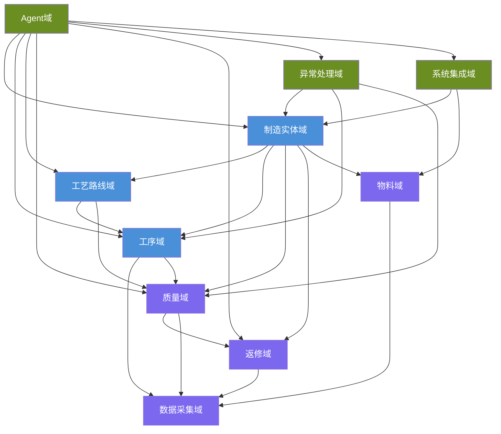

# DDD 领域模型拆分总览

本文档是 [PCBA工艺流程详细设计文档.md](./PCBA工艺流程详细设计文档.md)（原始未拆分版本）基于 DDD（领域驱动设计）思想的拆分索引。原文档按"篇-章"线性组织，现按**限界上下文（Bounded Context）**重新划分，每个领域拥有独立的统一语言（Ubiquitous Language）和领域模型，领域间通过明确定义的接口协作。

---

## 领域划分

### 核心域（Core Domain）

| 领域 | 文档 | 核心关注 | 原始章节 | 统一语言关键词 |
|------|------|----------|----------|----------------|
| 制造实体域 | [制造实体域.md](./制造实体域.md) | 工厂/车间/产线/工位的层次结构，工单/在制品/产品等核心业务实体及其生命周期状态机 | 第1章 + 第10章 | Factory, Workshop, ProductionLine, Workstation, WorkOrder, Unit, Product, StateMachine |
| 工序域 | [工序域.md](./工序域.md) | 27个标准工序类型的定义模板、分类体系、通用状态机及参数范围 | 第2章 | StepType, ProcessCategory, StepStateMachine, StepParameter |
| 工艺路线域 | [工艺路线域.md](./工艺路线域.md) | 工序如何组合为工艺路线，路线定义模型、版本管理、标准路线模板及双面混装详述 | 第7章 + 第8章 + 第9章 | ProcessRoute, RouteStep, RouteVersion, RouteTemplate, RouteGraph |

### 支撑域（Supporting Domain）

| 领域 | 文档 | 核心关注 | 原始章节 | 统一语言关键词 |
|------|------|----------|----------|----------------|
| 质量域 | [质量域.md](./质量域.md) | 缺陷分类体系、质量门禁定义模型、门禁库、检验方法、门禁配置规则语法、升级规则、有效性度量 | 第3章 + 第11章 | Defect, QualityGate, InspectionMethod, GateRule, EscalationRule, FPY, FPR, FNR |
| 返修域 | [返修域.md](./返修域.md) | 返修子流程的状态机、返修规则、再入点规则、报废判定 | 第4章 | ReworkState, ReworkRule, ReentryPoint, ScrapDecision |
| 数据采集域 | [数据采集域.md](./数据采集域.md) | 四层采集架构、设备/事件/环境数据采集Schema、数据质量管控、存储策略 | 第5章 | DataSchema, CollectionPoint, TraceabilityModel, DataQuality |
| 物料域 | [物料域.md](./物料域.md) | 物料主数据与分类、BOM结构、替代料、MSD管理、物料追溯、防错校验、库存与移动 | 第6章 | Material, MaterialLot, MSDLevel, ShelfLife, BOMMapping, MaterialTraceability |

### 通用域（Generic Domain）

| 领域 | 文档 | 核心关注 | 原始章节 | 统一语言关键词 |
|------|------|----------|----------|----------------|
| 异常处理域 | [异常处理域.md](./异常处理域.md) | 6大类24种异常分类、响应工作流、升级矩阵 | 第12章 | ExceptionType, ResponseWorkflow, EscalationMatrix, ContainmentAction |
| 系统集成域 | [系统集成域.md](./系统集成域.md) | WMS/设备/ERP集成接口定义、点检状态依赖、关键设备冻结规则 | 第13章 | IntegrationInterface, WMSConnector, EquipmentConnector, ERPConnector |
| Agent域 | [Agent域.md](./Agent域.md) | 文档检索结构、编码/名称/语义三级检索策略、查询模式映射、响应模板 | 第14章 | KnowledgeBase, QueryPattern, RetrievalStrategy, ResponseTemplate |

---

## 领域间依赖关系

**说明**：蓝色为核心域，紫色为支撑域，绿色为通用域。箭头表示"依赖"关系（如工艺路线域依赖工序域，因为路线由工序组合而成）。

---

## 跨领域协作场景

| 场景 | 主导领域 | 协作领域 | 协作方式 |
|------|----------|----------|----------|
| 在制品过站 | 制造实体域 | 工序域、数据采集域、质量域 | 实体域驱动工序实例执行，采集域记录数据，质量域判定门禁 |
| 质量门禁拦截 | 质量域 | 制造实体域、返修域 | 质量域判定失败 → 实体域挂起在制品 → 返修域接手返修流程 |
| 返修完成回流 | 返修域 | 制造实体域、质量域 | 返修域验证通过 → 实体域恢复在制品流转 → 质量域复检 |
| 物料上料防错 | 物料域 | 制造实体域 | 物料域校验通过 → 实体域允许工序进入READY |
| 异常停线 | 异常处理域 | 制造实体域、质量域 | 异常域触发停线 → 实体域冻结在制品 → 质量域评估影响范围 |
| Agent查询 | Agent域 | 所有领域 | Agent域按三级检索策略跨领域检索组合答案 |
