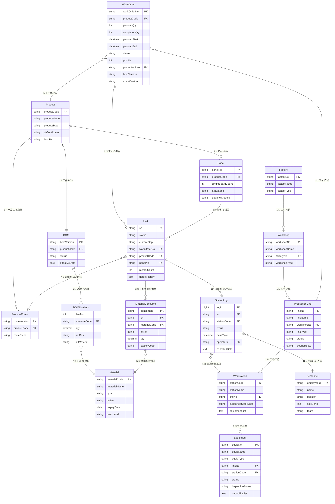
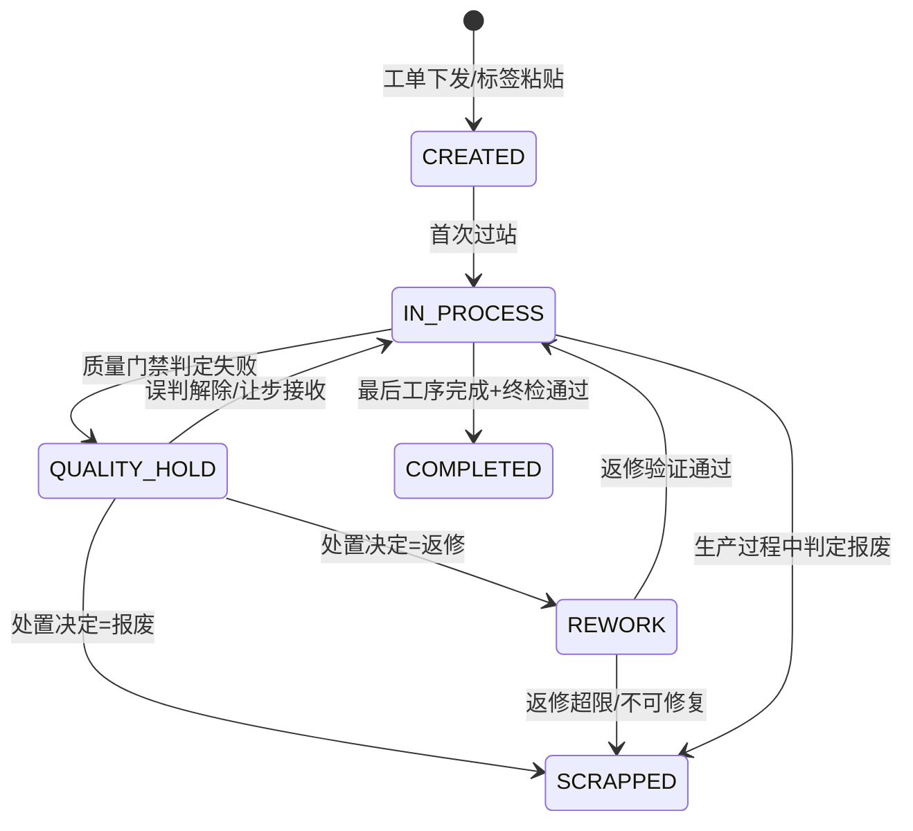
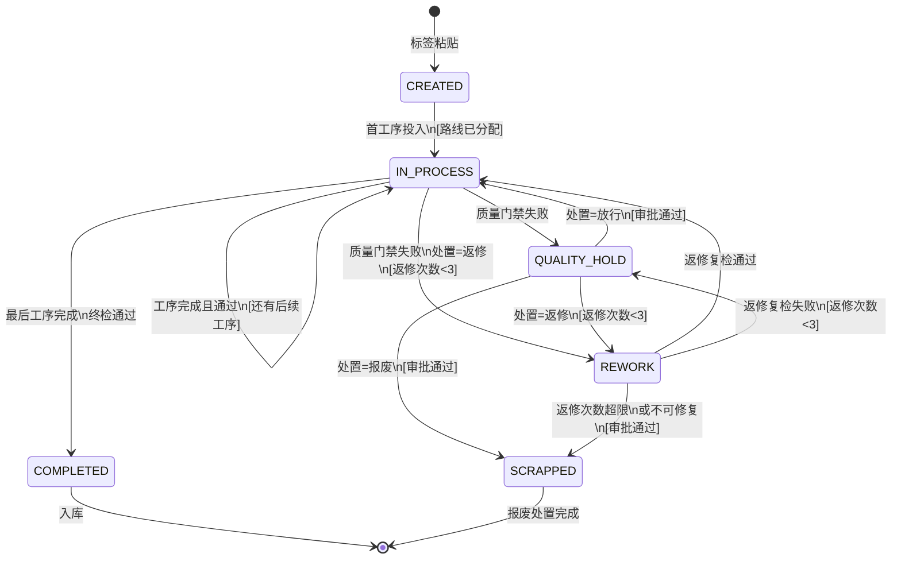
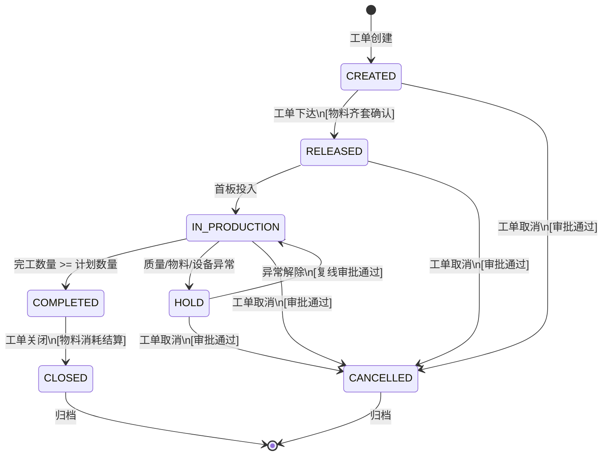

# PCBA 制造实体域（Manufacturing Entity Bounded Context）

> **限界上下文**：制造实体域  
> **统一语言**：Factory, Workshop, ProductionLine, Workstation, WorkOrder, Unit, Product, Panel, Equipment, Personnel, StateMachine  
> **核心关注**：定义车间制造实体的层次结构、核心业务实体属性、实体关系，以及在制品和工单的生命周期状态机  
> **原始章节**：第1章（制造实体模型）+ 第10章（工序状态机）

---

## 领域概述

制造实体域是 PCBA MES 系统的**核心域**，定义了从工厂到工位的四级层次模型，以及工单、在制品、产品等核心业务实体。本域同时管辖在制品（Unit）和工单（WorkOrder）的完整生命周期状态机，是所有生产执行行为的根基。

**跨领域协作**：
- 本域的在制品状态机与 **质量域** 的质量门禁协作（门禁失败 → 在制品挂起）
- 本域的工单状态机与 **物料域** 的物料齐套校验协作（物料齐套 → 工单下达）
- 本域的实体关系图引用 **工艺路线域** 的 ProcessRoute 实体
- **异常处理域** 可触发本域的工单挂起和在制品冻结
- **系统集成域** 负责工单下达、BOM下载等外部系统集成

---

# 制造实体模型

本章定义车间MES系统中制造实体的层次结构、核心业务实体属性、实体关系图及在制品生命周期状态机。所有实体定义与电子制造与整机组装混合型车间的实际运作保持一致。

---

## 1.1 实体层次结构

车间制造实体采用**工厂 > 车间 > 产线 > 工位**四级层次模型。工厂和车间是组织与管理边界，产线是工艺执行单元，工位是最小生产单元。

### 1.1.1 工厂（Factory）

工厂是最高层级的组织与法人边界，一个工厂可包含多个车间。

| 属性名 | 类型 | 说明 | 必填 |
|--------|------|------|:--:|
| 工厂编号 | VARCHAR(32) | 全局唯一标识，如 FACT-001 | Y |
| 工厂名称 | VARCHAR(128) | 工厂正式名称，如"第一电子制造厂" | Y |
| 工厂类型 | VARCHAR(32) | 生产类型：ELECTRONICS / ASSEMBLY / HYBRID | Y |
| 工厂状态 | VARCHAR(16) | ACTIVE / INACTIVE / SUSPENDED | Y |
| 地址 | VARCHAR(256) | 工厂物理地址 | Y |
| 时区 | VARCHAR(32) | 所在时区，如 Asia/Shanghai | Y |
| 年产能（UPH当量） | DECIMAL(12,2) | 以标准产能单位计量的年度设计产能 | N |
| 所属集团 | VARCHAR(128) | 所属集团/事业部 | N |
| 创建时间 | DATETIME | 工厂在系统中注册的时间 | Y |
| 更新时间 | DATETIME | 最近一次修改时间 | Y |

### 1.1.2 车间（Workshop）

车间是工厂之下的生产管理单元，承担特定阶段的生产任务（如SMT车间、装配车间）。

| 属性名 | 类型 | 说明 | 必填 |
|--------|------|------|:--:|
| 车间编号 | VARCHAR(32) | 全局唯一标识，如 WS-SMT-01 | Y |
| 车间名称 | VARCHAR(128) | 车间名称，如"PCBA电子制造车间" | Y |
| 所属工厂 | VARCHAR(32) | 外键，关联工厂编号 | Y |
| 车间类型 | VARCHAR(32) | SMT / THT / ASSEMBLY / TEST / WAREHOUSE | Y |
| 车间状态 | VARCHAR(16) | ACTIVE / INACTIVE / MAINTENANCE | Y |
| 负责人 | VARCHAR(64) | 车间主任/主管姓名 | N |
| 产线数量 | INT | 车间内产线总数（计算字段） | N |
| 温湿度控制 | VARCHAR(32) | 环境要求：CLASS_10K / CLASS_100K / STANDARD | N |
| 防静电等级 | VARCHAR(16) | ESD_100V / ESD_500V / NONE | N |
| 创建时间 | DATETIME | 车间注册时间 | Y |
| 更新时间 | DATETIME | 最近修改时间 | Y |

### 1.1.3 产线（ProductionLine）

产线是工艺执行单元，有明确的设备配置和工艺路线绑定，是MES排产与工艺建模的核心维度。

| 属性名 | 类型 | 说明 | 必填 |
|--------|------|------|:--:|
| 产线编号 | VARCHAR(32) | 全局唯一标识，如 LINE-SMT-01 | Y |
| 产线名称 | VARCHAR(128) | 产线名称，如"SMT一号线" | Y |
| 所属车间 | VARCHAR(32) | 外键，关联车间编号 | Y |
| 产线类型 | VARCHAR(32) | SMT / THT / ASSEMBLY / MIXED | Y |
| 产线状态 | VARCHAR(16) | ACTIVE / INACTIVE / MAINTENANCE / SETUP | Y |
| 绑定工艺路线 | VARCHAR(32) | 外键，默认绑定的工艺路线版本 | Y |
| 最大节拍时间 | DECIMAL(6,2) | 瓶颈工位节拍（秒），决定产线产能上限 | N |
| 设计UPH | INT | 每小时理论产出件数（Units Per Hour） | N |
| 工位数量 | INT | 产线内工位总数（计算字段） | N |
| 自动化等级 | VARCHAR(16) | AUTO / SEMI_AUTO / MANUAL | Y |
| 线长 | VARCHAR(64) | 产线负责人姓名 | N |
| 创建时间 | DATETIME | 产线注册时间 | Y |
| 更新时间 | DATETIME | 最近修改时间 | Y |

### 1.1.4 工位（Workstation）

工位是最小生产单元，绑定设备和操作岗位，是过站（Station Pass）的执行节点。

| 属性名 | 类型 | 说明 | 必填 |
|--------|------|------|:--:|
| 工位编码 | VARCHAR(32) | 全局唯一标识，如 WS-STN-SMT-01 | Y |
| 工位名称 | VARCHAR(128) | 工位名称，如"锡膏印刷工位" | Y |
| 所属产线 | VARCHAR(32) | 外键，关联产线编号 | Y |
| 所属车间 | VARCHAR(32) | 外键（冗余），关联车间编号 | Y |
| 工位类型 | VARCHAR(32) | 工序类型编码，如 STEP_TYPE.SMT.PRINT | Y |
| 工位状态 | VARCHAR(16) | ACTIVE / INACTIVE / MAINTENANCE / BLOCKED | Y |
| 支持工序类型 | VARCHAR(256) | 可执行的工序类型列表（逗号分隔） | Y |
| 设备列表 | TEXT | 绑定的设备编号列表（JSON数组） | Y |
| 操作岗位要求 | VARCHAR(128) | 所需技能认证编码 | Y |
| 标准节拍 | DECIMAL(6,2) | 该工位标准作业时间（秒） | N |
| 顺序编号 | INT | 产线内工序顺序号 | Y |
| 创建时间 | DATETIME | 工位注册时间 | Y |
| 更新时间 | DATETIME | 最近修改时间 | Y |

### 1.1.5 层次关系示意

```
工厂（Factory）
 ├── 车间 A（Workshop）- SMT电子制造
 │    ├── 产线 LINE-SMT-01（SMT 一号线）
 │    │    ├── 工位 WS-SMT-01-01（镭雕打标）
 │    │    ├── 工位 WS-SMT-01-02（锡膏印刷）
 │    │    ├── 工位 WS-SMT-01-03（SPI检测）
 │    │    ├── 工位 WS-SMT-01-04（贴片）
 │    │    ├── 工位 WS-SMT-01-05（回流焊）
 │    │    └── 工位 WS-SMT-01-06（AOI检测）
 │    └── 产线 LINE-SMT-02（SMT 二号线）
 │         └── ...
 ├── 车间 B（Workshop）- THT/后处理
 │    └── ...
 └── 车间 C（Workshop）- 整机组装
      └── ...
```

---

## 1.2 核心业务实体定义

### 1.2.1 工单（WorkOrder）

工单是生产执行的基本调度单位，代表一次有计划的生产任务。

| 属性名 | 类型 | 说明 | 必填 |
|--------|------|------|:--:|
| 工单号 | VARCHAR(32) | 全局唯一标识，如 WO-20240615-001 | Y |
| 产品编码 | VARCHAR(32) | 外键，关联产品主表 | Y |
| 计划数量 | INT | 计划生产数量 | Y |
| 完工数量 | INT | 实际完工数量（初始为0） | Y |
| 计划开工时间 | DATETIME | 计划开始生产时间 | Y |
| 计划完工时间 | DATETIME | 计划完成时间 | Y |
| 实际开工时间 | DATETIME | 首次过站时间 | N |
| 实际完工时间 | DATETIME | 最后一件完成时间 | N |
| 工单状态 | VARCHAR(16) | CREATED / RELEASED / IN_PROCESS / COMPLETED / HOLD / CANCELLED | Y |
| 优先级 | TINYINT | 1-10，1为最高优先 | Y |
| 绑定产线 | VARCHAR(32) | 外键，指定执行产线 | Y |
| BOM版本 | VARCHAR(32) | 引用的BOM版本号 | Y |
| 工艺路线版本 | VARCHAR(32) | 引用的工艺路线版本号 | Y |
| 客户编码 | VARCHAR(64) | 客户标识（如有） | N |
| 批次号 | VARCHAR(64) | 生产批次编号 | N |
| 创建人 | VARCHAR(64) | 工单创建人 | Y |
| 创建时间 | DATETIME | 工单创建时间 | Y |
| 更新时间 | DATETIME | 最近修改时间 | Y |

### 1.2.2 产品（Product）

产品是生产的对象定义，包含PCBA半成品和整机成品两种类型。

| 属性名 | 类型 | 说明 | 必填 |
|--------|------|------|:--:|
| 产品编码 | VARCHAR(32) | 全局唯一标识，如 PROD-PCBA-001 | Y |
| 产品名称 | VARCHAR(128) | 产品中文名称 | Y |
| 产品型号 | VARCHAR(64) | 产品型号/料号（客户视角） | Y |
| 产品类型 | VARCHAR(16) | PCBA / FINISHED_GOODS | Y |
| 客户 | VARCHAR(128) | 客户名称（自主品牌填"自有"） | N |
| 默认工艺路线 | VARCHAR(32) | 外键，默认工艺路线版本 | Y |
| BOM引用 | VARCHAR(32) | 外键，关联BOM版本号 | Y |
| 产品规格 | TEXT | 产品规格描述（JSON） | N |
| 产品状态 | VARCHAR(16) | ACTIVE / OBSOLETE / DEVELOPMENT | Y |
| 创建时间 | DATETIME | 产品注册时间 | Y |
| 更新时间 | DATETIME | 最近修改时间 | Y |

### 1.2.3 物料清单（BOM）

BOM定义产品与物料的组成关系，按版本管理，支持生效期控制。

| 属性名 | 类型 | 说明 | 必填 |
|--------|------|------|:--:|
| BOM版本号 | VARCHAR(32) | 全局唯一标识，如 BOM-V1.2-PCBA-001 | Y |
| 产品编码 | VARCHAR(32) | 外键，关联产品主表 | Y |
| BOM状态 | VARCHAR(16) | DRAFT / ACTIVE / OBSOLETE | Y |
| 生效日期 | DATE | BOM正式生效日期 | Y |
| 失效日期 | DATE | BOM失效日期（可为空） | N |
| BOM行项目 | TEXT | JSON数组，每项包含子属性 | Y |
| 总物料种数 | INT | 行项目数量（计算字段） | N |
| 创建人 | VARCHAR(64) | BOM创建人 | Y |
| 创建时间 | DATETIME | BOM创建时间 | Y |
| 更新时间 | DATETIME | 最近修改时间 | Y |

**BOM行项目（每个行项目的子属性）**：

| 子属性名 | 类型 | 说明 | 必填 |
|----------|------|------|:--:|
| 行号 | INT | 行项目序号 | Y |
| 物料编码 | VARCHAR(32) | 外键，关联物料主表 | Y |
| 物料描述 | VARCHAR(256) | 物料名称/规格描述 | N |
| 数量 | DECIMAL(10,3) | 单位用量 | Y |
| 位号 | VARCHAR(256) | PCB位号或装配位置（如 R1,R2,C10-C20） | Y |
| 替代料编码 | VARCHAR(32) | 替代物料编码（可为空） | N |
| 替代料优先级 | TINYINT | 替代料优先级，1为第一替代 | N |
| 关键物料标记 | BOOLEAN | 是否关键物料（影响追溯粒度） | Y |

### 1.2.4 PCB/拼板（Panel）

拼板是多片单板在PCB制造中组成的阵列，在SMT贴装阶段以拼板形式流转，在THT之前分割。

| 属性名 | 类型 | 说明 | 必填 |
|--------|------|------|:--:|
| 拼板编号 | VARCHAR(32) | 全局唯一标识，如 PANEL-001 | Y |
| 关联产品编码 | VARCHAR(32) | 外键，关联产品主表 | Y |
| 单板数量 | INT | 拼板内含单板（Single Board）数量 | Y |
| 阵列规格(M×N) | VARCHAR(16) | 拼板阵列，如"2×4"表示2行4列共8片 | Y |
| 基准点定义 | TEXT | Mark点/Fiducial坐标定义（JSON） | Y |
| 分割方式 | VARCHAR(16) | V_CUT / ROUTER / V_CUT_ROUTER | Y |
| 拼板尺寸 | VARCHAR(32) | 拼板外形尺寸，如"250.0×180.0 mm" | Y |
| 拼板厚度 | DECIMAL(5,2) | 拼板厚度（mm） | Y |
| 板材类型 | VARCHAR(32) | FR-4 / CEM-1 / ALUMINUM 等 | Y |
| 拼板状态 | VARCHAR(16) | ACTIVE / OBSOLETE | Y |
| 创建时间 | DATETIME | 拼板定义创建时间 | Y |

### 1.2.5 在制品单元（Unit）

在制品单元是MES追溯的最小粒度对象，每个Unit拥有唯一序列号SN，贯穿全生命周期。

| 属性名 | 类型 | 说明 | 必填 |
|--------|------|------|:--:|
| 唯一序列号SN | VARCHAR(64) | 全局唯一标识，在制品身份证 | Y |
| 当前状态 | VARCHAR(16) | CREATED / IN_PROCESS / QUALITY_HOLD / REWORK / SCRAPPED / COMPLETED | Y |
| 当前工序 | VARCHAR(32) | 当前所在工序类型编码 | Y |
| 当前工位 | VARCHAR(32) | 当前所在工位编码 | Y |
| 所属工单 | VARCHAR(32) | 外键，关联工单号 | Y |
| 所属批次 | VARCHAR(64) | 生产批次号 | Y |
| 产品编码 | VARCHAR(32) | 外键，关联产品主表 | Y |
| 所属拼板编号 | VARCHAR(32) | 拼板编号（分割后为空） | N |
| 拼板内位置 | VARCHAR(8) | 在拼板阵列中的位置，如"A3" | N |
| 缺陷历史 | TEXT | JSON数组，每项含缺陷类型/时间/工序/处置 | N |
| 返修次数 | INT | 累计返修次数 | Y |
| 创建时间 | DATETIME | Unit创建时间（标签粘贴时刻） | Y |
| 最后过站时间 | DATETIME | 最近一次过站时间戳 | Y |
| 最后更新人 | VARCHAR(64) | 最近操作人员 | N |

### 1.2.6 物料（Material）

物料是生产过程中消耗或使用的原材料、元器件和辅料。

| 属性名 | 类型 | 说明 | 必填 |
|--------|------|------|:--:|
| 物料编码 | VARCHAR(32) | 全局唯一标识，如 MAT-0805-100NF | Y |
| 物料名称 | VARCHAR(256) | 物料名称与规格描述 | Y |
| 物料类型分类 | VARCHAR(32) | PCB / COMPONENT / CONNECTOR / SOLDER / FLUX / ADHESIVE / PACKAGE / OTHER | Y |
| 批次号 | VARCHAR(64) | 物料批次编号（追溯关键） | Y |
| 有效期 | DATE | 物料有效期截止日期 | N |
| MSD等级 | VARCHAR(8) | 湿敏等级：1 / 2 / 2a / 3 / 4 / 5 / 5a / 6 | N |
| 存储条件 | VARCHAR(64) | 存储温湿度要求，如"25±3℃ / <10%RH" | N |
| 数量 | DECIMAL(12,3) | 库存数量 | Y |
| 单位 | VARCHAR(16) | PCS / ROLL / KG / L / BOX | Y |
| 库位 | VARCHAR(32) | 存储库位编码 | N |
| 质量状态 | VARCHAR(16) | AVAILABLE / QUARANTINED / REJECTED | Y |
| 供应商编码 | VARCHAR(32) | 供应商标识 | N |
| 创建时间 | DATETIME | 物料入库登记时间 | Y |

### 1.2.7 设备（Equipment）

设备是执行工序的物理资产，绑定到产线与工位，受点检保养体系管控。

| 属性名 | 类型 | 说明 | 必填 |
|--------|------|------|:--:|
| 设备编号 | VARCHAR(32) | 全局唯一标识，如 EQUIP-SMT-01 | Y |
| 设备名称 | VARCHAR(128) | 设备名称，如"高速贴片机#1" | Y |
| 设备类型 | VARCHAR(32) | LASER_MARKER / PRINTER / SPI / PICK_PLACE / REFLOW / AOI / WAVE_SOLDER / DEPANEL / ICT_FCT / PROGRAMMER / PACKAGER | Y |
| 所属产线 | VARCHAR(32) | 外键，关联产线编号 | Y |
| 所属工位 | VARCHAR(32) | 外键，关联工位编码 | Y |
| 设备状态 | VARCHAR(16) | RUNNING / IDLE / DOWNTIME / MAINTENANCE / INSPECT_PENDING | Y |
| 点检状态 | VARCHAR(16) | PASS / FAIL / PENDING | Y |
| 能力列表 | TEXT | 可支持的工序类型编码列表（JSON数组） | Y |
| 设备型号 | VARCHAR(64) | 厂商型号 | N |
| 资产编号 | VARCHAR(64) | 固定资产编号 | N |
| 购入日期 | DATE | 设备购入日期 | N |
| 保修到期日 | DATE | 保修期截止日期 | N |
| 上次保养日期 | DATE | 最近一次保养日期 | N |
| 下次保养日期 | DATE | 计划下次保养日期 | N |
| 创建时间 | DATETIME | 设备台账注册时间 | Y |

### 1.2.8 工位（Workstation）

工位实体（与1.1.4节层次结构中的工位一致，此处从业务实体维度补充完整属性）。

| 属性名 | 类型 | 说明 | 必填 |
|--------|------|------|:--:|
| 工位编码 | VARCHAR(32) | 全局唯一标识 | Y |
| 工位名称 | VARCHAR(128) | 工位中文名称 | Y |
| 所属产线 | VARCHAR(32) | 外键，关联产线编号 | Y |
| 所属车间 | VARCHAR(32) | 外键，关联车间编号 | Y |
| 设备列表 | TEXT | JSON数组，绑定设备编号列表 | Y |
| 支持工序类型 | VARCHAR(256) | 逗号分隔的工序类型编码 | Y |
| 操作岗位要求 | VARCHAR(128) | 所需岗位资质代码 | Y |
| 工位状态 | VARCHAR(16) | ACTIVE / INACTIVE / MAINTENANCE / BLOCKED | Y |
| 标准节拍 | DECIMAL(6,2) | 标准作业时间（秒） | N |
| 工序顺序号 | INT | 产线内工序顺序 | Y |
| 创建时间 | DATETIME | 工位注册时间 | Y |

### 1.2.9 人员（Personnel）

人员是执行生产操作的作业主体，需具备相应技能认证方可上岗。

| 属性名 | 类型 | 说明 | 必填 |
|--------|------|------|:--:|
| 工号 | VARCHAR(32) | 全局唯一标识，如 EMP-00123 | Y |
| 姓名 | VARCHAR(64) | 员工姓名 | Y |
| 岗位 | VARCHAR(64) | 当前岗位名称 | Y |
| 技能认证列表 | TEXT | JSON数组，含认证编码/名称/获取日期/到期日期 | Y |
| 班组 | VARCHAR(32) | 所属班组编号，如 SHIFT-A-TEAM-1 | Y |
| 资质状态 | VARCHAR(16) | ACTIVE / SUSPENDED / EXPIRED | Y |
| 所属车间 | VARCHAR(32) | 外键，关联车间编号 | N |
| 联系电话 | VARCHAR(32) | 联系方式 | N |
| 入职日期 | DATE | 入职日期 | N |
| 创建时间 | DATETIME | 人员档案创建时间 | Y |

---

## 1.3 实体关系图

以下Mermaid ER图描述核心实体之间的关系。本图聚焦于生产执行链上的关键实体关联。



**关键关系说明**：

| 关系 | 说明 |
|------|------|
| 工单 1:N 在制品 | 一个工单下产出多个Unit，每个Unit唯一SN追溯 |
| 工单 N:1 产品 | 多个工单可生产同一产品（不同批次/时段） |
| 产品 1:1 BOM | 每个产品在特定版本下对应一个BOM |
| BOM N:M 物料 | BOM行项目引用物料，同一物料可出现在不同BOM中 |
| 在制品 N:1 工艺路线 | 每个Unit按工艺路线规定的工序序列流转 |
| 工位 N:M 设备 | 一个工位可绑定多台设备，一台设备可服务多个工位（非同时） |
| 过站记录关联工位+人员 | 每次过站记录关联执行工位和操作人员 |
| 物料消耗关联Unit+物料 | 关键物料消耗记录关联到具体Unit和物料批次 |

---

## 1.4 在制品生命周期状态机

在制品单元（Unit）从创建到最终完成，经历由MES管控的完整状态变迁。以下定义顶层状态机。

### 1.4.1 状态定义

| 状态 | 编码 | 含义 |
|------|------|------|
| CREATED | 已创建 | Unit已建立（标签粘贴完成），尚未开始过站 |
| IN_PROCESS | 生产中 | Unit正在工艺路线上流转，已完成至少一次过站 |
| QUALITY_HOLD | 质量挂起 | 被质量门禁拦截，等待处置决定 |
| REWORK | 返修中 | 已决定返修，正在进行返修作业 |
| SCRAPPED | 已报废 | 经评审确认不可修复或返修超限，做报废处理 |
| COMPLETED | 已完成 | 全部工序完成且终检门禁通过，可入库 |

### 1.4.2 状态转换图



### 1.4.3 状态转换表

| 编号 | 起始状态 | 目标状态 | 触发条件 | 守卫条件 | 入口动作 |
|:--:|----------|----------|----------|----------|----------|
| T01 | CREATED | IN_PROCESS | 标签粘贴完成且首次过站扫码 | 工艺路线已分配；首站前置校验通过 | 记录实际开工时间；初始化过站序列 |
| T02 | IN_PROCESS | QUALITY_HOLD | 质量门禁判定失败（AOI/检验/测试NG） | 无 | 冻结当前Unit流转；记录缺陷信息；生成质量异常事件 |
| T03 | IN_PROCESS | COMPLETED | 最后工序完成且终检门禁全部PASS | 所有强制工序均已过站PASS；无未关闭的质量事件 | 记录实际完工时间；标记可入库状态 |
| T04 | QUALITY_HOLD | REWORK | 质量工程师处置决定为"返修" | 返修次数 < 3；缺陷类型在可返修范围内 | 记录返修决定；分配返修工位；递增返修次数 |
| T05 | QUALITY_HOLD | SCRAPPED | 质量工程师处置决定为"报废" | 报废评审已通过（需授权签核） | 记录报废原因与评审意见；释放物料追溯标记 |
| T06 | QUALITY_HOLD | IN_PROCESS | 误判解除（如AOI误报经人工复核通过）或让步接收 | 让步接收需客户/质量经理授权 | 记录解锁原因与授权人；恢复流转 |
| T07 | REWORK | IN_PROCESS | 返修作业完成且返修验证PASS | 返修后复检合格（AOI/目检/测试） | 更新返修次数；记录返修履历；流回正常工艺路线下一站 |
| T08 | REWORK | SCRAPPED | 返修次数已达上限（>=3）或缺陷不可修复 | 报废评审已通过 | 记录报废原因；释放物料追溯标记 |
| T09 | IN_PROCESS | SCRAPPED | 生产过程中发现不可修复缺陷（如来料严重缺陷、板层断裂） | 报废评审已通过 | 记录报废原因；立即隔离 |

### 1.4.4 状态转换事件记录

每次状态转换均生成不可变的事件记录：

| 字段 | 类型 | 说明 |
|------|------|------|
| 事件ID | BIGINT | 自增唯一标识 |
| 在制品SN | VARCHAR(64) | 关联Unit |
| 起始状态 | VARCHAR(16) | 转换前状态 |
| 目标状态 | VARCHAR(16) | 转换后状态 |
| 触发原因 | VARCHAR(64) | 转换触发条件编码 |
| 关联工位 | VARCHAR(32) | 触发转换的工位 |
| 操作人员 | VARCHAR(32) | 执行转换操作的人员 |
| 授权人员 | VARCHAR(32) | 如需授权，记录授权人 |
| 备注 | TEXT | 补充说明 |
| 事件时间 | DATETIME | 精确到毫秒的时间戳 |

### 1.4.5 特殊规则

| 规则 | 说明 |
|------|------|
| 不可逆报废 | SCRAPPED状态不可逆，一旦报废无法恢复为其他状态 |
| 返修次数上限 | 同一Unit累计返修不超过3次，超限强制进入报废评审 |
| 质量挂起超时 | QUALITY_HOLD超过24小时未处置，系统自动升级预警至质量经理 |
| 完成前校验 | COMPLETED状态入口须校验：所有强制工序已PASS + 质量门禁全部关闭 + 返修记录已闭合 |
| 子状态追踪 | IN_PROCESS状态下，Unit的工序级进度由过站记录（StationLog）精确追踪，不展开为独立状态 |

---


---

# 生产运营状态机

> 以下内容原属第10章，定义在制品和工单的完整生命周期状态机及状态转换事件。与第1章1.4节的在制品状态机相比，本节提供了更详细的转换规则和事件记录结构。

---

# 工序状态机（跨工序）

## 10.1 在制品单元状态机

在制品单元（Unit）以唯一序列号（SN）标识，从标签粘贴开始进入 MES 管控，至全部工序完成且终检通过后结束。状态机覆盖生产过程中所有可能的正常与异常路径。

### 10.1.1 状态定义

| 状态 | 编码 | 说明 |
|------|------|------|
| CREATED | 已创建 | 标签粘贴完成，SN 已注册，工艺路线已分配，尚未进入首工序 |
| IN_PROCESS | 生产中 | 正在执行某个工序或已完成当前工序等待进入下一工序 |
| QUALITY_HOLD | 质量挂起 | 质量门禁判定失败，流转冻结，等待处置决定 |
| REWORK | 返修中 | 已进入返修流程，正在执行返修作业或等待返修复检 |
| SCRAPPED | 已报废 | 经报废审批确认不可修复或返修次数超限，已隔离至报废区 |
| COMPLETED | 已完成 | 全部工序完成且终检门禁通过，等待入库 |

### 10.1.2 状态转换表

| 序号 | 起始状态 | 目标状态 | 触发条件 | 守卫条件 | 入口动作 |
|------|----------|----------|----------|----------|----------|
| 1 | CREATED | IN_PROCESS | 标签粘贴完成，PCB 投入首工序传送轨道 | 工艺路线已分配且路线状态为已发布；工单状态为 RELEASED 或 IN_PRODUCTION | 记录开始生产时间（start_time），初始化工序指针指向首工序 |
| 2 | IN_PROCESS | IN_PROCESS | 当前工序完成且质量门禁判定通过 | 还有后续工序未完成（工序指针未指向终点） | 记录过站数据（StationLog），推进工序指针到下一工序，更新 WIP 位置 |
| 3 | IN_PROCESS | QUALITY_HOLD | 质量门禁判定失败 | 无 | 冻结流转（hold_flag=true），创建质量事件（QualityEvent），通知质量工程师 |
| 4 | IN_PROCESS | REWORK | 质量门禁判定失败且处置决定为返修 | 返修次数未超限（rework_count < 3） | 记录返修入口信息（缺陷类型、返修方法、入口工序、返修开始时间），rework_count +1 |
| 5 | IN_PROCESS | COMPLETED | 最后工序完成且终检门禁（QG-FINAL-01）判定通过 | 无 | 记录完成时间（complete_time），更新工单完工数（completed_qty +1），生成入库通知 |
| 6 | QUALITY_HOLD | IN_PROCESS | 处置决定为放行 | 放行审批通过（审批人具有质量工程师及以上权限） | 解除挂起（hold_flag=false），记录放行审批信息，继续从挂起工序流转 |
| 7 | QUALITY_HOLD | REWORK | 处置决定为返修 | 返修次数未超限（rework_count < 3） | 解除挂起，进入返修流程，记录返修入口信息 |
| 8 | QUALITY_HOLD | SCRAPPED | 处置决定为报废 | 报废审批通过（审批人具有质量经理及以上权限） | 更新状态，记录报废原因与审批信息，生成报废单，实物隔离至报废区 |
| 9 | REWORK | IN_PROCESS | 返修完成且返修复检通过 | 无 | 更新返修完成时间，记录复检结果，流回主线再入点（reentry_step），标记"返修合格" |
| 10 | REWORK | SCRAPPED | 返修次数超限（rework_count >= 3）或判定为不可修复 | 报废审批通过 | 更新状态，记录报废原因，生成报废单，实物隔离至报废区 |
| 11 | REWORK | QUALITY_HOLD | 返修复检失败但返修次数未超限 | 无 | 冻结流转，创建质量事件，等待二次处置决定 |

### 10.1.3 状态转换 Mermaid 图



---

## 10.2 工单/批次状态机

工单（WorkOrder）是生产任务的基本单位，其状态机覆盖从创建到关闭的完整生命周期。

### 10.2.1 状态定义

| 状态 | 编码 | 说明 |
|------|------|------|
| CREATED | 已创建 | 工单已在 ERP/MES 中创建，尚未下达至车间 |
| RELEASED | 已下达 | 工单已下达至车间，BOM 已绑定，物料齐套确认完成 |
| IN_PRODUCTION | 生产中 | 首板已投入生产，在制品正在流转 |
| COMPLETED | 已完工 | 实际完工数量 >= 计划数量，等待关闭结算 |
| CLOSED | 已关闭 | 工单正式关闭，物料消耗已结算，不能再进行生产操作 |
| HOLD | 挂起 | 因质量异常、物料异常或设备异常暂停生产 |
| CANCELLED | 已取消 | 工单被取消（需审批），所有在制品做退料或报废处理 |

### 10.2.2 状态转换表

| 序号 | 起始状态 | 目标状态 | 触发条件 | 守卫条件 | 入口动作 |
|------|----------|----------|----------|----------|----------|
| 1 | CREATED | RELEASED | 工单下达操作 | BOM 已绑定；工艺路线已分配；物料齐套确认通过；计划开始时间有效 | 记录下达时间，通知车间调度，生成首工序投料任务 |
| 2 | RELEASED | IN_PRODUCTION | 首板投入首工序 | 线体设备点检合格；人员到岗 | 记录首板投入时间，更新工单状态 |
| 3 | IN_PRODUCTION | COMPLETED | 实际完工数量（completed_qty）>= 计划数量（planned_qty） | 终检门禁全部通过 | 记录完工时间，通知 ERP 生产完成，冻结工单生产操作 |
| 4 | COMPLETED | CLOSED | 工单关闭操作 | 物料消耗已全部回报；工时已结算；质量评审已完成 | 记录关闭时间，归档生产数据，工单不可再操作 |
| 5 | IN_PRODUCTION | HOLD | 质量异常 / 物料异常 / 设备异常触发停线 | 异常事件已创建 | 记录挂起时间与原因，冻结所有关联在制品的流转，通知相关人员 |
| 6 | HOLD | IN_PRODUCTION | 异常解除，恢复生产 | 异常事件已关闭；复线审批通过 | 记录恢复时间，解除在制品冻结，通知相关人员 |
| 7 | CREATED / RELEASED / IN_PRODUCTION / HOLD | CANCELLED | 工单取消操作 | 取消审批通过（审批人具有生产经理及以上权限）；工单未进入 COMPLETED/CLOSED 状态 | 记录取消原因与审批信息，关联在制品做退料或报废处置，释放物料预留 |

### 10.2.3 状态转换 Mermaid 图



---

## 10.3 状态转换事件定义

MES 系统中每次状态转换均生成一条不可变的事件记录，构成完整的审计追踪链。所有事件遵循"写入即固化"原则，不支持修改或删除。

### 10.3.1 事件数据结构

| 字段 | 类型 | 必填 | 说明 |
|------|------|------|------|
| event_id | String(36) | 是 | 事件唯一标识，UUID v4 格式 |
| event_type | String(32) | 是 | 事件类型，固定值：STATE_TRANSITION |
| entity_type | String(16) | 是 | 实体类型枚举：UNIT / WORK_ORDER |
| entity_id | String(64) | 是 | 实体标识：SN（在制品）或工单号（WorkOrder） |
| from_state | String(32) | 是 | 转换前状态编码 |
| to_state | String(32) | 是 | 转换后状态编码 |
| transition_id | String(8) | 是 | 转换编号，对应 10.1.2 或 10.2.2 中的序号，如 "UNIT-03" 表示在制品转换3 |
| trigger | String(256) | 是 | 触发原因的自然语言描述 |
| operator_id | String(16) | 是 | 触发操作的人员工号（系统自动触发时填写 "SYSTEM"） |
| operator_role | String(32) | 否 | 操作人员角色（如 OPERATOR / LINE_LEADER / QA_ENGINEER） |
| workstation_code | String(32) | 否 | 触发转换时所在的工站编码（仅 UNIT 类型） |
| timestamp | DateTime(ms) | 是 | 事件发生的精确时间戳（UTC），精确到毫秒 |
| related_event_id | String(36) | 否 | 关联事件 ID，如质量事件 ID、异常事件 ID |
| approval_id | String(36) | 否 | 关联审批记录 ID（涉及审批的状态转换必填） |
| remarks | String(512) | 否 | 补充说明，如处置决定、报废原因等 |

### 10.3.2 事件存储与审计

- **存储策略**：事件写入独立的审计日志表（audit_event_log），与业务数据分库/分表存储，采用 append-only 写入模式
- **不可变性**：事件记录不支持 UPDATE 和 DELETE 操作，任何"修正"须通过追加一条修正事件（event_type=CORRECTION）并关联原事件实现
- **保留周期**：事件数据至少保留至产品生命周期结束 + 法规要求的追溯期（一般不少于 5 年），到期后可归档至冷存储
- **查询接口**：支持按 entity_id、entity_type、时间范围、状态转换类型等维度检索，提供正向（从标签到成品）和反向（从成品到标签）全链路追溯

### 10.3.3 事件记录示例

```json
{
  "event_id": "e4a7b3c1-9f2d-4e8a-b1c5-3d6f8a9b0c2e",
  "event_type": "STATE_TRANSITION",
  "entity_type": "UNIT",
  "entity_id": "SN-20240615-000123",
  "from_state": "IN_PROCESS",
  "to_state": "QUALITY_HOLD",
  "transition_id": "UNIT-03",
  "trigger": "AOI T面判定：检测到 BGA 桥接缺陷（DEF-BGA-003），质量门禁 QG-SMT-AOI-01 判定失败",
  "operator_id": "SYSTEM",
  "operator_role": null,
  "workstation_code": "SMT-T-07",
  "timestamp": "2024-06-15T09:23:45.123Z",
  "related_event_id": "QE-20240615-0042",
  "approval_id": null,
  "remarks": "缺陷坐标(152.3, 88.7)，缺陷图像已关联"
}
```

---

