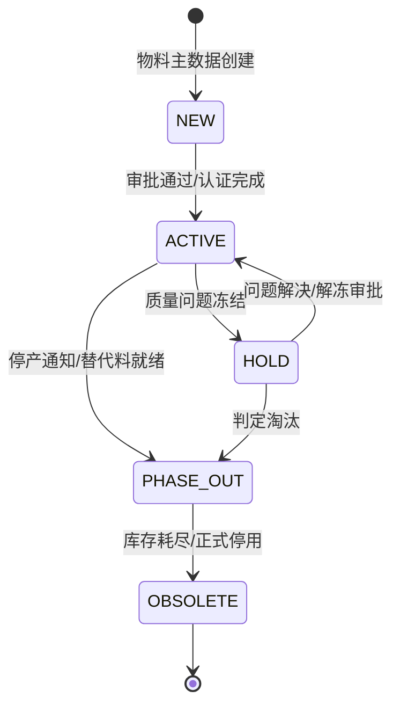

# PCBA 物料域（Material Bounded Context）

> **限界上下文**：物料域  
> **统一语言**：Material, MaterialLot, MSDLevel, ShelfLife, BOMMapping, MaterialTraceability, AlternativeMaterial, MaterialPokaYoke  
> **核心关注**：定义物料主数据与分类体系、BOM结构、替代料模型、MSD湿敏管理、物料追溯体系、防错校验和库存移动模型  

---

## 领域概述

物料域是 PCBA MES 系统的**支撑域**，管理从物料主数据定义到BOM结构、从物料生命周期管理到全链路追溯的完整物料管控体系。本域覆盖电子元器件、PCB基板、焊料/辅料、结构件、包材等全品类物料，支撑从IQC入料到成品出库的全流程物料管控。

**跨领域协作**：
- 本域的物料主数据在 **制造实体域** 的BOM和Material实体中引用
- 本域的物料防错校验与 **制造实体域** 的工序就绪校验协作
- 本域的物料批次追溯为 **数据采集域** 提供物料事件数据
- 本域的库存管理通过 **系统集成域** 与WMS集成
- 本域的物料异常（过期、MSD超时等）可触发 **异常处理域** 的异常响应

---

# 物料模型

## 6.1 物料主数据模型

本章定义车间 MES 系统中物料的主数据模型、BOM 结构、物料生命周期管理及物料追溯体系。物料模型覆盖电子元器件、PCB 基板、焊料/辅料、结构件、包材等全品类物料，支撑从 IQC 入料到成品出库的全流程物料管控。

### 6.1.1 物料分类体系

物料分类采用三级编码体系，适配电子制造与整机组装的物料管理需求。

| 一级分类 | 编码 | 二级分类 | 编码 | 典型物料 |
|----------|------|----------|------|----------|
| 电子元器件 | MAT-ELEC | 贴片阻容 | MAT-ELEC-SMD | 贴片电阻、贴片电容、贴片电感 |
| 电子元器件 | MAT-ELEC | IC芯片 | MAT-ELEC-IC | MCU、FPGA、BGA、QFN、QFP、SOP 封装芯片 |
| 电子元器件 | MAT-ELEC | 连接器 | MAT-ELEC-CONN | 排针、排母、FPC、板对板连接器 |
| 电子元器件 | MAT-ELEC | 分立器件 | MAT-ELEC-DISC | 二极管、三极管、MOSFET、晶振 |
| 电子元器件 | MAT-ELEC | 插件元器件 | MAT-ELEC-THT | 插件电阻、插件电容、插件电感、变压器 |
| PCB | MAT-PCB | 裸板 | MAT-PCB-BARE | FR-4 裸板、铝基板、柔性板 |
| PCB | MAT-PCB | 拼板 | MAT-PCB-PANEL | 多联拼板 |
| 焊料与辅料 | MAT-CONS | 焊膏 | MAT-CONS-PASTE | SAC305 焊膏、低温焊膏 |
| 焊料与辅料 | MAT-CONS | 锡条/锡丝 | MAT-CONS-SOLDER | 波峰焊锡条、补焊锡丝 |
| 焊料与辅料 | MAT-CONS | 助焊剂 | MAT-CONS-FLUX | 波峰焊助焊剂、返修助焊剂 |
| 焊料与辅料 | MAT-CONS | 清洗剂 | MAT-CONS-CLEAN | 钢网清洗剂、PCBA 清洗剂 |
| 结构件 | MAT-MECH | 机壳/机箱 | MAT-MECH-ENCL | 钣金机箱、铝合金机壳 |
| 结构件 | MAT-MECH | 紧固件 | MAT-MECH-FAST | 螺钉、螺母、垫圈、卡扣 |
| 结构件 | MAT-MECH | 散热件 | MAT-MECH-THERM | 散热片、导热硅脂、风扇 |
| 结构件 | MAT-MECH | 线束 | MAT-MECH-CABLE | 电源线、排线、射频线 |
| 包材 | MAT-PACK | 内包装 | MAT-PACK-INNER | 防静电袋、珍珠棉 |
| 包材 | MAT-PACK | 外包装 | MAT-PACK-OUTER | 纸箱、托盘 |
| 包材 | MAT-PACK | 标签 | MAT-PACK-LABEL | 产品标签、外箱标签、防拆标签 |
| 成品/半成品 | MAT-PROD | PCBA半成品 | MAT-PROD-PCBA | 已完成贴装的 PCBA 板 |
| 成品/半成品 | MAT-PROD | 整机成品 | MAT-PROD-FIN | 数控装置、伺服驱动器等成品 |

### 6.1.2 物料主数据属性

#### 6.1.2.1 通用属性（所有物料）

| 属性名 | 字段类型 | 说明 | 必填 |
|--------|----------|------|:--:|
| 物料编码 | VARCHAR(64) | 全局唯一物料编号 | Y |
| 物料名称 | VARCHAR(256) | 物料标准名称 | Y |
| 物料规格 | VARCHAR(256) | 规格描述 | Y |
| 物料分类 | VARCHAR(32) | 物料分类编码 | Y |
| 基本单位 | VARCHAR(16) | PCS / KG / M / ROLL | Y |
| 物料状态 | VARCHAR(16) | ACTIVE / OBSOLETE / PHASE_OUT / HOLD | Y |
| 制造商 | VARCHAR(128) | 原始制造商名称 | N |
| 制造商料号 | VARCHAR(64) | 制造商物料编号（MPN） | N |
| 品牌 | VARCHAR(64) | 品牌名称 | N |
| RoHS 状态 | VARCHAR(16) | COMPLIANT / EXEMPT / NON_COMPLIANT | Y |
| 是否湿敏元件 | BOOLEAN | MSL 等级管控标识 | Y |
| 是否静电敏感 | BOOLEAN | ESD 等级标识 | Y |
| 存储条件 | VARCHAR(64) | 温湿度存储要求描述 | N |
| 保质期（天） | INT | 物料有效天数 | N |
| 创建时间 | DATETIME | 物料主数据创建时间 | Y |
| 更新时间 | DATETIME | 最近修改时间 | Y |

#### 6.1.2.2 电子元器件扩展属性

| 属性名 | 字段类型 | 说明 | 必填 |
|--------|----------|------|:--:|
| 封装类型 | VARCHAR(32) | 0201 / 0402 / 0603 / 0805 / SOT-23 / SOP-8 / QFP-100 / BGA-256 等 | Y |
| 封装尺寸 | VARCHAR(32) | 封装外形尺寸描述 | N |
| 引脚数 | INT | 器件引脚总数 | N |
| 引脚间距 | DECIMAL(6,3) | 引脚中心距（mm） | N |
| MSL 等级 | VARCHAR(8) | 潮湿敏感等级：MSL1 / MSL2 / MSL2a / MSL3 / MSL4 / MSL5 / MSL5a / MSL6 | N |
| MSL 拆封后寿命 | INT | 拆封后在车间环境下的允许暴露时间（小时） | N |
| 烘烤条件 | VARCHAR(64) | MSL 超时后的烘烤恢复条件（温度×时间） | N |
| 耐温峰值 | DECIMAL(6,1) | 器件最高耐受温度（℃），用于回流焊工艺窗口判定 | Y |
| ESD 等级 | VARCHAR(16) | HBM / CDM / MM 模型下的静电敏感等级 | N |
| 贴装吸嘴类型 | VARCHAR(32) | SMT 贴片机吸嘴规格 | N |
| 供料方式 | VARCHAR(32) | TAPE_REEL / TRAY / TUBE / BULK | Y |
| 飞达类型 | VARCHAR(32) | 8mm / 12mm / 16mm / 24mm 等 | N |
| 极性标记 | VARCHAR(64) | 器件极性方向标识说明（适用二极管、钽电容等） | N |

#### 6.1.2.3 PCB 扩展属性

| 属性名 | 字段类型 | 说明 | 必填 |
|--------|----------|------|:--:|
| PCB 层数 | INT | 2 / 4 / 6 / 8 / 10+ | Y |
| PCB 板厚 | DECIMAL(4,2) | mm | Y |
| 板材类型 | VARCHAR(32) | FR-4 / High-Tg FR-4 / Aluminum / Flex / Rigid-Flex | Y |
| 表面处理 | VARCHAR(32) | HASL / ENIG / OSP / Immersion Silver / Immersion Tin | Y |
| 铜厚 | DECIMAL(4,2) | oz（外层/内层） | Y |
| 最小线宽/线距 | DECIMAL(4,2) | mil | N |
| 拼板数量 | INT | 单拼板内含子板数 | N |
| 拼板尺寸 | VARCHAR(32) | 长×宽（mm） | Y |
| 子板尺寸 | VARCHAR(32) | 单板长×宽（mm） | Y |
| 是否含 V-Cut | BOOLEAN | 是否含 V 槽分板线 | N |
| 是否含邮票孔 | BOOLEAN | 是否含邮票孔分板连接 | N |

#### 6.1.2.4 焊料/辅料扩展属性

| 属性名 | 字段类型 | 说明 | 必填 |
|--------|----------|------|:--:|
| 合金成分 | VARCHAR(32) | SAC305 / SAC0307 / Sn63Pb37 / Sn42Bi58 等 | Y |
| 焊膏粉径 | VARCHAR(16) | Type3 / Type4 / Type5 | N |
| 助焊剂类型 | VARCHAR(32) | 免清洗 / 水洗 / RMA | N |
| 黏度 | VARCHAR(32) | 焊膏黏度规格 | N |
| 回温时间 | INT | 从冷藏取出到可使用的回温时间（小时） | Y |
| 回温后有效期 | INT | 回温后允许使用的时间（小时） | Y |
| 钢网使用寿命 | INT | 钢网可使用的印刷次数 | N |
| 冷藏温度范围 | VARCHAR(16) | 焊膏冷藏温度范围（℃） | Y |

---

## 6.2 BOM（物料清单）模型

### 6.2.1 BOM 结构定义

BOM 采用父子关系层级结构，支持多层 BOM 展开。对于电子制造与整机组装混合型车间，BOM 至少包含三层：

```
成品（整机）
├── PCBA 半成品（子BOM）
│   ├── PCB 裸板
│   ├── 贴片阻容 × N
│   ├── IC 芯片 × N
│   ├── 连接器 × N
│   ├── 插件元器件 × N
│   └── ...其他电子元器件
├── 结构件
│   ├── 机壳/机箱
│   ├── 紧固件
│   ├── 散热件
│   └── ...其他结构件
├── 线束
├── 包材
└── ...其他物料
```

### 6.2.2 BOM 版本管理

| 属性名 | 字段类型 | 说明 | 必填 |
|--------|----------|------|:--:|
| BOM 编号 | VARCHAR(32) | BOM 唯一标识 | Y |
| BOM 版本号 | VARCHAR(16) | 版本号，如 V1.0 / V1.1 / V2.0 | Y |
| 成品物料编码 | VARCHAR(64) | 顶层物料编号 | Y |
| BOM 类型 | VARCHAR(16) | EBOM（设计BOM） / MBOM（制造BOM） / PBOM（工艺BOM） | Y |
| BOM 状态 | VARCHAR(16) | DRAFT / RELEASED / OBSOLETE / FROZEN | Y |
| 生效日期 | DATE | BOM 版本生效日期 | Y |
| 失效日期 | DATE | BOM 版本失效日期（可选） | N |
| 审批人 | VARCHAR(64) | BOM 发布审批人 | Y |
| 审批时间 | DATETIME | BOM 审批通过时间 | Y |
| 备注 | VARCHAR(512) | 版本变更说明 | N |

### 6.2.3 BOM 行项属性

| 属性名 | 字段类型 | 说明 | 必填 |
|--------|----------|------|:--:|
| BOM 编号 | VARCHAR(32) | 所属 BOM | Y |
| BOM 版本号 | VARCHAR(16) | 所属 BOM 版本 | Y |
| 行号 | INT | BOM 行项序号 | Y |
| 父项物料编码 | VARCHAR(64) | 父级物料编号 | Y |
| 子项物料编码 | VARCHAR(64) | 子级物料编号 | Y |
| 用量 | DECIMAL(10,4) | 单位用量 | Y |
| 损耗率 | DECIMAL(5,4) | 标准损耗率（小数形式，如 0.003 = 0.3%） | Y |
| 位号范围 | VARCHAR(256) | 元件位号列表（PCB 装配），如 R1-R10, C1-C20 | N |
| 替代料组 | VARCHAR(32) | 替代料组编号（如有） | N |
| 是否关键物料 | BOOLEAN | 是否标注为关键/安全物料 | N |
| 工艺阶段 | VARCHAR(16) | SMT_T / SMT_B / THT / ASSEMBLY / PACK | Y |
| 工序工位 | VARCHAR(32) | 物料装配的工序工位编码 | N |
| 备注 | VARCHAR(256) | 特殊工艺说明 | N |

---

## 6.3 替代料模型

### 6.3.1 替代料规则

| 属性名 | 字段类型 | 说明 | 必填 |
|--------|----------|------|:--:|
| 替代料组编号 | VARCHAR(32) | 替代料组唯一标识 | Y |
| 主料编码 | VARCHAR(64) | 首选物料编码 | Y |
| 替代料编码 | VARCHAR(64) | 替代物料编码 | Y |
| 替代优先级 | INT | 替代顺序（1=最高优先级） | Y |
| 替代类型 | VARCHAR(16) | FULL（完全替代） / PARTIAL（条件替代） | Y |
| 替代条件 | VARCHAR(256) | 替代的限定条件（如仅限某客户/某工单） | N |
| 是否需要审批 | BOOLEAN | 使用替代料是否需要额外审批 | Y |
| 生效日期 | DATE | 替代关系生效日期 | Y |
| 失效日期 | DATE | 替代关系失效日期 | N |
| 审批人 | VARCHAR(64) | 替代关系审批人 | Y |

### 6.3.2 替代料使用场景

| 场景 | 说明 | 示例 |
|------|------|------|
| 完全替代（FULL） | 替代料与主料在功能、性能、封装上完全一致，可无条件替换 | 同规格不同品牌的 0402 100nF 电容 |
| 条件替代（PARTIAL） | 替代料仅在某些条件下可替换主料 | 某 MCU 在特定温度范围或固件版本下可替代 |
| 临时替代 | 因主料短缺，经审批后临时使用的替代料 | 缺料应急场景，限定工单范围 |
| 多源供应 | 同一物料有多个合格供应商，均可直接使用 | 经 AVL（合格供应商名录）认证的多个品牌 |

---

## 6.4 物料生命周期管理

### 6.4.1 物料状态与转换



| 状态 | 编码 | 说明 | 允许的生产操作 |
|------|------|------|-------------|
| NEW | 新建 | 物料主数据已创建，尚未完成认证审批 | 不可用于生产 |
| ACTIVE | 激活 | 物料已通过认证，可正常使用 | 采购、入库、上料、生产消耗 |
| PHASE_OUT | 逐步淘汰 | 物料已收到停产/淘汰通知，正在消耗库存 | 可消耗现有库存，禁止新采购 |
| HOLD | 冻结 | 因质量问题或其它原因被临时冻结 | 禁止一切操作 |
| OBSOLETE | 已淘汰 | 物料已正式停用 | 不可使用 |

### 6.4.2 MSL 湿敏元件管理

湿敏元件（Moisture Sensitive Device）需要严格的暴露时间追踪和烘烤管理。

**MSL 等级与管控要求：**

| MSL 等级 | 拆封后车间寿命（标准） | 烘烤条件（典型） | 管控要求 |
|----------|----------------------|-----------------|----------|
| MSL 1 | 无限制 | 不适用 | 无特殊要求 |
| MSL 2 | 1 年 | 90℃ × 24h | 标准车间环境存储 |
| MSL 2a | 4 周 | 90℃ × 24h | 记录拆封时间 |
| MSL 3 | 168 小时（7 天） | 125℃ × 24h 或 90℃ × 48h | 严格追踪暴露时间 |
| MSL 4 | 72 小时（3 天） | 125℃ × 48h | 严格追踪，优先消耗 |
| MSL 5 | 48 小时（2 天） | 125℃ × 72h | 优先消耗，拆封即用 |
| MSL 5a | 24 小时 | 125℃ × 72h | 拆封即用，超时烘烤 |
| MSL 6 | 按标签说明 | 按标签说明 | 拆封前须烘烤 |

**MSL 暴露时间追踪数据模型：**

| 属性名 | 字段类型 | 说明 |
|--------|----------|------|
| 追踪编号 | VARCHAR(32) | 暴露追踪唯一标识 |
| 物料编码 | VARCHAR(64) | 物料编号 |
| 物料批次号 | VARCHAR(64) | 来料批次 |
| 原包装拆封时间 | DATETIME | 首次拆封时间 |
| MSL 等级 | VARCHAR(8) | MSL 等级 |
| 车间寿命（小时） | INT | 拆封后允许暴露的总时间 |
| 累计暴露时间（小时） | DECIMAL(8,2) | 已累计的暴露时间 |
| 剩余暴露时间（小时） | DECIMAL(8,2) | 剩余可用暴露时间 |
| 烘烤次数 | INT | 已烘烤次数 |
| 最近烘烤时间 | DATETIME | 最近一次烘烤完成时间 |
| 烘烤条件 | VARCHAR(64) | 烘烤温度与时间 |
| 当前状态 | VARCHAR(16) | SEALED（原封） / EXPOSED（暴露中） / BAKING（烘烤中） / EXPIRED（已超时） |
| 超时处置 | VARCHAR(32) | 超时后的处置方式：烘烤恢复 / 报废 |

---

## 6.5 物料追溯模型

### 6.5.1 追溯粒度

物料追溯体系支持从成品到原材料的多级正向与反向追溯。

| 追溯方向 | 追溯路径 | 用途 |
|----------|----------|------|
| 正向追溯 | 物料批次 → 工单 → 产品 SN | 物料不良时快速定位受影响产品范围 |
| 反向追溯 | 产品 SN → 工单 → 物料批次 | 产品异常时溯源涉及的物料批次 |
| 全链追溯 | 物料批次 → IQC → 仓库 → 产线上料 → 产品 SN → 测试 → 成品出库 | 端到端全生命周期追溯 |

### 6.5.2 追溯数据模型

#### 6.5.2.1 物料批次追溯

| 属性名 | 字段类型 | 说明 |
|--------|----------|------|
| 物料编码 | VARCHAR(64) | 物料编号 |
| 物料批次号 | VARCHAR(64) | 来料批次号 |
| 供应商批次号 | VARCHAR(64) | 供应商原始批次号 |
| 供应商编码 | VARCHAR(32) | 供应商编号 |
| 生产日期 | DATE | 物料生产日期（Date Code） |
| 来料日期 | DATE | 到货日期 |
| IQC 检验单号 | VARCHAR(32) | 来料检验单号 |
| IQC 检验结果 | VARCHAR(8) | PASS / FAIL / CONCESSION（让步接收） |
| 入库日期 | DATE | 入库时间 |
| 入库单号 | VARCHAR(32) | 入库单据编号 |

#### 6.5.2.2 生产消耗追溯（物料 → 产品）

| 属性名 | 字段类型 | 说明 |
|--------|----------|------|
| 物料编码 | VARCHAR(64) | 消耗的物料编号 |
| 物料批次号 | VARCHAR(64) | 消耗的物料批次 |
| 工单号 | VARCHAR(32) | 关联生产工单 |
| 产品 SN | VARCHAR(64) | 使用该物料的产品序列号 |
| 工序工位 | VARCHAR(32) | 物料消耗的工位 |
| 上料时间 | DATETIME | 物料装载时间 |
| 消耗时间 | DATETIME | 物料实际消耗时间（贴装/插件时间） |
| 消耗数量 | DECIMAL(10,4) | 消耗用量 |
| 飞达站位 | VARCHAR(16) | SMT 贴片飞达站位 |
| 操作员工号 | VARCHAR(32) | 上料/换料操作员 |

#### 6.5.2.3 产品组成追溯（产品 → 物料）

| 属性名 | 字段类型 | 说明 |
|--------|----------|------|
| 产品 SN | VARCHAR(64) | 产品序列号 |
| 工单号 | VARCHAR(32) | 关联工单 |
| 物料编码 | VARCHAR(64) | 物料编号 |
| 物料批次号 | VARCHAR(64) | 物料批次 |
| 位号 | VARCHAR(16) | PCB 位号（电子元器件） |
| BOM 版本号 | VARCHAR(16) | 使用的 BOM 版本 |
| 装配时间 | DATETIME | 物料装配到产品的时间 |
| 装配工位 | VARCHAR(32) | 装配工序工位 |

### 6.5.3 追溯查询场景

| 场景编号 | 场景名称 | 查询条件 | 期望输出 |
|----------|----------|----------|----------|
| TRACE-01 | 物料批次正向追溯 | 物料编码 + 批次号 | 该批次物料使用的所有工单、产品 SN 列表、消耗时间 |
| TRACE-02 | 产品反向追溯 | 产品 SN | 该产品使用的所有物料编码、批次号、供应商、装配时间 |
| TRACE-03 | 供应商批次追溯 | 供应商编码 + 供应商批次号 | 该供应商批次对应的 IQC 结果、入库记录、消耗产品 SN 列表 |
| TRACE-04 | 时间段物料追溯 | 物料编码 + 时间范围 | 该时间段内使用该物料的所有产品 SN |
| TRACE-05 | 缺陷关联追溯 | 缺陷产品 SN + 缺陷物料位号 | 同一物料批次的所有产品 SN，辅助缺陷影响范围评估 |
| TRACE-06 | 替代料使用追溯 | 替代料组编号 + 时间范围 | 使用了替代料的所有工单和产品 SN |

---

## 6.6 物料防错校验

### 6.6.1 防错校验点

| 校验点 | 时机 | 校验内容 | 校验方式 | 失败处置 |
|--------|------|----------|----------|----------|
| IQC 入库 | 来料入库前 | 物料编码、批次号、数量、RoHS、MSL 标签 | 扫码比对 + 人工确认 | 拒收/隔离 |
| 物料出库 | 仓库发料时 | 物料编码与工单 BOM 匹配 | 扫码校验 | 拦截出库 |
| SMT 上料 | 飞达装料时 | 物料编码与料站表匹配、批次号、MSL 剩余时间 | 扫码校验 + 系统比对 | 禁止上料 |
| SMT 换料 | 换料接料时 | 新旧料卷物料编码一致性、批次号记录 | 扫码校验 | 禁止接料 |
| THT 插件 | 插件工位 | 物料与工位物料清单匹配 | 扫码或亮灯指引 | 取料错误告警 |
| 装配上料 | 装配工位 | 物料编码与工单 BOM 匹配、批次号 | 扫码校验 | 禁止使用 |

### 6.6.2 防错校验数据模型

| 属性名 | 字段类型 | 说明 |
|--------|----------|------|
| 校验编号 | VARCHAR(32) | 防错校验事件唯一标识 |
| 校验类型 | VARCHAR(32) | IQC / WAREHOUSE / SMT_LOAD / SMT_CHANGE / THT / ASSEMBLY |
| 校验时间 | DATETIME | 校验执行时间 |
| 物料编码 | VARCHAR(64) | 被校验的物料编码 |
| 物料批次号 | VARCHAR(64) | 被校验的物料批次 |
| 工单号 | VARCHAR(32) | 关联工单 |
| 工位编码 | VARCHAR(32) | 校验发生工位 |
| 期望物料编码 | VARCHAR(64) | 系统期望的物料编码（来自 BOM/料站表） |
| 校验结果 | VARCHAR(8) | PASS / FAIL |
| 失败原因 | VARCHAR(256) | 校验失败的原因描述 |
| 操作员工号 | VARCHAR(32) | 执行校验的操作员 |
| 处置方式 | VARCHAR(32) | 校验失败后的处置：BLOCK / OVERRIDE（审批后放行） |
| 审批人 | VARCHAR(64) | 放行审批人（如有） |

---

## 6.7 物料库存与移动

### 6.7.1 物料库存模型

| 属性名 | 字段类型 | 说明 |
|--------|----------|------|
| 物料编码 | VARCHAR(64) | 物料编号 |
| 物料批次号 | VARCHAR(64) | 物料批次 |
| 仓库编码 | VARCHAR(32) | 仓库编号 |
| 库位编码 | VARCHAR(32) | 库位编号 |
| 库存数量 | DECIMAL(12,4) | 当前库存数量 |
| 可用数量 | DECIMAL(12,4) | 可分配数量（库存 - 已分配） |
| 冻结数量 | DECIMAL(12,4) | 被冻结的数量（质检冻结/MSL 超时冻结） |
| 库存状态 | VARCHAR(16) | AVAILABLE / ALLOCATED / FROZEN / QUARANTINE |
| 入库日期 | DATE | 入库时间 |
| 有效期至 | DATE | 物料有效期截止日 |
| MSL 状态 | VARCHAR(16) | SEALED / EXPOSED / BAKING / EXPIRED |
| MSL 剩余时间 | DECIMAL(8,2) | 湿敏元件剩余暴露时间（小时） |
| 最近更新 | DATETIME | 库存最近变动时间 |

### 6.7.2 物料移动类型

| 移动类型 | 编码 | 说明 | 源位置 | 目标位置 |
|----------|------|------|--------|----------|
| 来料入库 | MV-RCV | 供应商来料经 IQC 合格后入库 | 供应商 | 原料仓 |
| 生产发料 | MV-ISS | 按工单 BOM 从原料仓发料到产线 | 原料仓 | 线边仓 |
| SMT 上料 | MV-SMT-LOAD | 物料装载到贴片机飞达 | 线边仓 | 贴片机飞达 |
| 生产退料 | MV-RET | 工单完工后退回剩余物料 | 线边仓 | 原料仓 |
| 不良品退库 | MV-DEF-RET | 发现不良物料退回不良品仓 | 线边仓 | 不良品仓 |
| 不良品退货 | MV-DEF-VEND | 不良品退回供应商 | 不良品仓 | 供应商 |
| 报废出库 | MV-SCRAP | 判定报废物料移出库存 | 不良品仓 | 报废区 |
| 半成品入库 | MV-SEMI-IN | PCBA 半成品完工入库 | 产线 | 半成品仓 |
| 半成品发料 | MV-SEMI-OUT | 半成品发料到装配线 | 半成品仓 | 装配线边仓 |
| 成品入库 | MV-FIN-IN | 整机成品完工入库 | 产线 | 成品仓 |
| 成品出库 | MV-FIN-OUT | 成品发货出库 | 成品仓 | 客户/下一环节 |
| 库存转移 | MV-TRANS | 仓库间/库位间转移 | 源库位 | 目标库位 |
| 库存盘点调整 | MV-ADJ | 盘点差异调整 | 系统账面 | 实物盘存 |
| MSL 烘烤 | MV-MSL-BAKE | 湿敏元件烘烤后重新入库 | 烘烤区 | 原料仓（重置 MSL 计时） |

### 6.7.3 物料移动记录

| 属性名 | 字段类型 | 说明 |
|--------|----------|------|
| 移动编号 | VARCHAR(32) | 物料移动唯一标识 |
| 移动类型 | VARCHAR(16) | 移动类型编码 |
| 物料编码 | VARCHAR(64) | 物料编号 |
| 物料批次号 | VARCHAR(64) | 物料批次 |
| 移动数量 | DECIMAL(12,4) | 移动数量 |
| 源仓库 | VARCHAR(32) | 源仓库编号 |
| 源库位 | VARCHAR(32) | 源库位编号 |
| 目标仓库 | VARCHAR(32) | 目标仓库编号 |
| 目标库位 | VARCHAR(32) | 目标库位编号 |
| 工单号 | VARCHAR(32) | 关联工单 |
| 移动时间 | DATETIME | 移动发生时间 |
| 操作员工号 | VARCHAR(32) | 执行人 |
| 单据号 | VARCHAR(32) | 关联单据（入库单/发料单/退料单） |


---

