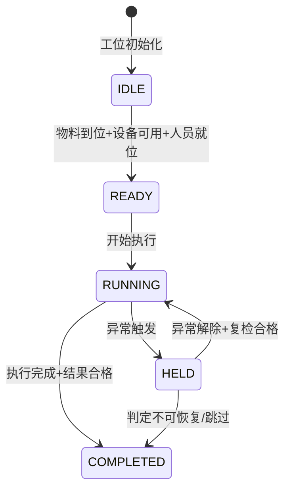

# PCBA 工序域（Process Operation Bounded Context）

> **限界上下文**：工序域  
> **统一语言**：StepType, ProcessCategory, StepStateMachine, StepParameter, StepTemplate  
> **核心关注**：定义27个标准工序类型的分类体系、定义模板、通用状态机及参数参考范围，是工艺路线建模和Agent知识库的核心基础  
---

## 领域概述

工序域是 PCBA MES 系统的**核心域**，定义了从物料准备到成品入库全链路的27个标准工序类型。每个工序类型按照统一的定义模板描述其输入条件、输出产物、状态机、数据采集Schema、质量门禁槽位、设备绑定、物料消耗和参数模板。

工序域是 **工艺路线域** 的基础——工艺路线由工序实例组合而成。工序域也为 **质量域** 提供门禁挂载点，为 **数据采集域** 提供采集Schema定义的引用。

**跨领域协作**：
- 本域的工序类型是 **工艺路线域** 中路线步骤的组成单元
- 本域的质量门禁槽位由 **质量域** 配置具体的门禁规则
- 本域的数据采集Schema引用由 **数据采集域** 定义的具体Schema
- 本域的工序通用状态机由 **制造实体域** 的在制品状态机驱动
- 本域的设备绑定与 **系统集成域** 的设备集成接口协作

---

# 工序元素库

本章定义车间全部工序类型的标准化描述，包括分类体系、定义模板、通用状态机、完整工序类型目录和参数参考范围。工序元素库是MES工艺路线建模和Agent知识库的核心基础。

---

## 2.1 工序类型分类体系

车间工序按功能域分为7大类别，覆盖从物料准备到成品入库的完整制造链。

### 2.1.1 分类树形图

```
工序类型分类
├── 1. 物料准备（PREP）
│   ├── STEP_TYPE.PREP.IQC         — PCB来料检验
│   ├── STEP_TYPE.PREP.LABEL       — 粘贴追溯标签
│   └── STEP_TYPE.PREP.BAKE        — MSD烘烤
│
├── 2. SMT加工（SMT）
│   ├── STEP_TYPE.SMT.PRINT        — 锡膏印刷
│   ├── STEP_TYPE.SMT.SPI          — 锡膏检测（SPI）
│   ├── STEP_TYPE.SMT.PLACE        — 贴片
│   ├── STEP_TYPE.SMT.REFLOW       — 回流焊
│   └── STEP_TYPE.SMT.AOI          — AOI光学检测
│
├── 3. THT加工（THT）
│   ├── STEP_TYPE.THT.INSERT       — 插件
│   ├── STEP_TYPE.THT.WAVE         — 波峰焊
│   ├── STEP_TYPE.THT.SELECTIVE    — 选择性焊接
│   └── STEP_TYPE.THT.HAND_SOLDER  — 手工焊接
│
├── 4. 后处理（POST）
│   ├── STEP_TYPE.POST.DEPANEL     — 分割拼板
│   ├── STEP_TYPE.POST.CLEAN       — 清洗
│   ├── STEP_TYPE.POST.COATING     — 三防涂覆
│   └── STEP_TYPE.POST.DISPENSE    — 点胶
│
├── 5. 检验测试（INSPECT）
│   ├── STEP_TYPE.INSPECT.VISUAL         — 人工目检
│   ├── STEP_TYPE.INSPECT.FIRST_ARTICLE   — 首件检验
│   ├── STEP_TYPE.TEST.ICT               — ICT在线测试
│   ├── STEP_TYPE.TEST.FCT               — FCT功能测试
│   └── STEP_TYPE.TEST.BURNIN            — 老化测试
│
├── 6. 成品化（FINISH）
│   ├── STEP_TYPE.FINISH.FLASH          — 固件烧录
│   ├── STEP_TYPE.FINISH.FINAL_INSPECT  — 终检
│   └── STEP_TYPE.FINISH.PACK           — 包装入库
│
└── 7. 返修（REWORK）
    ├── STEP_TYPE.REWORK.ANALYZE   — 缺陷分析
    ├── STEP_TYPE.REWORK.EXECUTE   — 返修作业
    └── STEP_TYPE.REWORK.VERIFY    — 返修验证
```

### 2.1.2 类别说明

| 类别编码 | 类别名称 | 包含工序数 | 说明 |
|----------|----------|:--------:|------|
| PREP | 物料准备 | 3 | PCB来料检验、标签建立、湿敏器件预处理 |
| SMT | SMT加工 | 5 | 表面贴装核心工序链：印刷-SPI-贴片-回流-AOI |
| THT | THT加工 | 4 | 通孔插装与焊接工序 |
| POST | 后处理 | 4 | SMT/THT后的物理处理工序 |
| INSPECT | 检验测试 | 5 | 目检、首件检验、ICT、FCT、老化 |
| FINISH | 成品化 | 3 | 固件烧录、终检、包装入库 |
| REWORK | 返修 | 3 | 缺陷分析、返修作业、返修验证 |

---

## 2.2 工序类型定义模板

每个工序类型均按以下标准模板定义。本节定义模板结构，2.4节按此模板逐一定义全部27个工序类型。

```
### [类型编码] [类型名称]

| 属性 | 值 |
|------|-----|
| 类型编码 | STEP_TYPE.{类别}.{名称} |
| 类型名称 | 中文名称 / English Name |
| 所属类别 | 7大类别之一 |
| 工序说明 | 一句话描述该工序的核心功能 |

**输入条件**
- 前置工序要求：必须已完成的前置工序列表
- 物料要求：本工序需要的物料类型与条件
- 设备要求：执行本工序所需的设备类型与状态
- 人员要求：操作人员须具备的技能认证
- 环境要求：温湿度、ESD、洁净度等（如适用）

**输出产物**
- 物理产物：工序完成后在制品发生的物理变化
- 数据记录：工序产生的过站记录与采集数据

**工序状态机**
引用通用状态机（见2.3节），标注该工序特有的转换守卫条件。

**数据采集Schema**
引用第5章的具体Schema编号（预留引用，实际编号在建表时分配）。

**质量门禁槽位**
可挂载质量门禁的时机点，如：
- 工序开始时（前置门禁）
- 工序完成时（后置门禁）
- 工序执行中（过程中门禁）

**设备绑定**
可执行此工序的设备类型列表（与点检保养.md设备清单一致）。

**物料消耗**
本工序消耗的物料类型。

**参数模板**
可配置参数列表（详细值见2.5节参数参考范围）。
```

---

## 2.3 工序通用状态机

所有工序类型共享统一的状态机模型。每个工序实例（对应一次过站操作）在其生命周期内经历以下状态。

### 2.3.1 状态定义

| 状态 | 编码 | 含义 |
|------|------|------|
| IDLE | 空闲 | 工位就绪，等待物料和在制品到达 |
| READY | 就绪 | 物料到位、设备可用、操作员就位，可开始执行 |
| RUNNING | 执行中 | 工序正在执行（设备加工或人工操作中） |
| HELD | 挂起 | 工序因异常中断，等待恢复或处置 |
| COMPLETED | 已完成 | 工序执行完成，结果已判定 |

### 2.3.2 状态转换图



### 2.3.3 状态转换表

| 编号 | 起始状态 | 目标状态 | 触发条件 | 守卫条件 | 入口动作 |
|:--:|----------|----------|----------|----------|----------|
| S01 | IDLE | READY | 物料到达工位，设备自检PASS，操作员扫码登录 | 设备点检状态=合格；物料批次有效；操作员资质匹配 | 锁定物料批次；记录就绪时间 |
| S02 | READY | RUNNING | 操作员确认开始或设备自动触发 | 前置校验全部通过；质量门禁（如有）放行 | 记录开始时间；初始化采集数据缓冲区 |
| S03 | RUNNING | COMPLETED | 工序执行完成且结果判定合格 | 所有必采数据已采集；质量门禁（如有）判定PASS | 记录完成时间；写入过站记录；更新Unit当前工序 |
| S04 | RUNNING | HELD | 异常触发 | — | 记录异常时间与原因；冻结当前工序计时 |
| S05 | HELD | RUNNING | 异常解除且复检合格 | 设备点检复检合格；物料/人员条件恢复 | 记录恢复时间；重新开始计时 |
| S06 | HELD | COMPLETED | 判定不可恢复（如物料永久短缺、设备不可修复），授权跳过或终止 | 线长/质量工程师授权 | 记录跳过/终止原因与授权人；标记异常完成 |

### 2.3.4 HELD子原因分类

| 子原因编码 | 子原因名称 | 说明 | 典型处置 |
|------------|------------|------|----------|
| HELD_QUALITY | 质量异常 | 检测数据超差、连续NG触发停线 | 根因分析→纠正措施→复检 |
| HELD_EQUIPMENT | 设备故障 | 设备停机、精度漂移超限 | 报修→维修→点检复检合格 |
| HELD_MATERIAL | 物料短缺 | 来料不足、物料批次异常 | 补料→换料→物料校验 |
| HELD_PERSONNEL | 人员缺席 | 操作员离岗、资质人员不足 | 替补人员到岗→资质校验 |

### 2.3.5 时间戳事件记录

每次状态转换生成不可变事件记录，包含：工序实例ID、起始状态、目标状态、触发原因、子原因（如HELD）、操作人员、时间戳（精确到毫秒）。

---

## 2.4 完整工序类型目录

本节按2.2节模板逐一定义全部27个工序类型。

---

### 2.4.1 STEP_TYPE.PREP.IQC — PCB来料检验

| 属性 | 值 |
|------|-----|
| 类型编码 | STEP_TYPE.PREP.IQC |
| 类型名称 | PCB来料检验 / PCB Incoming Quality Control |
| 所属类别 | PREP（物料准备） |
| 工序说明 | 对入厂PCB基板进行外观、尺寸、焊盘状态等检验，判定来料是否满足生产要求 |

**输入条件**

- 前置工序要求：无（首道工序）
- 物料要求：PCB来料批次与送货单一致；供应商COA（出厂检验报告）齐全
- 设备要求：显微镜/放大镜、卡尺、PCB尺寸测量平台（可选）、PCB翘曲度检测仪
- 人员要求：IQC检验员资质认证
- 环境要求：ESD防护区域，光照≥1000 Lux

**输出产物**

- 物理产物：合格PCB转入物料仓/线边仓；不合格PCB隔离退库
- 数据记录：IQC检验报告（含抽样数、AQL、缺陷明细、判定结果）、物料批次入库状态更新

**工序状态机**

引用通用状态机（2.3节）。特有守卫：
- IDLE→READY：IQC检验规范已分配，抽样方案已确定（如AQL 0.65/1.0）
- RUNNING→COMPLETED：所有检验项目判定合格，数据完整录入
- RUNNING→HELD：发现批量缺陷（超出AQL接收限），触发HELD_MATERIAL

**数据采集Schema**

引用 SCHEMA_IQC_001（PCB来料检验数据采集）

**质量门禁槽位**

- 工序完成时：检验合格方可入库/上线

**设备绑定**

- 显微镜/放大镜
- 数字卡尺
- PCB翘曲度检测仪
- PCB尺寸测量平台

**物料消耗**

- 无（检验过程不消耗物料）

**参数模板**

| 参数名 | 单位 | 默认范围 | 说明 |
|--------|------|----------|------|
| 抽样比例 | % | 按AQL表（如一般检验水平II） | 来料抽检比例 |
| 焊盘氧化判定阈值 | — | 变色面积≤5% | 焊盘氧化可接受上限 |
| PCB翘曲度 | % | ≤0.75%（SMT板） | 对角线翘曲度 |
| 板厚公差 | mm | ±10% 标称值 | 板厚允许偏差 |
| 外形尺寸公差 | mm | ±0.2 | 外形尺寸允许偏差 |
| 阻焊偏移 | mm | ≤0.1 | 阻焊开窗偏移量 |

---

### 2.4.2 STEP_TYPE.PREP.LABEL — 粘贴追溯标签

| 属性 | 值 |
|------|-----|
| 类型编码 | STEP_TYPE.PREP.LABEL |
| 类型名称 | 粘贴追溯标签 / Traceability Labeling |
| 所属类别 | PREP（物料准备） |
| 工序说明 | 在PCB表面粘贴含唯一序列号SN的追溯标签，建立板级全流程追溯起点 |

**输入条件**

- 前置工序要求：PCB来料检验（IQC）已合格
- 物料要求：追溯标签（与工单匹配，已打印）；PCB基板
- 设备要求：标签打印机、扫码枪、镭雕机（如采用激光打标替代标签）
- 人员要求：贴标操作员资质

**输出产物**

- 物理产物：PCB表面具有唯一可识别追溯标识（标签或激光标记）
- 数据记录：标签内容（工单号、板号、SN）、扫码校验结果、操作员ID、粘贴时间、Unit创建记录

**工序状态机**

引用通用状态机（2.3节）。特有守卫：
- IDLE→READY：标签打印内容与工单系统核对一致
- RUNNING→COMPLETED：条码可识别且内容校验通过
- RUNNING→HELD：标签漏贴、错贴或无法识别

**数据采集Schema**

引用 SCHEMA_LABEL_001（标签粘贴数据采集）

**质量门禁槽位**

- 工序完成时：QG-01（标签完整性与准确性）

**设备绑定**

- 标签打印机
- 扫码枪
- 镭雕机（激光打标场景）

**物料消耗**

- 追溯标签（每板1枚）
- 色带/碳带（标签打印机耗材）

**参数模板**

| 参数名 | 单位 | 默认范围 | 说明 |
|--------|------|----------|------|
| 标签粘贴位置偏差 | mm | ±2.0 | 标签位置与工艺文件指定位置的偏差 |
| 条码可读等级 | — | ≥Grade B（ISO 15415） | 条码印刷质量等级 |
| 镭雕深度 | μm | 10-30 | 激光打标深度（镭雕场景） |
| 标签耐温等级 | ℃ | ≥260（无铅回流峰值） | 标签耐温要求 |

---

### 2.4.3 STEP_TYPE.PREP.BAKE — MSD烘烤

| 属性 | 值 |
|------|-----|
| 类型编码 | STEP_TYPE.PREP.BAKE |
| 类型名称 | MSD烘烤 / MSD Baking |
| 所属类别 | PREP（物料准备） |
| 工序说明 | 对湿敏器件（MSD）按等级要求进行烘烤除湿，防止回流焊时产生"爆米花"效应 |

**输入条件**

- 前置工序要求：IQC检验合格；MSD物料floor life超时或湿度指示卡超标
- 物料要求：MSD等级3及以上的湿敏元器件
- 设备要求：MSD烘烤箱（温控精度±3℃）
- 人员要求：物料管理员资质
- 环境要求：烘烤区域通风良好

**输出产物**

- 物理产物：已完成除湿的MSD器件（密封包装或立即上线）
- 数据记录：烘烤温度曲线、烘烤时长、MSD等级、物料批次、操作员ID、烘烤完成时间

**工序状态机**

引用通用状态机（2.3节）。特有守卫：
- IDLE→READY：烘烤程序已按MSD等级配置；烤箱温度已稳定在设定值
- RUNNING→COMPLETED：烘烤时长达到MSD等级要求；冷却后密封包装或立即上线
- RUNNING→HELD：烘烤过程中温度超差（HELD_EQUIPMENT）

**数据采集Schema**

引用 SCHEMA_BAKE_001（MSD烘烤数据采集）

**质量门禁槽位**

- 工序完成时：烘烤时长达标且温度曲线合格

**设备绑定**

- MSD烘烤箱
- 湿度指示卡（HIC）
- 真空封装机

**物料消耗**

- 干燥剂（封装用）
- 湿度指示卡

**参数模板**

| 参数名 | 单位 | 默认范围 | 说明 |
|--------|------|----------|------|
| 烘烤温度（MSD 3级） | ℃ | 125±3 | MSD等级3烘烤温度 |
| 烘烤温度（MSD 4级） | ℃ | 125±3 | MSD等级4烘烤温度 |
| 烘烤温度（MSD 5级） | ℃ | 125±3 | MSD等级5烘烤温度 |
| 烘烤时长（MSD 3级） | h | 8-24 | 视暴露时长而定 |
| 烘烤时长（MSD 4级） | h | 12-48 | 视暴露时长而定 |
| 烘烤时长（MSD 5级） | h | 24-48 | 视暴露时长而定 |
| 冷却时间 | min | 30-60 | 烘烤后冷却至室温 |

---

### 2.4.4 STEP_TYPE.SMT.PRINT — 锡膏印刷

| 属性 | 值 |
|------|-----|
| 类型编码 | STEP_TYPE.SMT.PRINT |
| 类型名称 | 锡膏印刷 / Solder Paste Printing |
| 所属类别 | SMT（SMT加工） |
| 工序说明 | 通过钢网将锡膏精确印刷至PCB焊盘，为后续贴片提供焊料 |

**输入条件**

- 前置工序要求：粘贴标签已完成（Unit已创建）；投板方向正确
- 物料要求：锡膏（在有效期内，回温记录齐全）；钢网（型号与产品匹配，张力合格）；PCB基板
- 设备要求：锡膏印刷机（点检合格）；钢网（张力≥35 N/cm²）；刮刀（无缺口/变形）
- 人员要求：SMT操作员资质
- 环境要求：SMT车间温湿度受控（23±3℃ / 40-60%RH）

**输出产物**

- 物理产物：焊盘上均匀覆盖锡膏的PCB
- 数据记录：印刷参数（压力/速度/脱模速度）、锡膏批号、钢网编号、SPI联机数据（如有）、设备编号、印刷时间

**工序状态机**

引用通用状态机（2.3节）。特有守卫：
- IDLE→READY：锡膏印刷机点检合格；钢网型号与工单匹配；锡膏批次有效
- RUNNING→COMPLETED：印刷完成且SPI检测在允差内（如有SPI联机）
- RUNNING→HELD：SPI超差连续≥3片（HELD_QUALITY）；锡膏不足（HELD_MATERIAL）

**数据采集Schema**

引用 SCHEMA_PRINT_001（锡膏印刷数据采集）

**质量门禁槽位**

- 工序完成时：SPI检测（偏移/厚度/覆盖面积）在允差内

**设备绑定**

- 锡膏印刷机
- 钢网
- 刮刀

**物料消耗**

- 锡膏（含铅/无铅）
- 清洗纸/无尘布（钢网擦拭）

**参数模板**

| 参数名 | 单位 | 默认范围 | 说明 |
|--------|------|----------|------|
| 印刷速度 | mm/s | 20-80 | 刮刀移动速度 |
| 印刷压力 | kgf | 3-8 | 刮刀下压力 |
| 脱模速度 | mm/s | 0.5-3 | 钢网与PCB分离速度 |
| 脱模距离 | mm | 1.0-3.0 | 钢网脱离距离 |
| 钢网间隙 | mm | 0（接触式）/ 0.1-0.5（非接触式） | 钢网与PCB间隙 |
| 刮刀角度 | ° | 45-60 | 刮刀与钢网夹角 |
| 锡膏回温时长 | h | 4-8 | 锡膏从冷藏到室温的回温时间 |

---

### 2.4.5 STEP_TYPE.SMT.SPI — 锡膏检测（SPI）

| 属性 | 值 |
|------|-----|
| 类型编码 | STEP_TYPE.SMT.SPI |
| 类型名称 | 锡膏检测（SPI） / Solder Paste Inspection |
| 所属类别 | SMT（SMT加工） |
| 工序说明 | 对锡膏印刷后的焊膏形态进行三维检测，识别厚度不足、偏移、桥接等印刷缺陷 |

**输入条件**

- 前置工序要求：锡膏印刷已完成
- 物料要求：标准校验样片/量块（用于GR&R校验）
- 设备要求：锡膏检测机SPI（点检合格、标准样片校验通过）
- 人员要求：SMT操作员资质

**输出产物**

- 物理产物：SPI检测合格的PCB（流转至贴片）；不合格PCB退出线体进行清洗
- 数据记录：检测程序版本、锡膏厚度（均值/最小值）、覆盖面积、偏移量、桥接检测结果、NG类型统计

**工序状态机**

引用通用状态机（2.3节）。特有守卫：
- IDLE→READY：SPI检测程序与PCB型号匹配；标准样片校验通过
- RUNNING→COMPLETED：检测结果在允差内
- RUNNING→HELD：连续NG超过阈值（HELD_QUALITY）

**数据采集Schema**

引用 SCHEMA_SPI_001（SPI数据采集）

**质量门禁槽位**

- 工序完成时：锡膏厚度、覆盖面积、偏移量在允差内

**设备绑定**

- 锡膏检测机（SPI）

**物料消耗**

- 无（检测过程不消耗物料）

**参数模板**

| 参数名 | 单位 | 默认范围 | 说明 |
|--------|------|----------|------|
| 锡膏厚度允差 | % | ±30（标称值） | 锡膏厚度允许偏差 |
| 覆盖面积下限 | % | ≥70（标称开孔面积） | 焊盘锡膏覆盖面积最低要求 |
| 偏移量上限 | mm | ≤0.15 | 锡膏印刷偏移最大允差 |
| 桥接检测阈值 | mm | <0.1（相邻焊盘间距） | 桥接判定间距阈值 |
| GR&R校验允差 | % | ≤10 | 量具重复性与再现性允差 |

---

### 2.4.6 STEP_TYPE.SMT.PLACE — 贴片

| 属性 | 值 |
|------|-----|
| 类型编码 | STEP_TYPE.SMT.PLACE |
| 类型名称 | 贴片 / SMT Pick & Place |
| 所属类别 | SMT（SMT加工） |
| 工序说明 | 通过高速贴片机将表面贴装元器件（阻容、IC、BGA等）精确贴装至已印刷锡膏的PCB焊盘上 |

**输入条件**

- 前置工序要求：锡膏印刷已完成（SPI合格，如配置SPI）
- 物料要求：表贴元器件（料站表与BOM一致）；供料器装料正确
- 设备要求：贴片机（点检合格，气压/真空正常，吸嘴状态良好）；供料器运转正常
- 人员要求：SMT技术员/操作员资质

**输出产物**

- 物理产物：元器件已精确贴装的PCB（等待回流焊）
- 数据记录：贴装程序版本、料站表、贴装坐标、吸嘴编号、抛料统计、贴装数量、贴装时间

**工序状态机**

引用通用状态机（2.3节）。特有守卫：
- IDLE→READY：料站表与BOM核对一致；贴装程序版本与工单匹配；吸嘴状态合格
- RUNNING→COMPLETED：全部元件贴装完成，无异常报警
- RUNNING→HELD：连续抛料超限（HELD_QUALITY）；供料器卡料（HELD_EQUIPMENT）；物料不足（HELD_MATERIAL）

**数据采集Schema**

引用 SCHEMA_PLACE_001（贴片数据采集）

**质量门禁槽位**

- 工序完成时：贴装后抽检偏移量符合标准

**设备绑定**

- 贴片机（SMT）（高速贴片机 + 多功能贴片机）
- 供料器（喂料器）

**物料消耗**

- 表贴元器件（阻容、IC、BGA、连接器等）
- 吸嘴（按寿命更换）

**参数模板**

| 参数名 | 单位 | 默认范围 | 说明 |
|--------|------|----------|------|
| 贴装精度（Chip） | mm | ±0.05 | Chip元件贴装精度 |
| 贴装精度（IC/QFP） | mm | ±0.025 | IC/QFP贴装精度 |
| 贴装速度（高速机） | CPH | 30000-80000 | 每小时贴装点数 |
| 真空吸取压力 | kPa | -60 至 -80 | 吸嘴真空度 |
| 抛料率上限 | ppm | ≤500 | 抛料率控制目标 |
| 供料器进给精度 | mm | ±0.1 | 供料器步进精度 |

---

### 2.4.7 STEP_TYPE.SMT.REFLOW — 回流焊

| 属性 | 值 |
|------|-----|
| 类型编码 | STEP_TYPE.SMT.REFLOW |
| 类型名称 | 回流焊 / Reflow Soldering |
| 所属类别 | SMT（SMT加工） |
| 工序说明 | 按设定的温区曲线对贴装完成的PCB进行加热，使锡膏熔化并形成可靠焊点 |

**输入条件**

- 前置工序要求：贴片已完成（或炉前首件目检已PASS）
- 物料要求：无（PCB已贴装元器件）
- 设备要求：回流焊炉（点检合格）；炉温曲线已测定且在规格内
- 人员要求：SMT技术员资质
- 环境要求：排风系统正常运行

**输出产物**

- 物理产物：焊点成型完成的PCBA
- 数据记录：炉温曲线（各温区设定/实测温度）、链速、峰值温度、保温时间、液相线以上时间、设备编号、过炉时间

**工序状态机**

引用通用状态机（2.3节）。特有守卫：
- IDLE→READY：炉温曲线已测定合格；链速设定与工艺文件一致
- RUNNING→COMPLETED：过炉完成且炉温曲线在规格内
- RUNNING→HELD：炉温偏移超出规格（HELD_QUALITY）；设备故障（HELD_EQUIPMENT）

**数据采集Schema**

引用 SCHEMA_REFLOW_001（回流焊数据采集）

**质量门禁槽位**

- 工序完成时：炉温曲线须定期测定（每班/每换型）并记录；实时监控温区温度

**设备绑定**

- 回流焊炉

**物料消耗**

- 氮气（N₂）（如使用氮气回流）
- 助焊剂（焊膏中自带，非独立消耗）

**参数模板**

| 参数名 | 单位 | 默认范围 | 说明 |
|--------|------|----------|------|
| 峰值温度（Sn-Ag-Cu无铅） | ℃ | 235-250 | 焊膏熔点以上最高温度 |
| 保温区温度 | ℃ | 150-200 | 预热保温阶段温度 |
| 保温区时间 | s | 60-120 | 保温阶段持续时间 |
| 液相线以上时间（TAL） | s | 45-90 | 焊料熔化状态持续时间 |
| 升温速率 | ℃/s | 1-3 | 预热到峰值升温速率 |
| 冷却速率 | ℃/s | 2-6 | 峰值到凝固冷却速率 |
| 链速 | cm/min | 40-80 | 传送带速度 |
| 温区数量 | — | 8-12 | 回流焊炉温区数量 |

---

### 2.4.8 STEP_TYPE.SMT.AOI — AOI光学检测

| 属性 | 值 |
|------|-----|
| 类型编码 | STEP_TYPE.SMT.AOI |
| 类型名称 | AOI光学检测 / Automated Optical Inspection |
| 所属类别 | SMT（SMT加工） |
| 工序说明 | 对回流焊后的PCBA进行自动光学检测，识别焊点缺陷（桥接、虚焊、少锡）、元器件偏移、缺件、立碑等缺陷 |

**输入条件**

- 前置工序要求：回流焊已完成
- 物料要求：标准缺陷样片（OK/NG标准板）
- 设备要求：AOI检测机（点检合格、标准样片校验通过）；检测程序与PCB版本匹配
- 人员要求：AOI操作员/检验员资质（需具备人工复核判断能力）

**输出产物**

- 物理产物：检测合格的PCBA流转至下工序；NG品标记并进入人工复核
- 数据记录：检测程序版本、检测结果（OK/NG/待判）、缺陷类型编码、缺陷坐标（X,Y）、缺陷图像、检出率统计

**工序状态机**

引用通用状态机（2.3节）。特有守卫：
- IDLE→READY：AOI检测程序与PCB版本匹配；标准样片校验通过
- RUNNING→COMPLETED：自动判定OK或人工复核通过
- RUNNING→HELD：连续NG或检出率异常（HELD_QUALITY）；光源衰减（HELD_EQUIPMENT）

**数据采集Schema**

引用 SCHEMA_AOI_001（AOI数据采集）

**质量门禁槽位**

- 工序完成时：QG-02（T面SMT质量）/ QG-03（B面SMT质量）；AOI报警件须人工复核

**设备绑定**

- AOI检测机

**物料消耗**

- 无（检测过程不消耗物料）

**参数模板**

| 参数名 | 单位 | 默认范围 | 说明 |
|--------|------|----------|------|
| 检出率（关键缺陷） | % | ≥95 | 关键缺陷（桥接/虚焊/缺件）检出率 |
| 误报率上限 | % | ≤5 | 假阳性（False Positive）率 |
| 漏检率上限 | % | ≤1 | 假阴性（False Negative）率 |
| 检测分辨率 | μm/pixel | 10-20 | 图像采集分辨率 |
| 光源亮度衰减阈值 | % | ≤20（相对初始值） | 光源需更换的阈值 |

---

### 2.4.9 STEP_TYPE.THT.INSERT — 插件

| 属性 | 值 |
|------|-----|
| 类型编码 | STEP_TYPE.THT.INSERT |
| 类型名称 | 插件 / Through-Hole Component Insertion |
| 所属类别 | THT（THT加工） |
| 工序说明 | 将通孔元器件（接插件、变压器、大功率器件、电解电容等）手动或自动插入PCB对应孔位 |

**输入条件**

- 前置工序要求：分割拼板已完成（THT段首工序）；或前道SMT/THT工序已完成
- 物料要求：通孔元器件（型号与BOM一致）；PCB基板
- 设备要求：插件工装/治具；自动插件机（如有）；弯脚治具
- 人员要求：插件操作员资质（需能识别元器件极性、方向）
- 环境要求：ESD防护区域

**输出产物**

- 物理产物：元器件已插入PCB的组件（引脚穿出焊接面）
- 数据记录：元器件型号校验结果、极性/方向确认记录、插件工位、操作员ID

**工序状态机**

引用通用状态机（2.3节）。特有守卫：
- IDLE→READY：元器件型号与BOM核对一致；极性/方向图可用
- RUNNING→COMPLETED：全部元件插入到位，极性方向正确，引脚伸出长度符合要求
- RUNNING→HELD：错料/错向（HELD_QUALITY）；物料不足（HELD_MATERIAL）

**数据采集Schema**

引用 SCHEMA_INSERT_001（插件数据采集）

**质量门禁槽位**

- 工序完成时：插件后人工自检确认（器件型号、极性、插装到位）

**设备绑定**

- 自动插件机（如有）
- 插件工装/治具
- 弯脚治具

**物料消耗**

- 通孔元器件（接插件、变压器、继电器、电解电容、大功率电阻等）

**参数模板**

| 参数名 | 单位 | 默认范围 | 说明 |
|--------|------|----------|------|
| 引脚伸出长度 | mm | 1.5-2.5 | 引脚穿出焊接面的长度 |
| 元器件浮起高度 | mm | ≤0.5 | 器件底部与PCB表面的间隙 |
| 弯脚角度 | ° | 30-45 | 引脚弯脚角度（如需弯脚固定） |
| 插装力度（自动机） | N | 5-15 | 自动插件机插入力 |

---

### 2.4.10 STEP_TYPE.THT.WAVE — 波峰焊

| 属性 | 值 |
|------|-----|
| 类型编码 | STEP_TYPE.THT.WAVE |
| 类型名称 | 波峰焊 / Wave Soldering |
| 所属类别 | THT（THT加工） |
| 工序说明 | 将插装完成的PCBA通过熔融锡波，完成通孔引脚与焊盘的批量焊接 |

**输入条件**

- 前置工序要求：插件已完成（或炉前首件目检已PASS）
- 物料要求：助焊剂（型号正确、在有效期内）；焊锡条（无铅/有铅规格匹配）
- 设备要求：波峰焊炉（点检合格）；助焊剂喷涂系统正常；预热区温度达标
- 人员要求：波峰焊技术员资质

**输出产物**

- 物理产物：通孔焊点完成的PCBA
- 数据记录：助焊剂型号/批次、预热温度曲线、锡波温度、链速、接触时间、设备编号、过炉时间

**工序状态机**

引用通用状态机（2.3节）。特有守卫：
- IDLE→READY：波峰焊设备点检合格；助焊剂/焊锡满足要求；预热温度达标
- RUNNING→COMPLETED：过炉完成且焊接参数在规格内
- RUNNING→HELD：焊点连续NG（HELD_QUALITY）；锡波不稳（HELD_EQUIPMENT）；助焊剂不足（HELD_MATERIAL）

**数据采集Schema**

引用 SCHEMA_WAVE_001（波峰焊数据采集）

**质量门禁槽位**

- 工序完成时：波峰焊参数须测定记录；焊点外观需经后检验证

**设备绑定**

- 波峰焊炉

**物料消耗**

- 助焊剂
- 焊锡条（无铅Sn-Cu-Ni / Sn-Ag-Cu或有铅Sn-Pb）
- 氮气（N₂）（如使用氮气保护波峰焊）

**参数模板**

| 参数名 | 单位 | 默认范围 | 说明 |
|--------|------|----------|------|
| 预热温度（板面） | ℃ | 100-130 | PCB板面预热温度 |
| 锡波温度（无铅） | ℃ | 250-260 | 熔融锡波温度 |
| 接触时间 | s | 2-5 | PCB与锡波接触时间 |
| 链速 | cm/min | 80-150 | 传送带速度 |
| 波峰高度 | mm | 6-10 | 锡波峰值高度 |
| 助焊剂喷涂量 | μg/cm² | 50-150（固含量） | 单位面积助焊剂涂布量 |

---

### 2.4.11 STEP_TYPE.THT.SELECTIVE — 选择性焊接

| 属性 | 值 |
|------|-----|
| 类型编码 | STEP_TYPE.THT.SELECTIVE |
| 类型名称 | 选择性焊接 / Selective Soldering |
| 所属类别 | THT（THT加工） |
| 工序说明 | 对混装板或热敏感器件的特定通孔焊点进行精确局部焊接，避免整板过波峰焊对SMT器件的影响 |

**输入条件**

- 前置工序要求：插件已完成（局部点位）
- 物料要求：焊锡丝/焊锡条（规格匹配）；助焊剂（喷嘴式）
- 设备要求：选择性焊接机（点检合格）；焊接程序与产品型号匹配
- 人员要求：焊接技术员资质

**输出产物**

- 物理产物：指定点位通孔焊点完成的PCBA
- 数据记录：焊接程序版本、焊接温度曲线、焊点坐标、焊接时间、设备编号

**工序状态机**

引用通用状态机（2.3节）。特有守卫：
- IDLE→READY：焊接程序与产品匹配；喷嘴状态良好
- RUNNING→COMPLETED：所有目标焊点焊接完成且焊点合格
- RUNNING→HELD：焊点不良连续出现（HELD_QUALITY）；喷嘴堵塞（HELD_EQUIPMENT）

**数据采集Schema**

引用 SCHEMA_SELECTIVE_001（选择性焊接数据采集）

**质量门禁槽位**

- 工序完成时：焊点外观检验合格

**设备绑定**

- 选择性焊接机

**物料消耗**

- 焊锡丝/焊锡条
- 助焊剂
- 焊接喷嘴（按寿命更换）

**参数模板**

| 参数名 | 单位 | 默认范围 | 说明 |
|--------|------|----------|------|
| 焊接温度 | ℃ | 280-350 | 焊嘴温度 |
| 焊接时间/焊点 | s | 1.5-4.0 | 每个焊点焊接持续时间 |
| 预热温度 | ℃ | 80-120 | PCB局部预热温度 |
| 助焊剂喷涂量 | μL | 2-8（每焊点） | 每焊点助焊剂量 |
| 喷嘴直径 | mm | 2-8 | 焊接喷嘴内径 |

---

### 2.4.12 STEP_TYPE.THT.HAND_SOLDER — 手工焊接

| 属性 | 值 |
|------|-----|
| 类型编码 | STEP_TYPE.THT.HAND_SOLDER |
| 类型名称 | 手工焊接 / Manual Hand Soldering |
| 所属类别 | THT（THT加工） |
| 工序说明 | 对特殊大件、异形件、返修点位或无法自动焊接的部位进行人工烙铁焊接 |

**输入条件**

- 前置工序要求：根据实际工艺路线确定（波峰焊后补焊、返修场景等）
- 物料要求：焊锡丝（规格匹配、助焊剂芯含量适当）
- 设备要求：恒温烙铁/焊台（温度校准在有效期内）；吸烟/排烟系统
- 人员要求：手工焊接资质认证（如IPC J-STD-001）
- 环境要求：ESD防护区域；局部排烟

**输出产物**

- 物理产物：目标焊点完成焊接的PCBA
- 数据记录：焊接温度、焊点位置、操作员ID、焊接时间

**工序状态机**

引用通用状态机（2.3节）。特有守卫：
- IDLE→READY：烙铁温度已校准且稳定；操作员焊接资质有效
- RUNNING→COMPLETED：焊点外观合格（光滑、饱满、润湿良好）
- RUNNING→HELD：焊点质量不合格（HELD_QUALITY）

**数据采集Schema**

引用 SCHEMA_HANDSOLDER_001（手工焊接数据采集）

**质量门禁槽位**

- 工序完成时：焊点外观目检合格（参照IPC-A-610）

**设备绑定**

- 恒温烙铁/焊台
- 吸烟/排烟系统
- 显微镜/放大镜（焊后检查）

**物料消耗**

- 焊锡丝
- 助焊剂（如需额外添加）
- 烙铁头（按寿命更换）
- 吸锡带/吸锡器（返修用）

**参数模板**

| 参数名 | 单位 | 默认范围 | 说明 |
|--------|------|----------|------|
| 烙铁温度（无铅） | ℃ | 350-400 | 无铅焊接烙铁设定温度 |
| 烙铁温度（有铅） | ℃ | 320-360 | 有铅焊接烙铁设定温度 |
| 焊接时间/焊点 | s | 2-5 | 每个焊点加热时间 |
| 烙铁头温度校准允差 | ℃ | ±10 | 烙铁实际温度与设定偏差 |
| 焊锡丝直径 | mm | 0.5-1.0 | 常用焊锡丝直径 |

---

### 2.4.13 STEP_TYPE.POST.DEPANEL — 分割拼板

| 属性 | 值 |
|------|-----|
| 类型编码 | STEP_TYPE.POST.DEPANEL |
| 类型名称 | 分割拼板 / Depanelization |
| 所属类别 | POST（后处理） |
| 工序说明 | 将SMT贴装完成后的拼板（Panel）按V-Cut或铣槽路径分割为独立单板（Single Board） |

**输入条件**

- 前置工序要求：双面SMT AOI均已判定合格（或按产品工艺要求的前置工序）
- 物料要求：拼板（Panel）
- 设备要求：V-Cut分板机或铣刀分板机（点检合格）
- 人员要求：分板操作员资质

**输出产物**

- 物理产物：独立单板（板边无毛刺、裂纹、应力损伤）
- 数据记录：分板路径/方向、分板设备编号、分板时间、操作员ID

**工序状态机**

引用通用状态机（2.3节）。特有守卫：
- IDLE→READY：前置工序（双面AOI）均已PASS；分板设备点检合格
- RUNNING→COMPLETED：分割完成，单板尺寸合格，板边无毛刺裂纹
- RUNNING→HELD：板边毛刺/裂纹超限（HELD_QUALITY）；刀具磨损（HELD_EQUIPMENT）

**数据采集Schema**

引用 SCHEMA_DEPANEL_001（分割拼板数据采集）

**质量门禁槽位**

- 工序完成时：分割后抽检板边质量

**设备绑定**

- V-Cut分板机
- 铣刀分板机

**物料消耗**

- 铣刀（铣刀分板机，按寿命更换）

**参数模板**

| 参数名 | 单位 | 默认范围 | 说明 |
|--------|------|----------|------|
| V-Cut分割速度 | mm/s | 50-150 | V-Cut刀片移动速度 |
| 铣刀转速 | RPM | 20000-40000 | 铣刀旋转速度 |
| 铣刀进给速度 | mm/s | 10-30 | 铣刀移动速度 |
| 板边毛刺高度上限 | mm | ≤0.2 | 分割后板边毛刺允许最大值 |
| 铣刀寿命 | m | 50-200（视板材） | 单把铣刀累计切割长度寿命 |

---

### 2.4.14 STEP_TYPE.POST.CLEAN — 清洗

| 属性 | 值 |
|------|-----|
| 类型编码 | STEP_TYPE.POST.CLEAN |
| 类型名称 | 清洗 / Cleaning |
| 所属类别 | POST（后处理） |
| 工序说明 | 去除PCBA表面助焊剂残留、锡珠、灰尘等污染物，满足后续涂覆或电气性能要求 |

**输入条件**

- 前置工序要求：焊接工序已完成（回流焊/波峰焊/手工焊接）
- 物料要求：清洗剂（型号与产品兼容）；DI水（水基清洗工艺）
- 设备要求：超声波清洗机或喷淋清洗机（点检合格）
- 人员要求：清洗操作员资质
- 环境要求：清洗区域通风良好；废液收集合规

**输出产物**

- 物理产物：表面洁净的PCBA（离子污染度达标）
- 数据记录：清洗剂型号/批次、清洗温度、清洗时间、干燥温度/时间、离子污染度测试结果（如有）

**工序状态机**

引用通用状态机（2.3节）。特有守卫：
- IDLE→READY：清洗液浓度/温度达标；清洗程序匹配产品
- RUNNING→COMPLETED：清洗+干燥完成，洁净度达标
- RUNNING→HELD：洁净度测试不合格（HELD_QUALITY）

**数据采集Schema**

引用 SCHEMA_CLEAN_001（清洗数据采集）

**质量门禁槽位**

- 工序完成时：离子污染度测试（如适用）达标；目检无残留

**设备绑定**

- 超声波清洗机
- 喷淋清洗机
- 干燥箱

**物料消耗**

- 清洗剂（水基/溶剂型）
- DI水（去离子水）

**参数模板**

| 参数名 | 单位 | 默认范围 | 说明 |
|--------|------|----------|------|
| 清洗温度 | ℃ | 40-65 | 清洗液工作温度 |
| 清洗时间 | min | 5-15 | 超声波/喷淋清洗时间 |
| 干燥温度 | ℃ | 60-80 | 干燥温度 |
| 干燥时间 | min | 15-30 | 干燥时间 |
| 离子污染度上限 | μg NaCl eq/cm² | ≤1.56 | IPC标准离子污染度上限 |
| 清洗液浓度 | % | 5-20 | 清洗剂稀释比例（水基） |

---

### 2.4.15 STEP_TYPE.POST.COATING — 三防涂覆

| 属性 | 值 |
|------|-----|
| 类型编码 | STEP_TYPE.POST.COATING |
| 类型名称 | 三防涂覆 / Conformal Coating |
| 所属类别 | POST（后处理） |
| 工序说明 | 在PCBA表面涂覆保护层，实现防潮（Humidity）、防霉（Fungus）、防盐雾（Salt Spray）的三防保护 |

**输入条件**

- 前置工序要求：清洗已完成（如工艺要求清洗）；焊接及所有返修已完成
- 物料要求：三防漆（型号与产品要求匹配，在有效期内）
- 设备要求：自动涂覆机或手动喷涂设备（点检合格）；固化炉/UV固化灯（按漆类型）
- 人员要求：涂覆操作员资质
- 环境要求：涂覆区域温湿度受控；通风/排风良好

**输出产物**

- 物理产物：表面覆盖三防保护层的PCBA
- 数据记录：三防漆型号/批次、涂覆厚度、涂覆区域（遮蔽区域）、固化温度/时间、UV能量（UV固化型）

**工序状态机**

引用通用状态机（2.3节）。特有守卫：
- IDLE→READY：三防漆型号匹配；涂覆程序与产品匹配；遮蔽区域已确认
- RUNNING→COMPLETED：涂覆+固化完成，厚度/覆盖达标
- RUNNING→HELD：涂覆厚度超标或漏涂（HELD_QUALITY）；三防漆不足（HELD_MATERIAL）

**数据采集Schema**

引用 SCHEMA_COATING_001（三防涂覆数据采集）

**质量门禁槽位**

- 工序完成时：涂覆厚度检验；UV检查（荧光检测）确认覆盖完整

**设备绑定**

- 自动涂覆机
- 手动喷涂设备
- 固化炉/UV固化灯

**物料消耗**

- 三防漆（丙烯酸/聚氨酯/硅酮/UV固化型）
- 遮蔽胶带/遮蔽治具

**参数模板**

| 参数名 | 单位 | 默认范围 | 说明 |
|--------|------|----------|------|
| 涂覆厚度（丙烯酸） | μm | 25-75 | 丙烯酸三防漆干膜厚度 |
| 涂覆厚度（硅酮） | μm | 50-200 | 硅酮三防漆干膜厚度 |
| 涂覆厚度（聚氨酯） | μm | 25-75 | 聚氨酯三防漆干膜厚度 |
| 固化温度 | ℃ | 60-80（热固化）/ 室温（湿固化） | 固化条件 |
| 固化时间 | min | 10-30（热固化）/ 24-72h（湿固化） | 固化时长 |
| UV能量（UV固化型） | mJ/cm² | 1000-3000 | UV固化所需能量 |
| 喷涂压力 | MPa | 0.2-0.5 | 喷涂雾化压力 |
| 粘度 | mPa·s | 100-500 | 三防漆工作粘度 |

---

### 2.4.16 STEP_TYPE.POST.DISPENSE — 点胶

| 属性 | 值 |
|------|-----|
| 类型编码 | STEP_TYPE.POST.DISPENSE |
| 类型名称 | 点胶 / Dispensing |
| 所属类别 | POST（后处理） |
| 工序说明 | 对特定元器件或区域进行胶水精确点涂，实现加固、密封、导热或绝缘功能 |

**输入条件**

- 前置工序要求：焊接工序已完成；需点胶的元器件已安装
- 物料要求：胶水（型号与用途匹配，在有效期内）：固定胶/导热胶/密封胶/UV胶
- 设备要求：自动点胶机或手动点胶设备（点检合格）；UV固化灯（UV胶）
- 人员要求：点胶操作员资质

**输出产物**

- 物理产物：指定位置已完成点胶的PCBA
- 数据记录：胶水型号/批次、点胶位置、点胶量/胶点直径、固化参数、设备编号

**工序状态机**

引用通用状态机（2.3节）。特有守卫：
- IDLE→READY：胶水型号匹配；点胶程序与产品匹配；针头/喷嘴状态良好
- RUNNING→COMPLETED：点胶+固化完成，胶量/位置合格
- RUNNING→HELD：点胶偏移/量不足（HELD_QUALITY）；胶水不足（HELD_MATERIAL）；针头堵塞（HELD_EQUIPMENT）

**数据采集Schema**

引用 SCHEMA_DISPENSE_001（点胶数据采集）

**质量门禁槽位**

- 工序完成时：点胶位置与胶量目检/自动检测

**设备绑定**

- 自动点胶机
- 手动点胶设备
- UV固化灯

**物料消耗**

- 固定胶（RTV硅胶/环氧胶）
- 导热胶/导热硅脂
- UV胶
- 点胶针头（按寿命更换）

**参数模板**

| 参数名 | 单位 | 默认范围 | 说明 |
|--------|------|----------|------|
| 点胶压力 | MPa | 0.1-0.4 | 点胶阀气压 |
| 点胶时间 | ms | 50-500 | 单点出胶时间 |
| 胶点直径 | mm | 1.0-5.0 | 胶点直径（视元器件大小） |
| 针头内径 | mm | 0.2-1.0 | 点胶针头内径 |
| 固化时间（UV胶） | s | 5-30 | UV固化时间 |
| 固化温度（热固胶） | ℃ | 80-120 | 热固化温度 |

---

### 2.4.17 STEP_TYPE.INSPECT.VISUAL — 人工目检

| 属性 | 值 |
|------|-----|
| 类型编码 | STEP_TYPE.INSPECT.VISUAL |
| 类型名称 | 人工目检 / Manual Visual Inspection |
| 所属类别 | INSPECT（检验测试） |
| 工序说明 | 检验员通过目视（辅以放大镜/显微镜）对PCBA焊点、元器件、板面外观进行人工质量判定 |

**输入条件**

- 前置工序要求：根据工艺路线位置不同（如回流焊后、波峰焊后、板面全检等）
- 物料要求：无
- 设备要求：放大镜/显微镜；检验工作台（光照≥1000 Lux）
- 人员要求：目检检验员资质（需通过IPC-A-610标准培训）
- 环境要求：ESD防护区域；光照充足

**输出产物**

- 物理产物：判定合格的PCBA流转至下工序；NG品标识并转入返修
- 数据记录：检验项目明细、检验结果（PASS/NG）、缺陷类型编码、缺陷位置、检验员ID、检验时间

**工序状态机**

引用通用状态机（2.3节）。特有守卫：
- IDLE→READY：检验标准/SOP已就位；检验员资质有效
- RUNNING→COMPLETED：全部检验项目完成，结果PASS
- RUNNING→HELD：发现缺陷需返修（转入REWORK流程）；检验员资质过期（HELD_PERSONNEL）

**数据采集Schema**

引用 SCHEMA_VISUAL_001（人工目检数据采集）

**质量门禁槽位**

- 工序完成时：根据所在工序位置挂载不同门禁（如炉后目检门禁、板面全检QG-05）

**设备绑定**

- 显微镜/放大镜
- 检验工作台

**物料消耗**

- 无

**参数模板**

| 参数名 | 单位 | 默认范围 | 说明 |
|--------|------|----------|------|
| 检验光照度 | Lux | ≥1000 | 检验区域最低光照要求 |
| 放大倍数 | × | 3-20 | 检验用放大镜/显微镜放大倍数 |
| 单板检验时间 | s | 30-120 | 每片板标准检验时间（视板复杂度） |
| 缺陷判定标准 | — | IPC-A-610 Class 2/3 | 引用验收标准等级 |

---

### 2.4.18 STEP_TYPE.INSPECT.FIRST_ARTICLE — 首件检验

| 属性 | 值 |
|------|-----|
| 类型编码 | STEP_TYPE.INSPECT.FIRST_ARTICLE |
| 类型名称 | 首件检验 / First Article Inspection |
| 所属类别 | INSPECT（检验测试） |
| 工序说明 | 对新工单/换线/换班/参数变更后的首件产品进行全面检验，确认工艺状态合格后方可批量生产 |

**输入条件**

- 前置工序要求：需首件检验的工序已完成（如贴片后、回流焊前、波峰焊前）
- 物料要求：BOM、贴装图、工艺文件
- 设备要求：首件检查夹具；LCR表/万用表（元件值测量）；放大镜/显微镜
- 人员要求：首件检验员资质（高于普通目检员，需经过专门认证）
- 环境要求：ESD防护区域；光照充足

**输出产物**

- 物理产物：首件检验合格的首件PCBA（作为后续生产参照）
- 数据记录：首件检验报告（逐项检验结果）、BOM比对结果、测量数据、判定结果、检验员ID、检验时间

**工序状态机**

引用通用状态机（2.3节）。特有守卫：
- IDLE→READY：首件触发条件满足（新工单/换线/换班/参数变更）；检验文件齐备
- RUNNING→COMPLETED：全部检验项合格，首件放行
- RUNNING→HELD：任一项不合格（HELD_QUALITY），触发停线整改

**数据采集Schema**

引用 SCHEMA_FIRST_ARTICLE_001（首件检验数据采集）

**质量门禁槽位**

- 工序完成时：首件不合格产线不得批量生产（强制停线门禁）

**设备绑定**

- 首件检查夹具
- LCR表/万用表
- 显微镜/放大镜

**物料消耗**

- 无

**参数模板**

| 参数名 | 单位 | 默认范围 | 说明 |
|--------|------|----------|------|
| 首件检验覆盖率 | % | 100%（BOM所有行项） | 首件须检验全部物料项 |
| 电阻容差 | % | ±标称值容差 | 电阻测量允差 |
| 电容容差 | % | ±标称值容差 | 电容测量允差 |
| 元件偏移允差 | mm | ≤0.1（Chip）/ ≤0.05（IC） | 首件偏移量允差 |
| 极性确认 | — | 100%极性器件 | 所有极性器件方向须逐项确认 |

---

### 2.4.19 STEP_TYPE.TEST.ICT — ICT在线测试

| 属性 | 值 |
|------|-----|
| 类型编码 | STEP_TYPE.TEST.ICT |
| 类型名称 | ICT在线测试 / In-Circuit Test |
| 所属类别 | INSPECT（检验测试） |
| 工序说明 | 通过针床测试夹具对PCBA上每个节点的电气参数（电阻、电容、电感、二极管、晶体管、开路/短路等）进行自动化测量 |

**输入条件**

- 前置工序要求：焊接工序全部完成（含目检/全检合格）
- 物料要求：无
- 设备要求：ICT测试机（点检合格）；测试针床/夹具（探针状态良好、接触电阻达标）
- 人员要求：测试技术员资质
- 环境要求：ESD防护区域

**输出产物**

- 物理产物：ICT测试合格的PCBA（流转至FCT/烧录）；FAIL品标记并隔离
- 数据记录：测试程序版本、测试项明细（逐项PASS/FAIL）、测量值、上限/下限、探针接触电阻、测试时间

**工序状态机**

引用通用状态机（2.3节）。特有守卫：
- IDLE→READY：ICT测试程序与产品匹配；针床接触电阻达标（≤1Ω）；标准板校验通过
- RUNNING→COMPLETED：全部测试项PASS
- RUNNING→HELD：连续FAIL或接触电阻异常（HELD_QUALITY）；探针磨损（HELD_EQUIPMENT）

**数据采集Schema**

引用 SCHEMA_ICT_001（ICT数据采集）

**质量门禁槽位**

- 工序完成时：全部测试项PASS（QG-06子项）

**设备绑定**

- ICT测试机
- 测试夹具/针床/载板

**物料消耗**

- 探针（按寿命更换）
- 测试用耗材（如接口线缆、密封圈等）

**参数模板**

| 参数名 | 单位 | 默认范围 | 说明 |
|--------|------|----------|------|
| 探针接触电阻 | Ω | ≤1 | 单探针接触电阻上限 |
| 测试电压 | V | 0.1-10（视测试项） | 测试激励电压 |
| 电阻测量精度 | % | ±1 | 电阻测量精度 |
| 电容测量精度 | % | ±2 | 电容测量精度 |
| 开路判定阈值 | Ω | >100 | 开路判定电阻 |
| 短路判定阈值 | Ω | <5 | 短路判定电阻 |
| 探针寿命 | 次 | 50000-200000 | 探针累计测试次数寿命 |

---

### 2.4.20 STEP_TYPE.TEST.FCT — FCT功能测试

| 属性 | 值 |
|------|-----|
| 类型编码 | STEP_TYPE.TEST.FCT |
| 类型名称 | FCT功能测试 / Functional Circuit Test |
| 所属类别 | INSPECT（检验测试） |
| 工序说明 | 在模拟实际工作条件下对PCBA或整机进行功能验证，测试电路的全部功能指标是否满足设计要求 |

**输入条件**

- 前置工序要求：ICT测试已完成（如配置ICT）；或焊接/组装已完成
- 物料要求：无（或需配套测试用线缆/负载）
- 设备要求：FCT测试机/工装测试机（点检合格）；测试程序与工单一致；Golden Unit验证通过
- 人员要求：测试技术员资质

**输出产物**

- 物理产物：功能测试合格的PCBA/整机；FAIL品标记并隔离转入故障分析
- 数据记录：测试程序版本、测试项明细、测试数据（各子项PASS/FAIL）、测试限值、Golden Unit校验记录、测试时间

**工序状态机**

引用通用状态机（2.3节）。特有守卫：
- IDLE→READY：测试程序版本匹配；Golden Unit验证PASS；测试限值文件版本正确
- RUNNING→COMPLETED：全部测试子项PASS
- RUNNING→HELD：任一子项FAIL（HELD_QUALITY）；测试系统异常（HELD_EQUIPMENT）

**数据采集Schema**

引用 SCHEMA_FCT_001（FCT数据采集）

**质量门禁槽位**

- 工序完成时：全部功能测试子项PASS（QG-06子项 / QG-09整机功能测试）

**设备绑定**

- FCT测试机/工装测试机
- 测试夹具/针床/载板
- 联测设备（整机测试场景）

**物料消耗**

- 测试用线缆/负载（按寿命更换）
- 探针（如含针床）

**参数模板**

| 参数名 | 单位 | 默认范围 | 说明 |
|--------|------|----------|------|
| 测试电压精度 | % | ±0.5 | 电压测量精度要求 |
| 测试频率范围 | Hz | 视产品规格 | 信号频率测试范围 |
| Golden Unit校验周期 | h | 每4-8小时或每班 | 标准样机校验频率 |
| 单板测试时间 | s | 30-300 | 单板标准测试时间（视产品复杂度） |
| 测试覆盖率 | % | ≥85 | 功能测试覆盖率目标 |

---

### 2.4.21 STEP_TYPE.TEST.BURNIN — 老化测试

| 属性 | 值 |
|------|-----|
| 类型编码 | STEP_TYPE.TEST.BURNIN |
| 类型名称 | 老化测试 / Burn-in Test |
| 所属类别 | INSPECT（检验测试） |
| 工序说明 | 在规定温度和时间条件下对产品施加工作负载运行，筛除早期失效（婴儿死亡率）产品 |

**输入条件**

- 前置工序要求：功能测试（FCT）已PASS
- 物料要求：无
- 设备要求：老化架/老化房（温控正常）；老化程序与产品匹配；电源/负载系统正常
- 人员要求：老化测试操作员资质

**输出产物**

- 物理产物：老化测试合格的产品；FAIL品标记并隔离转入故障分析
- 数据记录：入老化时间、出老化时间、老化时长、老化温度曲线、老化过程异常记录（断电/报警）、产品运行状态日志

**工序状态机**

引用通用状态机（2.3节）。特有守卫：
- IDLE→READY：老化架/老化房状态可用；老化程序匹配；老化时长要求已配置
- RUNNING→COMPLETED：老化时长达标且过程无异常
- RUNNING→HELD：老化过程异常（断电/超温/产品FAIL）（HELD_QUALITY）；老化设备故障（HELD_EQUIPMENT）

**数据采集Schema**

引用 SCHEMA_BURNIN_001（老化测试数据采集）

**质量门禁槽位**

- 工序完成时：老化时长达标且过程无异常（QG-10）

**设备绑定**

- 老化架
- 老化房
- 联测设备（老化中监测）

**物料消耗**

- 无（电力消耗）

**参数模板**

| 参数名 | 单位 | 默认范围 | 说明 |
|--------|------|----------|------|
| 老化温度 | ℃ | 40-55（常温老化）/ 55-85（高温老化） | 老化环境温度 |
| 老化时长 | h | 4-48（视产品等级） | 老化持续时间 |
| 温度均匀度 | ℃ | ±3 | 老化房/架温度均匀度 |
| 升降温速率 | ℃/min | 1-3 | 老化温度变化速率 |
| 电源电压波动 | % | ±5 | 老化过程供电波动允许值 |

---

### 2.4.22 STEP_TYPE.FINISH.FLASH — 固件烧录

| 属性 | 值 |
|------|-----|
| 类型编码 | STEP_TYPE.FINISH.FLASH |
| 类型名称 | 固件烧录 / Firmware Flashing |
| 所属类别 | FINISH（成品化） |
| 工序说明 | 将固件/应用程序写入产品的非易失性存储器（Flash/EEPROM），并通过read-back校验确认写入完整性 |

**输入条件**

- 前置工序要求：PCBA测试已完成（或组装已完成，整机场景）；烧录接口可访问
- 物料要求：固件发布包（MD5/版本号与发布单一致）
- 设备要求：烧录器/编程器（点检合格）；烧录治具/烧录座（接触良好）；烧录软件运行正常
- 人员要求：烧录操作员资质

**输出产物**

- 物理产物：固件已烧录并校验通过的产品
- 数据记录：固件版本号、固件MD5、烧录结果、read-back校验结果、烧录器编号、烧录时间、烧录次数（含重试）

**工序状态机**

引用通用状态机（2.3节）。特有守卫：
- IDLE→READY：固件包版本/MD5校验通过；烧录配置文件匹配；烧录设备点检合格
- RUNNING→COMPLETED：烧录成功且read-back校验通过
- RUNNING→HELD：烧录失败（HELD_QUALITY）；烧录器/治具故障（HELD_EQUIPMENT）

**数据采集Schema**

引用 SCHEMA_FLASH_001（固件烧录数据采集）

**质量门禁槽位**

- 工序完成时：固件版本与烧录校验双重确认（QG-06子项 / 整机场景烧录门禁）

**设备绑定**

- 烧录器
- 烧录治具/烧录座

**物料消耗**

- 烧录座（按寿命更换）
- 烧录治具弹片/顶针

**参数模板**

| 参数名 | 单位 | 默认范围 | 说明 |
|--------|------|----------|------|
| 烧录重试上限 | 次 | 3 | 烧录失败最大重试次数 |
| 烧录校验方式 | — | read-back / CRC32 / MD5 | 写入完整性校验方式 |
| 烧录电压 | V | 3.3 / 5.0（视芯片） | 烧录供电电压 |
| 烧录速率 | bps | 视芯片与接口 | 烧录通信速率 |
| 烧录座寿命 | 次 | 10000-50000 | 烧录座插拔寿命 |

---

### 2.4.23 STEP_TYPE.FINISH.FINAL_INSPECT — 终检

| 属性 | 值 |
|------|-----|
| 类型编码 | STEP_TYPE.FINISH.FINAL_INSPECT |
| 类型名称 | 终检 / Final Inspection |
| 所属类别 | FINISH（成品化） |
| 工序说明 | 对已完成所有制造与测试工序的产品进行最终外观、标识、附件完整性及出厂指标复核 |

**输入条件**

- 前置工序要求：所有制造工序已完成；功能测试/老化测试已PASS
- 物料要求：出厂检验标准/出货检验规范
- 设备要求：检验工作台（光照≥1000 Lux）；出厂指标复核所需测量设备
- 人员要求：终检检验员资质（高于普通目检员）
- 环境要求：ESD防护区域

**输出产物**

- 物理产物：终检合格的产品（可进入包装）；不合格品转入返工或故障分析
- 数据记录：外观检验结果、标识完整性确认、附件齐全性确认、出厂指标复核结果、检验员ID、检验时间

**工序状态机**

引用通用状态机（2.3节）。特有守卫：
- IDLE→READY：前置工序全部完成；检验标准文件齐备
- RUNNING→COMPLETED：全部检验项合格
- RUNNING→HELD：外观不良（HELD_QUALITY）；指标超差（HELD_QUALITY）

**数据采集Schema**

引用 SCHEMA_FINAL_INSPECT_001（终检数据采集）

**质量门禁槽位**

- 工序完成时：终检全部项目合格（QG-11）

**设备绑定**

- 检验工作台
- 显微镜/放大镜
- 出厂指标复核用测量设备（视产品）

**物料消耗**

- 无

**参数模板**

| 参数名 | 单位 | 默认范围 | 说明 |
|--------|------|----------|------|
| 外观缺陷判定标准 | — | 客户允收标准/厂内标准 | 外观允收等级 |
| 标识检验覆盖率 | % | 100% | 标识/标签须逐件检验 |
| 附件齐套率 | % | 100% | 附件/说明书须逐件核对 |
| 出厂指标复核项数 | 项 | 视产品出货检验规范 | 出厂前必检指标数量 |

---

### 2.4.24 STEP_TYPE.FINISH.PACK — 包装入库

| 属性 | 值 |
|------|-----|
| 类型编码 | STEP_TYPE.FINISH.PACK |
| 类型名称 | 包装入库 / Packaging & Warehousing |
| 所属类别 | FINISH（成品化） |
| 工序说明 | 按包装规范对产品进行防静电/防震包装、装箱、贴标，并完成WMS入库登记 |

**输入条件**

- 前置工序要求：终检已PASS；产品状态标识为"合格"
- 物料要求：包装材料（防静电袋/泡棉/干燥剂/外箱/标签）；附件/说明书齐全
- 设备要求：包装机/封箱机（点检合格）；扫码枪
- 人员要求：包装操作员资质

**输出产物**

- 物理产物：包装完成并入库的产品
- 数据记录：包装方式、装箱数量、外箱标签信息、库位、入库时间、WMS入库确认回执

**工序状态机**

引用通用状态机（2.3节）。特有守卫：
- IDLE→READY：终检已PASS；包装材料匹配；WMS接口正常
- RUNNING→COMPLETED：包装合规且WMS入库确认
- RUNNING→HELD：包装不合规（HELD_QUALITY）；WMS接口异常（HELD_EQUIPMENT）

**数据采集Schema**

引用 SCHEMA_PACK_001（包装入库数据采集）

**质量门禁槽位**

- 工序完成时：包装方式符合客户/厂内规范；WMS入库确认（QG-07）

**设备绑定**

- 包装机
- 封箱机
- 扫码枪

**物料消耗**

- 防静电袋
- 泡棉/缓冲材料
- 干燥剂
- 外箱
- 标签/贴纸

**参数模板**

| 参数名 | 单位 | 默认范围 | 说明 |
|--------|------|----------|------|
| 防静电袋密封性 | — | 真空/热封完整 | 防静电包装密封要求 |
| 干燥剂用量 | 包/箱 | 按箱体体积计算 | 干燥剂规格与数量 |
| 装箱数量 | PCS/箱 | 按包装BOM | 每箱产品数量 |
| 标签内容校验 | — | 100%匹配工单 | 外箱标签内容核对 |

---

### 2.4.25 STEP_TYPE.REWORK.ANALYZE — 缺陷分析

| 属性 | 值 |
|------|-----|
| 类型编码 | STEP_TYPE.REWORK.ANALYZE |
| 类型名称 | 缺陷分析 / Defect Analysis |
| 所属类别 | REWORK（返修） |
| 工序说明 | 对质量门禁拦截的不良品进行缺陷定位、根因分析和返修方案制定 |

**输入条件**

- 前置工序要求：在制品处于QUALITY_HOLD状态或某工序判定NG
- 物料要求：不良品（附AOI图像/测试数据/缺陷描述等）
- 设备要求：显微镜/放大镜；X-Ray检测设备（BGA场景）；万用表/示波器
- 人员要求：返修分析技术员资质（需具备电路分析与故障定位能力）

**输出产物**

- 物理产物：缺陷分析报告（附缺陷位置标记）
- 数据记录：缺陷类型编码、缺陷位置、根因分类、建议返修方法、是否可返修判定、分析人员ID、分析时间

**工序状态机**

引用通用状态机（2.3节）。特有守卫：
- IDLE→READY：不良品及缺陷信息已就位
- RUNNING→COMPLETED：缺陷定位完成，返修方案确定
- RUNNING→HELD：缺陷无法定位需升级分析（HELD_QUALITY）

**数据采集Schema**

引用 SCHEMA_REWORK_ANALYZE_001（缺陷分析数据采集）

**质量门禁槽位**

- 工序完成时：返修方案须经质量工程师审批（关键器件返修）

**设备绑定**

- 显微镜/放大镜
- X-Ray检测设备
- 万用表/示波器
- 热成像仪（如需要）

**物料消耗**

- 无（分析过程不消耗物料）

**参数模板**

| 参数名 | 单位 | 默认范围 | 说明 |
|--------|------|----------|------|
| 缺陷分类编码 | — | 按厂内缺陷代码表 | 缺陷类型标准化编码 |
| 分析时间上限 | min | 30（常规）/ 60（复杂） | 单件缺陷分析时间上限 |
| X-Ray检测电压 | kV | 70-130 | X-Ray检测管电压 |
| 可返修判定 | — | 返修次数<3且缺陷可修复 | 返修可行性判定条件 |

---

### 2.4.26 STEP_TYPE.REWORK.EXECUTE — 返修作业

| 属性 | 值 |
|------|-----|
| 类型编码 | STEP_TYPE.REWORK.EXECUTE |
| 类型名称 | 返修作业 / Rework Execution |
| 所属类别 | REWORK（返修） |
| 工序说明 | 按照缺陷分析确定的返修方案，对不良品执行维修操作（补焊、更换器件、清洗等） |

**输入条件**

- 前置工序要求：缺陷分析已完成；返修方案已审批
- 物料要求：替换元器件（如需更换）；焊锡丝/锡膏/助焊剂
- 设备要求：返修台（BGA返修用，含温度曲线控制）；恒温烙铁/焊台；热风枪；吸烟系统
- 人员要求：返修作业员资质（关键器件返修需高级资质）
- 环境要求：ESD防护区域；局部排烟

**输出产物**

- 物理产物：已完成返修作业的PCBA/产品
- 数据记录：返修方法、使用物料批次（替换件）、返修温度曲线（BGA返修）、返修作业员ID、返修时间

**工序状态机**

引用通用状态机（2.3节）。特有守卫：
- IDLE→READY：返修方案已审批；替换物料齐备；返修设备状态合格
- RUNNING→COMPLETED：返修操作完成，等待验证
- RUNNING→HELD：返修过程中发现新缺陷或不可修复（HELD_QUALITY）；设备异常（HELD_EQUIPMENT）

**数据采集Schema**

引用 SCHEMA_REWORK_EXECUTE_001（返修作业数据采集）

**质量门禁槽位**

- 工序完成后须经返修验证（STEP_TYPE.REWORK.VERIFY）

**设备绑定**

- BGA返修台
- 恒温烙铁/焊台
- 热风枪
- 吸烟/排烟系统

**物料消耗**

- 替换元器件
- 焊锡丝/锡膏
- 助焊剂
- 吸锡带/吸锡器
- 烙铁头（按寿命）

**参数模板**

| 参数名 | 单位 | 默认范围 | 说明 |
|--------|------|----------|------|
| BGA返修峰值温度 | ℃ | 235-250（无铅） | BGA返修回流峰值温度 |
| BGA返修预热温度 | ℃ | 150-180 | BGA返修底部预热温度 |
| 烙铁温度（返修） | ℃ | 350-400（无铅） | 手工返修烙铁温度 |
| 返修加热时间 | s | 30-90（视器件） | 返修加热持续时间 |
| 返修次数上限 | 次 | 3 | 同一缺陷最大返修次数 |

---

### 2.4.27 STEP_TYPE.REWORK.VERIFY — 返修验证

| 属性 | 值 |
|------|-----|
| 类型编码 | STEP_TYPE.REWORK.VERIFY |
| 类型名称 | 返修验证 / Rework Verification |
| 所属类别 | REWORK（返修） |
| 工序说明 | 对返修完成的产品进行复检验证，确认返修效果合格，产品可流回正常工艺路线 |

**输入条件**

- 前置工序要求：返修作业已完成
- 物料要求：无
- 设备要求：AOI检测机（SMT返修验证）；显微镜/放大镜（目检验证）；ICT/FCT测试机（电气性能验证）
- 人员要求：返修验证检验员资质

**输出产物**

- 物理产物：返修验证合格的产品（流回正常工艺路线）；FAIL品转入二次返修或报废评审
- 数据记录：验证方式（AOI/目检/测试）、验证结果（PASS/FAIL）、验证人员ID、验证时间、返修次数更新

**工序状态机**

引用通用状态机（2.3节）。特有守卫：
- IDLE→READY：返修作业已完成；验证设备状态合格
- RUNNING→COMPLETED：验证PASS，Unit状态由REWORK转为IN_PROCESS
- RUNNING→HELD：验证FAIL（HELD_QUALITY），如返修次数已达上限则转SCRAPPED

**数据采集Schema**

引用 SCHEMA_REWORK_VERIFY_001（返修验证数据采集）

**质量门禁槽位**

- 工序完成时：返修验证PASS方可流回主线

**设备绑定**

- AOI检测机
- 显微镜/放大镜
- ICT/FCT测试机

**物料消耗**

- 无

**参数模板**

| 参数名 | 单位 | 默认范围 | 说明 |
|--------|------|----------|------|
| 返修验证方式 | — | 与原工序检测方式一致 | AOI/目检/ICT/FCT |
| 返修次数上限 | 次 | 3 | 达到上限转报废评审 |
| 验证判定标准 | — | 与正常品一致 | 返修品须达到与正常品相同标准 |

---

## 2.5 工序参数参考范围

以下汇总所有工序类型的关键参数参考范围，便于快速查阅和MES参数配置。

### 2.5.1 物料准备（PREP）参数

| 工序类型 | 参数名 | 单位 | 参考范围 | 备注 |
|----------|--------|------|----------|------|
| PREP.IQC | 抽样比例 | % | 按AQL表（一般检验水平II） | 来料抽检比例 |
| PREP.IQC | 焊盘氧化判定阈值 | — | 变色面积≤5% | 焊盘氧化可接受上限 |
| PREP.IQC | PCB翘曲度 | % | ≤0.75（SMT板） | 对角线翘曲度 |
| PREP.IQC | 板厚公差 | mm | ±10% 标称值 | 板厚允许偏差 |
| PREP.IQC | 外形尺寸公差 | mm | ±0.2 | 外形尺寸允许偏差 |
| PREP.IQC | 阻焊偏移 | mm | ≤0.1 | 阻焊开窗偏移量 |
| PREP.LABEL | 标签粘贴位置偏差 | mm | ±2.0 | 标签位置偏差 |
| PREP.LABEL | 条码可读等级 | — | ≥Grade B（ISO 15415） | 条码质量等级 |
| PREP.LABEL | 镭雕深度 | μm | 10-30 | 激光打标深度 |
| PREP.LABEL | 标签耐温等级 | ℃ | ≥260 | 标签耐温要求 |
| PREP.BAKE | 烘烤温度（MSD 3级） | ℃ | 125±3 | MSD等级3 |
| PREP.BAKE | 烘烤温度（MSD 4级） | ℃ | 125±3 | MSD等级4 |
| PREP.BAKE | 烘烤温度（MSD 5级） | ℃ | 125±3 | MSD等级5 |
| PREP.BAKE | 烘烤时长（MSD 3级） | h | 8-24 | 视暴露时长 |
| PREP.BAKE | 烘烤时长（MSD 4级） | h | 12-48 | 视暴露时长 |
| PREP.BAKE | 烘烤时长（MSD 5级） | h | 24-48 | 视暴露时长 |
| PREP.BAKE | 冷却时间 | min | 30-60 | 烘烤后冷却 |

### 2.5.2 SMT加工（SMT）参数

| 工序类型 | 参数名 | 单位 | 参考范围 | 备注 |
|----------|--------|------|----------|------|
| SMT.PRINT | 印刷速度 | mm/s | 20-80 | 刮刀移动速度 |
| SMT.PRINT | 印刷压力 | kgf | 3-8 | 刮刀下压力 |
| SMT.PRINT | 脱模速度 | mm/s | 0.5-3 | 钢网分离速度 |
| SMT.PRINT | 脱模距离 | mm | 1.0-3.0 | 钢网脱离距离 |
| SMT.PRINT | 钢网间隙 | mm | 0（接触式）/ 0.1-0.5（非接触式） | 钢网与PCB间隙 |
| SMT.PRINT | 刮刀角度 | ° | 45-60 | 刮刀夹角 |
| SMT.PRINT | 锡膏回温时长 | h | 4-8 | 回温时间 |
| SMT.SPI | 锡膏厚度允差 | % | ±30（标称值） | 厚度允许偏差 |
| SMT.SPI | 覆盖面积下限 | % | ≥70（标称开孔面积） | 覆盖面积最低要求 |
| SMT.SPI | 偏移量上限 | mm | ≤0.15 | 偏移最大允差 |
| SMT.SPI | 桥接检测阈值 | mm | <0.1 | 桥接判定间距 |
| SMT.SPI | GR&R校验允差 | % | ≤10 | 量具重复性再现性 |
| SMT.PLACE | 贴装精度（Chip） | mm | ±0.05 | Chip元件精度 |
| SMT.PLACE | 贴装精度（IC/QFP） | mm | ±0.025 | IC/QFP精度 |
| SMT.PLACE | 贴装速度（高速机） | CPH | 30000-80000 | 每小时贴装点数 |
| SMT.PLACE | 真空吸取压力 | kPa | -60 至 -80 | 吸嘴真空度 |
| SMT.PLACE | 抛料率上限 | ppm | ≤500 | 抛料率控制目标 |
| SMT.PLACE | 供料器进给精度 | mm | ±0.1 | 供料器步进精度 |
| SMT.REFLOW | 峰值温度（无铅） | ℃ | 235-250 | Sn-Ag-Cu |
| SMT.REFLOW | 保温区温度 | ℃ | 150-200 | 预热保温阶段 |
| SMT.REFLOW | 保温区时间 | s | 60-120 | 保温持续时间 |
| SMT.REFLOW | 液相线以上时间 | s | 45-90 | TAL |
| SMT.REFLOW | 升温速率 | ℃/s | 1-3 | 预热到峰值 |
| SMT.REFLOW | 冷却速率 | ℃/s | 2-6 | 峰值到凝固 |
| SMT.REFLOW | 链速 | cm/min | 40-80 | 传送带速度 |
| SMT.REFLOW | 温区数量 | — | 8-12 | 回流焊炉温区 |
| SMT.AOI | 检出率（关键缺陷） | % | ≥95 | 关键缺陷检出率 |
| SMT.AOI | 误报率上限 | % | ≤5 | 假阳性率 |
| SMT.AOI | 漏检率上限 | % | ≤1 | 假阴性率 |
| SMT.AOI | 检测分辨率 | μm/pixel | 10-20 | 图像分辨率 |
| SMT.AOI | 光源亮度衰减阈值 | % | ≤20（相对初始值） | 光源更换阈值 |

### 2.5.3 THT加工（THT）参数

| 工序类型 | 参数名 | 单位 | 参考范围 | 备注 |
|----------|--------|------|----------|------|
| THT.INSERT | 引脚伸出长度 | mm | 1.5-2.5 | 引脚穿出焊接面长度 |
| THT.INSERT | 元器件浮起高度 | mm | ≤0.5 | 器件底部与PCB间隙 |
| THT.INSERT | 弯脚角度 | ° | 30-45 | 引脚弯脚角度 |
| THT.INSERT | 插装力度（自动机） | N | 5-15 | 自动插件插入力 |
| THT.WAVE | 预热温度（板面） | ℃ | 100-130 | PCB板面预热温度 |
| THT.WAVE | 锡波温度（无铅） | ℃ | 250-260 | 熔融锡波温度 |
| THT.WAVE | 接触时间 | s | 2-5 | PCB与锡波接触时间 |
| THT.WAVE | 链速 | cm/min | 80-150 | 传送带速度 |
| THT.WAVE | 波峰高度 | mm | 6-10 | 锡波峰值高度 |
| THT.WAVE | 助焊剂喷涂量 | μg/cm² | 50-150（固含量） | 助焊剂涂布量 |
| THT.SELECTIVE | 焊接温度 | ℃ | 280-350 | 焊嘴温度 |
| THT.SELECTIVE | 焊接时间/焊点 | s | 1.5-4.0 | 每焊点持续时间 |
| THT.SELECTIVE | 预热温度 | ℃ | 80-120 | PCB局部预热 |
| THT.SELECTIVE | 助焊剂喷涂量 | μL | 2-8（每焊点） | 每焊点助焊剂量 |
| THT.SELECTIVE | 喷嘴直径 | mm | 2-8 | 焊接喷嘴内径 |
| THT.HAND_SOLDER | 烙铁温度（无铅） | ℃ | 350-400 | 无铅焊接烙铁温度 |
| THT.HAND_SOLDER | 烙铁温度（有铅） | ℃ | 320-360 | 有铅焊接烙铁温度 |
| THT.HAND_SOLDER | 焊接时间/焊点 | s | 2-5 | 每焊点加热时间 |
| THT.HAND_SOLDER | 烙铁温度校准允差 | ℃ | ±10 | 烙铁温度偏差 |
| THT.HAND_SOLDER | 焊锡丝直径 | mm | 0.5-1.0 | 常用焊锡丝直径 |

### 2.5.4 后处理（POST）参数

| 工序类型 | 参数名 | 单位 | 参考范围 | 备注 |
|----------|--------|------|----------|------|
| POST.DEPANEL | V-Cut分割速度 | mm/s | 50-150 | V-Cut刀片移动速度 |
| POST.DEPANEL | 铣刀转速 | RPM | 20000-40000 | 铣刀旋转速度 |
| POST.DEPANEL | 铣刀进给速度 | mm/s | 10-30 | 铣刀移动速度 |
| POST.DEPANEL | 板边毛刺高度上限 | mm | ≤0.2 | 毛刺允许最大值 |
| POST.DEPANEL | 铣刀寿命 | m | 50-200 | 单把铣刀切割寿命 |
| POST.CLEAN | 清洗温度 | ℃ | 40-65 | 清洗液工作温度 |
| POST.CLEAN | 清洗时间 | min | 5-15 | 超声波/喷淋清洗时间 |
| POST.CLEAN | 干燥温度 | ℃ | 60-80 | 干燥温度 |
| POST.CLEAN | 干燥时间 | min | 15-30 | 干燥时间 |
| POST.CLEAN | 离子污染度上限 | μg NaCl eq/cm² | ≤1.56 | IPC标准 |
| POST.CLEAN | 清洗液浓度 | % | 5-20 | 清洗剂稀释比例 |
| POST.COATING | 涂覆厚度（丙烯酸） | μm | 25-75 | 丙烯酸干膜厚度 |
| POST.COATING | 涂覆厚度（硅酮） | μm | 50-200 | 硅酮干膜厚度 |
| POST.COATING | 涂覆厚度（聚氨酯） | μm | 25-75 | 聚氨酯干膜厚度 |
| POST.COATING | 固化温度 | ℃ | 60-80（热固化）/ 室温（湿固化） | 固化条件 |
| POST.COATING | 固化时间 | min | 10-30（热固化）/ 24-72h（湿固化） | 固化时长 |
| POST.COATING | UV能量（UV固化型） | mJ/cm² | 1000-3000 | UV固化能量 |
| POST.COATING | 喷涂压力 | MPa | 0.2-0.5 | 喷涂雾化压力 |
| POST.COATING | 粘度 | mPa·s | 100-500 | 三防漆工作粘度 |
| POST.DISPENSE | 点胶压力 | MPa | 0.1-0.4 | 点胶阀气压 |
| POST.DISPENSE | 点胶时间 | ms | 50-500 | 单点出胶时间 |
| POST.DISPENSE | 胶点直径 | mm | 1.0-5.0 | 胶点直径 |
| POST.DISPENSE | 针头内径 | mm | 0.2-1.0 | 点胶针头内径 |
| POST.DISPENSE | 固化时间（UV胶） | s | 5-30 | UV固化时间 |
| POST.DISPENSE | 固化温度（热固胶） | ℃ | 80-120 | 热固化温度 |

### 2.5.5 检验测试（INSPECT）参数

| 工序类型 | 参数名 | 单位 | 参考范围 | 备注 |
|----------|--------|------|----------|------|
| INSPECT.VISUAL | 检验光照度 | Lux | ≥1000 | 检验区域最低光照 |
| INSPECT.VISUAL | 放大倍数 | × | 3-20 | 放大镜/显微镜 |
| INSPECT.VISUAL | 单板检验时间 | s | 30-120 | 视板复杂度 |
| INSPECT.VISUAL | 缺陷判定标准 | — | IPC-A-610 Class 2/3 | 验收标准等级 |
| INSPECT.FIRST_ARTICLE | 首件检验覆盖率 | % | 100%（BOM所有行项） | 全项检验 |
| INSPECT.FIRST_ARTICLE | 电阻容差 | % | ±标称值容差 | 电阻测量允差 |
| INSPECT.FIRST_ARTICLE | 电容容差 | % | ±标称值容差 | 电容测量允差 |
| INSPECT.FIRST_ARTICLE | 元件偏移允差 | mm | ≤0.1（Chip）/ ≤0.05（IC） | 偏移允差 |
| INSPECT.FIRST_ARTICLE | 极性确认 | — | 100%极性器件 | 逐项确认 |
| TEST.ICT | 探针接触电阻 | Ω | ≤1 | 单探针接触电阻 |
| TEST.ICT | 测试电压 | V | 0.1-10 | 测试激励电压 |
| TEST.ICT | 电阻测量精度 | % | ±1 | 电阻精度 |
| TEST.ICT | 电容测量精度 | % | ±2 | 电容精度 |
| TEST.ICT | 开路判定阈值 | Ω | >100 | 开路判定电阻 |
| TEST.ICT | 短路判定阈值 | Ω | <5 | 短路判定电阻 |
| TEST.ICT | 探针寿命 | 次 | 50000-200000 | 探针累计寿命 |
| TEST.FCT | 测试电压精度 | % | ±0.5 | 电压测量精度 |
| TEST.FCT | 测试频率范围 | Hz | 视产品规格 | 信号频率范围 |
| TEST.FCT | Golden Unit校验周期 | h | 每4-8小时或每班 | 标准样机校验频率 |
| TEST.FCT | 单板测试时间 | s | 30-300 | 视产品复杂度 |
| TEST.FCT | 测试覆盖率 | % | ≥85 | 功能测试覆盖率 |
| TEST.BURNIN | 老化温度 | ℃ | 40-55（常温）/ 55-85（高温） | 老化环境温度 |
| TEST.BURNIN | 老化时长 | h | 4-48 | 视产品等级 |
| TEST.BURNIN | 温度均匀度 | ℃ | ±3 | 温度均匀度 |
| TEST.BURNIN | 升降温速率 | ℃/min | 1-3 | 温度变化速率 |
| TEST.BURNIN | 电源电压波动 | % | ±5 | 供电波动允许值 |

### 2.5.6 成品化（FINISH）参数

| 工序类型 | 参数名 | 单位 | 参考范围 | 备注 |
|----------|--------|------|----------|------|
| FINISH.FLASH | 烧录重试上限 | 次 | 3 | 最大重试次数 |
| FINISH.FLASH | 烧录校验方式 | — | read-back / CRC32 / MD5 | 校验方式 |
| FINISH.FLASH | 烧录电压 | V | 3.3 / 5.0（视芯片） | 烧录供电电压 |
| FINISH.FLASH | 烧录速率 | bps | 视芯片与接口 | 烧录通信速率 |
| FINISH.FLASH | 烧录座寿命 | 次 | 10000-50000 | 烧录座插拔寿命 |
| FINISH.FINAL_INSPECT | 外观缺陷判定标准 | — | 客户允收标准/厂内标准 | 外观允收等级 |
| FINISH.FINAL_INSPECT | 标识检验覆盖率 | % | 100% | 标识逐件检验 |
| FINISH.FINAL_INSPECT | 附件齐套率 | % | 100% | 附件逐件核对 |
| FINISH.FINAL_INSPECT | 出厂指标复核项数 | 项 | 视产品出货检验规范 | 必检指标数量 |
| FINISH.PACK | 防静电袋密封性 | — | 真空/热封完整 | 密封要求 |
| FINISH.PACK | 干燥剂用量 | 包/箱 | 按箱体体积计算 | 干燥剂规格 |
| FINISH.PACK | 装箱数量 | PCS/箱 | 按包装BOM | 每箱产品数 |
| FINISH.PACK | 标签内容校验 | — | 100%匹配工单 | 标签内容核对 |

### 2.5.7 返修（REWORK）参数

| 工序类型 | 参数名 | 单位 | 参考范围 | 备注 |
|----------|--------|------|----------|------|
| REWORK.ANALYZE | 缺陷分类编码 | — | 按厂内缺陷代码表 | 标准化编码 |
| REWORK.ANALYZE | 分析时间上限 | min | 30（常规）/ 60（复杂） | 单件分析时间 |
| REWORK.ANALYZE | X-Ray检测电压 | kV | 70-130 | 管电压 |
| REWORK.ANALYZE | 可返修判定 | — | 返修次数<3且缺陷可修复 | 返修可行性 |
| REWORK.EXECUTE | BGA返修峰值温度 | ℃ | 235-250（无铅） | BGA返修回流峰值 |
| REWORK.EXECUTE | BGA返修预热温度 | ℃ | 150-180 | BGA底部预热 |
| REWORK.EXECUTE | 烙铁温度（返修） | ℃ | 350-400（无铅） | 手工返修烙铁 |
| REWORK.EXECUTE | 返修加热时间 | s | 30-90 | 视器件大小 |
| REWORK.EXECUTE | 返修次数上限 | 次 | 3 | 同一缺陷最大次数 |
| REWORK.VERIFY | 返修验证方式 | — | 与原工序检测方式一致 | AOI/目检/ICT/FCT |
| REWORK.VERIFY | 返修次数上限 | 次 | 3 | 达到上限转报废 |
| REWORK.VERIFY | 验证判定标准 | — | 与正常品一致 | 返修品同等标准 |

---

**文档版本**：v1.0
**适用车间类型**：电子制造与整机组装混合型工厂
**关联文档**：点检保养.md（设备清单与点检标准）、车间过点流程.md（过站业务设计）、工艺流程.md（工艺路线定义）


---

