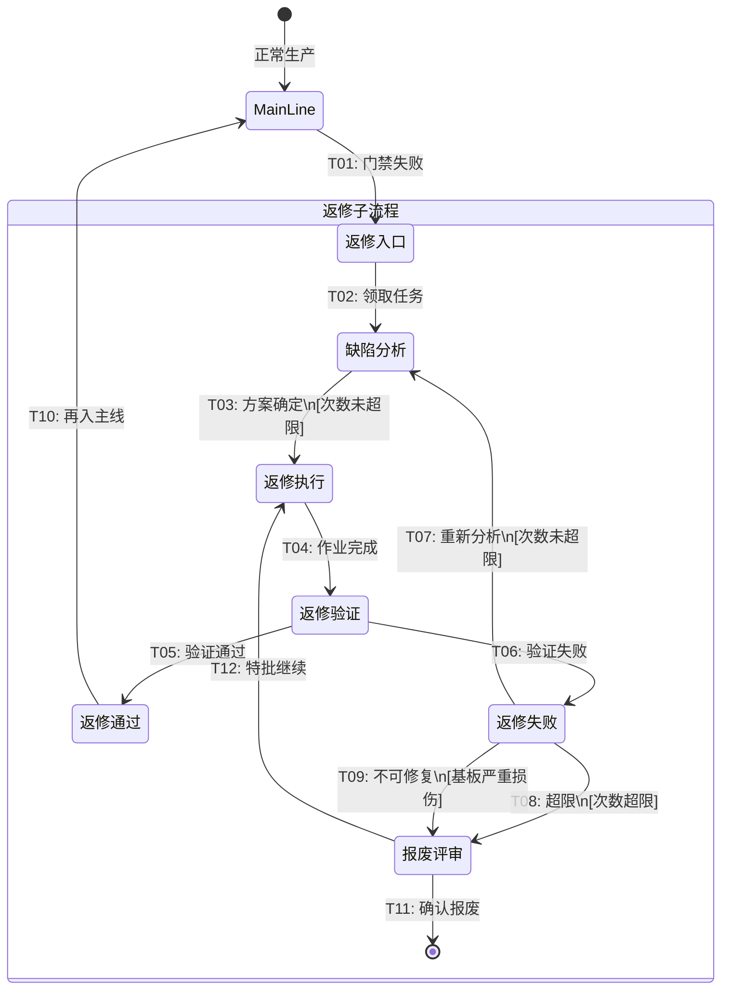
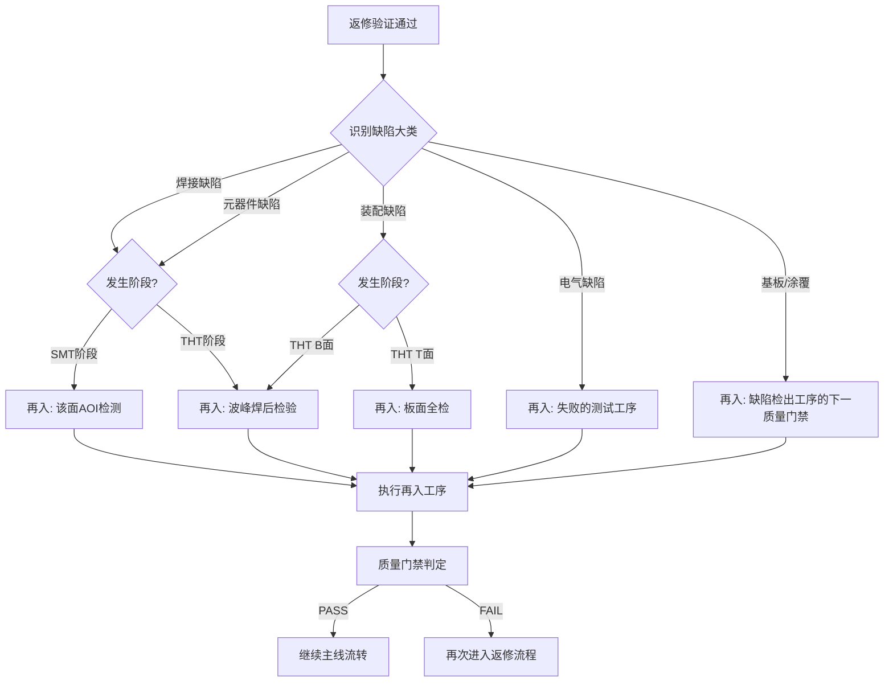
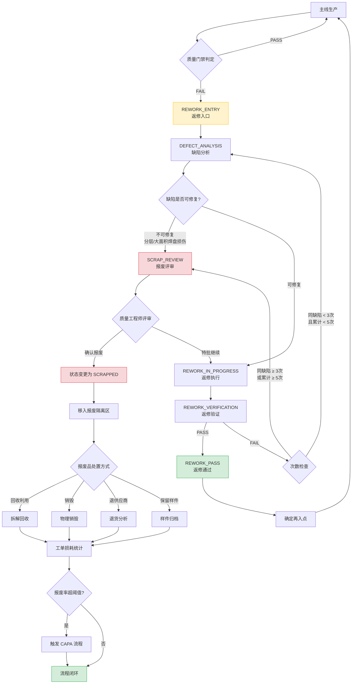

# PCBA 返修域（Rework Bounded Context）

> **限界上下文**：返修域  
> **统一语言**：ReworkState, ReworkRule, ReentryPoint, ScrapDecision, ReworkVerification  
> **核心关注**：定义返修子流程的状态机、返修规则、再入点规则、报废判定，以及返修作业的完整生命周期  
> **原始章节**：第4章（返修模型）

---

## 领域概述

返修域是 PCBA MES 系统的**支撑域**，管理在制品被质量门禁拦截后的返修子流程。返修是与主线生产流程并行的独立子流程——当在制品在某个质量门禁被判定为不合格时，系统将其从主线"切出"到返修子流程；返修验证通过后，再将其"切入"回主线继续流转。

**跨领域协作**：
- **制造实体域** 的在制品状态机驱动进入返修状态（IN_PROCESS → QUALITY_HOLD → REWORK）
- **质量域** 的门禁失败动作触发返修流程
- 返修完成后的验证结果反馈给 **质量域** 进行门禁复检
- 返修过程中的数据由 **数据采集域** 采集和存储
- 返修超限或不可修复时，进入报废流程，与 **制造实体域** 的报废状态协作

---

# 返修模型

## 4.1 返修状态机

返修是独立于主线生产流程的并行子流程。当在制品（WIP）在某个质量门禁被判定为不合格时，系统将其从主线"切出"到返修子流程；返修验证通过后，再将其"切入"回主线继续流转。

### 4.1.1 状态定义

| 状态 | 编码 | 说明 | 归属流程 |
|------|------|------|----------|
| REWORK_ENTRY | RW-ENT | 返修入口：不良品被质量门禁拦截，进入返修队列 | 返修子流程 |
| DEFECT_ANALYSIS | RW-ANA | 缺陷分析：对不良品进行缺陷定性和根因分析，确定返修方案 | 返修子流程 |
| REWORK_IN_PROGRESS | RW-IP | 返修执行：按返修方案执行返修作业 | 返修子流程 |
| REWORK_VERIFICATION | RW-VFY | 返修验证：对返修后的板进行质量验证（AOI/目检/ICT/X-Ray） | 返修子流程 |
| REWORK_PASS | RW-PASS | 返修通过：验证合格，准备流回主线 | 返修子流程（终态） |
| REWORK_FAIL | RW-FAIL | 返修失败：验证不合格，进入二次返修或报废评审 | 返修子流程 |
| SCRAP_REVIEW | RW-SCRP | 报废评审：由质量工程师判定是否报废 | 返修子流程 |

### 4.1.2 状态转换表

| 编号 | 源状态 | 目标状态 | 触发条件 | 守卫条件 | 动作 |
|------|--------|----------|----------|----------|------|
| T01 | (主线) | REWORK_ENTRY | 质量门禁判定失败 | 失败动作 = `转返修` | ① 记录门禁判定结果与缺陷编码 ② 在制品状态变更为 `IN_REWORK` ③ 分配返修任务编号（RW-{yyyyMMdd}-{seq}） ④ 板移入返修暂存区 |
| T02 | REWORK_ENTRY | DEFECT_ANALYSIS | 返修人员领取返修任务 | 板状态 = `IN_REWORK` | ① 分配返修人员工号 ② 记录领取时间 ③ 板移入返修工位 |
| T03 | DEFECT_ANALYSIS | REWORK_IN_PROGRESS | 缺陷分析完成，返修方案确定 | 返修方法已选择；返修设备可用；返修次数未超限 | ① 记录缺陷编码、缺陷描述、根因 ② 选择返修方法 ③ 记录计划使用的返修设备 ④ 更新板累计返修次数 |
| T04 | REWORK_IN_PROGRESS | REWORK_VERIFICATION | 返修作业完成 | 返修作业按方案执行完毕；返修记录完整 | ① 记录返修方法、设备编号、操作人员 ② 记录返修开始/结束时间 ③ 触发返修验证工序 |
| T05 | REWORK_VERIFICATION | REWORK_PASS | 验证合格 | 验证结果 = `PASS` | ① 记录验证结果 ② 记录验证方法（AOI/目检/ICT/X-Ray） ③ 板状态变更为 `REWORK_PASS` ④ 确定再入点（参见 4.3 节） |
| T06 | REWORK_VERIFICATION | REWORK_FAIL | 验证不合格 | 验证结果 = `FAIL` | ① 记录验证结果与失败原因 ② 板状态变更为 `REWORK_FAIL` ③ 通知返修人员 |
| T07 | REWORK_FAIL | DEFECT_ANALYSIS | 返修次数未超限 | 同缺陷返修次数 < 3 且 板累计返修次数 < 5 | ① 记录本次返修失败信息 ② 重新进入缺陷分析（T03） |
| T08 | REWORK_FAIL | SCRAP_REVIEW | 返修次数超限 | 同缺陷返修次数 ≥ 3 或 板累计返修次数 ≥ 5 | ① 板状态变更为 `SCRAP_REVIEW` ② 通知质量工程师 ③ 生成报废评审任务 |
| T09 | REWORK_FAIL | SCRAP_REVIEW | 基板严重损伤 | 缺陷类型 = `DEF-BRD-002`（分层） 或 缺陷类型 = `DEF-BRD-005`（焊盘大面积损伤） | ① 直接进入报废评审（不可修复缺陷） |
| T10 | REWORK_PASS | (主线) | 确定再入点并流转 | 再入点工序已确定；再入点工序未锁定 | ① 板状态变更为 `IN_PROCESS` ② 插入到再入点工序队列 ③ 清除返修标记（保留返修历史记录） |
| T11 | SCRAP_REVIEW | (主线-终态) | 报废评审通过 | 质量工程师签字确认 | ① 板状态变更为 `SCRAPPED` ② 板移入报废隔离区 ③ 记录报废原因、评审人、评审时间 ④ 触发 MRB（Material Review Board）处置流程 ⑤ 更新工单损耗统计 |
| T12 | SCRAP_REVIEW | REWORK_IN_PROGRESS | 报废评审驳回 | 质量工程师判定可继续返修 | ① 记录驳回原因 ② 重置对应缺陷的返修次数（经特批） ③ 重新进入返修执行（T04） |

### 4.1.3 返修状态机流程图

---

## 4.2 返修规则

### 4.2.1 次数限制规则

| 规则编号 | 规则名称 | 规则内容 | 阈值 | 超限处理 | 是否可配置 |
|----------|----------|----------|------|----------|-----------|
| RW-RULE-001 | 同缺陷返修次数上限 | 同一缺陷编码在同一板上的返修次数不得超过上限 | 3 次 | 进入报废评审（SCRAP_REVIEW） | 是（按产品/客户可调） |
| RW-RULE-002 | 单板累计返修次数上限 | 单板在所有工序中的累计返修次数不得超过上限 | 5 次 | 进入报废评审（SCRAP_REVIEW） | 是（按产品可调） |
| RW-RULE-003 | 返修周期上限 | 单板从进入返修到返修完成的时间不得超过上限 | 48 小时 | 升级通知生产主管 | 是 |
| RW-RULE-004 | BGA 器件返修次数上限 | BGA 器件的返修次数限制更严格 | 2 次 | 进入报废评审 | 是 |
| RW-RULE-005 | 关键器件更换次数上限 | 单板上关键器件（BGA/QFN/加密芯片）的累计更换次数 | 3 个 | 进入报废评审 | 是 |

**次数计数规则：**

- 同缺陷返修次数：以缺陷编码为粒度，同一板上同一 `DEF-xxx-xxx` 编码的返修计为同缺陷返修
- 单板累计返修次数：以板 SN 为粒度，该板进入 `REWORK_ENTRY` 状态的累计次数
- 返修失败后重新进入 `DEFECT_ANALYSIS` 不增加计数（同一次返修周期内的迭代）
- 返修验证通过后再次因其他缺陷进入返修，累计返修次数 +1

### 4.2.2 缺陷-返修方法映射表

| 缺陷大类 | 缺陷子类 | 缺陷编码 | 推荐返修方法 | 返修设备 | 返修后验证方法 | 备注 |
|----------|----------|----------|-------------|----------|---------------|------|
| 焊接缺陷 | 连锡/桥接 | DEF-SLD-001 | 吸锡+补焊 | 返修台 / 烙铁 | AOI / 目检 | 桥接位置密集时优先使用返修台 |
| 焊接缺陷 | 少锡 | DEF-SLD-002 | 补焊 | 烙铁 / 返修台 | AOI / 目检 | 补焊后焊点轮廓须满足 IPC-A-610 3 级标准 |
| 焊接缺陷 | 多锡 | DEF-SLD-003 | 吸锡 | 吸锡枪 / 吸锡绳 | 目检 | 多锡通常为 Minor 缺陷，可按标准判定接收 |
| 焊接缺陷 | 冷焊/虚焊 | DEF-SLD-004 | 返修台重焊 | 返修台 | AOI / X-Ray | 需验证温度曲线；虚焊可能需 X-Ray 辅助判定 |
| 焊接缺陷 | 锡珠/锡溅 | DEF-SLD-005 | 清除+清洗 | 防静电刷 / 超声波清洗机 | 目检 | 锡珠直径 > 0.13mm 且不固定在焊点上的必须清除 |
| 焊接缺陷 | 不润湿/反润湿 | DEF-SLD-006 | 返修台重焊 | 返修台 | 目检 / X-Ray | 须先清洁焊盘表面氧化层，检查焊盘可焊性 |
| 焊接缺陷 | 拉尖 | DEF-SLD-007 | 修整 | 烙铁 | 目检 | 拉尖尖端与相邻导体间距须满足最小电气间隙 |
| 焊接缺陷 | 空洞/气孔 | DEF-SLD-008 | 返修台重焊 | 返修台 | X-Ray | BGA 焊点空洞率 > 25% 须返修（IPC-7095） |
| 焊接缺陷 | 立碑 | DEF-SLD-009 | 重新贴装+回流 | 贴片机 + 返修台 | AOI | 注意检查另一焊盘是否受损 |
| 焊接缺陷 | 焊盘翘起 | DEF-SLD-010 | 评估报废或特殊修复 | 返修台（如可修复） | 目检 | 轻微翘起可尝试导电胶修复，大面积须报废 |
| 元器件缺陷 | 缺件 | DEF-CMP-001 | 补件+回流 | 返修台 | AOI / ICT | 补充的元器件须与 BOM 一致 |
| 元器件缺陷 | 错件 | DEF-CMP-002 | 拆除+更换+回流 | 返修台 | AOI / ICT | BGA 拆除须用专用 BGA 返修台 |
| 元器件缺陷 | 极性反 | DEF-CMP-003 | 拆除+更换+回流 | 返修台 | AOI / ICT | 拆除后须确认焊盘完好，方向标识清晰 |
| 元器件缺陷 | 偏移 | DEF-CMP-004 | 评估后决定 | — | AOI | 偏移量在 IPC-A-610 允收标准内可放行 |
| 元器件缺陷 | 器件损伤 | DEF-CMP-005 | 更换 | 返修台 | AOI / ICT / FCT | 更换后须验证功能 |
| 元器件缺陷 | 侧立 | DEF-CMP-006 | 重新贴装+回流 | 贴片机 + 返修台 | AOI | 检查焊盘是否被污染或损伤 |
| 元器件缺陷 | 引脚翘起/共面性不良 | DEF-CMP-007 | 返修台修复 | 返修台 | AOI / 目检 | QFP/SOIC 引脚共面度须 ≤ 0.1mm |
| 装配缺陷 | 漏插 | DEF-ASM-001 | 补插+焊接 | 烙铁 / 返修台 | 目检 / ICT | 焊接前须确认插装到位 |
| 装配缺陷 | 错插 | DEF-ASM-002 | 拆除+更换+焊接 | 烙铁 / 返修台 | 目检 / ICT | 拆除通孔器件时注意避免焊盘损伤 |
| 装配缺陷 | 未插到位 | DEF-ASM-003 | 重新插装+焊接 | 烙铁 / 返修台 | 目检 | 插装到位后引脚伸出长度须 ≥ 0.5mm |
| 装配缺陷 | 引脚弯折 | DEF-ASM-004 | 校直或更换 | 镊子 / 烙铁 | 目检 | 弯折严重导致引脚损伤须更换 |
| 基板缺陷 | 板弯翘 | DEF-BRD-001 | 评估是否可继续 | 热矫正夹具（如有） | 工装检验 | 弯翘度超过板长 0.75% 须报废 |
| 基板缺陷 | 分层 | DEF-BRD-002 | 报废 | — | — | 不可返修，直接报废 |
| 基板缺陷 | 划伤/裂纹 | DEF-BRD-003 | 评估处置 | — | 目检 | 涉及内层线路或结构完整性须报废 |
| 基板缺陷 | 污染 | DEF-BRD-004 | 清洗 | 超声波清洗机 / 清洗剂 | 目检 | 清洗后须烘干并复检 |
| 基板缺陷 | 焊盘损伤 | DEF-BRD-005 | 评估报废或特殊修复 | 返修台（如可修复） | 目检 | 单个焊盘可尝试跳线修复 |
| 涂覆缺陷 | 覆盖不足 | DEF-COT-001 | 补涂 | 涂覆设备 / 手工涂刷 | UV 灯 / 目检 | 补涂厚度和覆盖范围须满足工艺要求 |
| 涂覆缺陷 | 气泡 | DEF-COT-002 | 返修 | 热风枪 / 涂覆工具 | 目检 | 去除气泡后须补涂 |
| 涂覆缺陷 | 剥离 | DEF-COT-003 | 去除+重新涂覆 | 涂覆去除工具 + 涂覆设备 | 目检 | 去除涂覆层时避免损伤元器件和焊点 |
| 涂覆缺陷 | 涂覆下污染 | DEF-COT-004 | 去除涂覆+清洁+重新涂覆 | 涂覆去除工具 + 清洗设备 + 涂覆设备 | 目检 | 污染物必须彻底清除，否则影响可靠性 |
| 电气缺陷 | 开路 | DEF-ELC-001 | 定位+补焊/更换 | ICT 定位 + 返修台 | ICT（复测） | ICT 辅助精确定位开路网络 |
| 电气缺陷 | 短路 | DEF-ELC-002 | 定位+修复 | ICT 定位 + 返修台 / 烙铁 | ICT（复测） | 短路可能由焊料桥接、异物或 PCB 制造缺陷引起 |
| 电气缺陷 | 参数超差 | DEF-ELC-003 | 分析原因+更换器件 | ICT 定位 + 返修台 | ICT / FCT（复测） | 需区分器件偏差与焊接不良导致的参数异常 |
| 电气缺陷 | 功能失效 | DEF-ELC-004 | 故障分析+定向返修 | FCT 定位 + 综合返修台 | FCT（复测） | 需逐级排查，从功能模块到元器件级定位故障 |

### 4.2.3 关键器件返修特殊规则

#### BGA 器件返修规则

| 规则项 | 要求 |
|--------|------|
| 返修设备 | 必须使用专用 BGA 返修台（含底部预热 + 顶部热风 + 光学对位系统） |
| 温度曲线 | 须根据器件规格书测定并遵循温度曲线，包括预热区、均温区、回流区、冷却区 |
| 返修前处理 | 拆除旧 BGA 后须清除焊盘残留焊料（使用吸锡绳或返修台除锡功能）；清洁焊盘表面 |
| 植球要求 | 更换新 BGA 时须确认植球完整；如使用拆下的 BGA 须重新植球 |
| 返修后检验 | 必须经 X-Ray 检验空洞率和焊球形态；必须经 AOI 检验外围焊点 |
| 次数限制 | 同一 BGA 焊盘返修次数 ≤ 2 次 |
| 记录要求 | 记录温度曲线数据、BGA 返修台程序编号、X-Ray 图像存档 |

#### QFN 器件返修规则

| 规则项 | 要求 |
|--------|------|
| 返修设备 | 必须使用专用返修台（含底部预热 + 顶部热风），或红外返修系统 |
| 温度曲线 | 同 BGA 要求，需特别控制底部散热焊盘的焊接温度 |
| 返修前处理 | 拆除旧 QFN 后须清除底部散热焊盘和引脚焊盘上的残留焊料 |
| 返修后检验 | 必须经 X-Ray 检验底部散热焊盘空洞率和周边引脚焊点 |
| 次数限制 | 同一 QFN 焊盘返修次数 ≤ 2 次 |

#### 不可返修器件清单

以下类型器件在出现缺陷时不得返修，必须直接更换：

| 器件类型 | 原因 | 处置方式 |
|----------|------|----------|
| 加密芯片 / 安全芯片 | 返修可能导致密钥丢失或芯片损坏 | 拆除后更换新芯片，重新注入密钥 |
| 一次性烧录器件（OTP） | 烧录后不可改写，返修加热可能损坏 | 拆除后更换新器件，重新烧录 |
| 已编程的 FPGA / CPLD | 返修加热可能影响已配置逻辑 | 拆除后更换新器件，重新编程 |
| 已校准的传感器 | 返修后校准参数可能偏移 | 拆除后更换新传感器，重新校准 |
| 客户指定的不可返修器件 | 客户技术要求明确禁止返修 | 严格遵守客户要求，更换新器件 |

#### 热敏感器件返修规则

| 规则项 | 要求 |
|--------|------|
| 识别 | 在 BOM 中标记热敏感器件及其最高耐受温度 |
| 温度控制 | 返修温度须控制在器件耐受范围内；必要时对热敏感器件采取隔热保护（隔热胶带/隔热罩） |
| 返修顺序 | 优先返修热敏感器件周边区域；如必须拆除热敏感器件，须降低返修温度并延长加热时间 |
| 返修后检验 | 热敏感器件返修后须进行功能验证，确认无热损伤 |

### 4.2.4 返修记录要求

每次返修必须记录以下信息，形成完整的返修追溯档案：

| 记录项 | 字段名 | 类型 | 是否必填 | 说明 |
|--------|--------|------|----------|------|
| 返修任务编号 | rework_task_id | String | 是 | 格式 `RW-{yyyyMMdd}-{seq}`，系统自动生成 |
| 板序列号 | board_sn | String | 是 | 被返修板的唯一序列号 |
| 工单号 | work_order | String | 是 | 关联的工单编号 |
| 缺陷编码 | defect_code | String | 是 | 如 `DEF-SLD-001` |
| 缺陷描述 | defect_desc | String | 是 | 对缺陷的具体描述，含位置信息 |
| 缺陷检出工序 | detect_step | String | 是 | 缺陷在哪个工序被检出 |
| 缺陷检出方法 | detect_method | String | 是 | AOI / 目检 / ICT / FCT / X-Ray |
| 返修方法 | rework_method | String | 是 | 采用的返修方法，如"吸锡+补焊" |
| 返修设备编号 | equipment_id | String | 是 | 使用的返修设备资产编号 |
| 返修温度曲线 | temperature_profile | File/Ref | 否 | BGA/QFN 返修时须上传温度曲线文件 |
| 操作人员工号 | operator_id | String | 是 | 执行返修的操作员工号 |
| 返修开始时间 | start_time | DateTime | 是 | 返修作业的实际开始时间 |
| 返修结束时间 | end_time | DateTime | 是 | 返修作业的实际结束时间 |
| 返修结果 | rework_result | String | 是 | PASS / FAIL |
| 验证方法 | verify_method | String | 是 | AOI / 目检 / ICT / FCT / X-Ray |
| 验证结果 | verify_result | String | 是 | PASS / FAIL |
| 验证人员工号 | verifier_id | String | 是 | 执行返修验证的检验员工号 |
| 验证时间 | verify_time | DateTime | 是 | 返修验证的执行时间 |
| 备注 | remarks | String | 否 | 其他补充信息 |

---

## 4.3 返修再入点规则

返修验证通过后，在制品单元须流回主线继续生产。再入点（Re-entry Point）由返修内容和返修发生的工序阶段共同决定，基本原则是：**返修后的板必须重新经过能检出该缺陷类型的质量门禁**。

### 4.3.1 再入点映射表

| 返修内容 | 缺陷大类 | 返修发生阶段 | 再入工序 | 再入工序编码 | 说明 |
|----------|----------|-------------|----------|-------------|------|
| SMT 面焊接缺陷返修 | 焊接缺陷 | 阶段一/二（SMT） | 该面 AOI 检测 | SMT-T-07 / SMT-B-06 | 返修后须重新 AOI 检测验证焊点质量 |
| SMT 面元器件更换 | 元器件缺陷 | 阶段一/二（SMT） | 该面 AOI 检测 | SMT-T-07 / SMT-B-06 | 更换后须重新 AOI 检测确认贴装和焊接质量 |
| SMT 面极性反修复 | 元器件缺陷 | 阶段一/二（SMT） | 该面 AOI 检测 | SMT-T-07 / SMT-B-06 | 极性修复后须 AOI + ICT（如适用）验证 |
| THT 插件缺陷返修 | 装配缺陷 | 阶段三（THT） | 波峰焊后检验 | THT-05 | 补插/重插后须目检验证插装和焊接质量 |
| THT 元器件更换 | 装配缺陷 | 阶段三（THT） | 波峰焊后检验 或 板面全检 | THT-05 / THTR-03 | 取决于更换位置：B 面插件更换回波峰焊后检验；T 面补充件更换回板面全检 |
| 波峰焊焊接缺陷返修 | 焊接缺陷 | 阶段三（THT） | 波峰焊后检验 | THT-05 | 波峰焊缺陷返修后须目检或 AOI 重新验证 |
| T 面补充插件缺陷返修 | 装配缺陷 | 阶段四（THTR） | 板面全检 | THTR-03 | 补充插件缺陷返修后须全检验证 |
| 电气测试失败返修 | 电气缺陷 | 阶段五（TEST） | 失败的测试工序 | TEST-01 | 返修后须重新执行 ICT 和/或 FCT，不得跳过 |
| 板面全检发现缺陷返修 | 各类 | 阶段四（THTR） | 板面全检 | THTR-03 | 返修后须重新全检验证 |
| 终检发现缺陷返修 | 各类 | 阶段六（PKG） | 终检 | — | 返修后须重新终检确认 |

### 4.3.2 再入点确定逻辑

再入点的确定遵循以下优先级规则：

1. **按缺陷大类确定基准再入点**：根据上表，按返修缺陷的大类和发生阶段确定基准再入工序
2. **最近门禁原则**：如返修内容跨越多个工序阶段，选择最近的、能检出该缺陷类型的质量门禁作为再入点
3. **不可跳过原则**：返修后的板不得跳过任何一道强制质量门禁
4. **测试复测原则**：任何涉及电气性能的返修（更换元器件、补焊），返修后必须重新执行电气测试（ICT/FCT）
5. **多重缺陷原则**：如单板同时存在多种缺陷，以最严格（再入点最靠前）的规则为准

### 4.3.3 再入点特殊场景处理

| 场景 | 处理规则 |
|------|----------|
| 返修后板在再入点之前已完成的工序 | 系统自动标记为"已过站"（通过返修验证即视为该节点前工序合格），无需重新执行 |
| 再入点工序正在执行其他批次 | 返修板按正常优先级排队，紧急返修可经线长审批插队 |
| 返修内容涉及多面（T面+B面） | 以最上游（最靠前）的再入点为准，确保所有受影响面都经过重新验证 |
| 返修后再入时产品工艺已变更 | 系统须检查再入点工序的工艺版本，如已变更则按新版本执行 |
| 返修板长期未再入（>24h） | 系统预警通知线长，超时返修板须重新评估是否仍可继续生产 |

---

## 4.4 报废判定

### 4.4.1 报废触发条件

| 触发条件编号 | 触发条件 | 触发路径 | 判定方式 |
|-------------|----------|----------|----------|
| SCRAP-01 | 同一缺陷返修次数超过上限（≥ 3 次） | REWORK_FAIL → SCRAP_REVIEW（T08） | 系统自动判定 |
| SCRAP-02 | 单板累计返修次数超过上限（≥ 5 次） | REWORK_FAIL → SCRAP_REVIEW（T08） | 系统自动判定 |
| SCRAP-03 | 基板分层（DEF-BRD-002） | REWORK_FAIL → SCRAP_REVIEW（T09） | 系统自动判定（不可修复缺陷） |
| SCRAP-04 | 基板焊盘大面积损伤（DEF-BRD-005） | REWORK_FAIL → SCRAP_REVIEW（T09） | 系统自动判定（不可修复缺陷） |
| SCRAP-05 | BGA/QFN 焊盘返修超过 2 次 | REWORK_FAIL → SCRAP_REVIEW（T08） | 系统自动判定 |
| SCRAP-06 | 不可修复的电气缺陷（如内层开路） | REWORK_FAIL → SCRAP_REVIEW（T09） | 质量工程师判定 |
| SCRAP-07 | 客户指定不可返修器件的缺陷 | REWORK_ENTRY → SCRAP_REVIEW（直接） | 系统配置判定 |
| SCRAP-08 | 板弯翘超过板长 0.75% | REWORK_FAIL → SCRAP_REVIEW（T09） | 质量工程师判定 |
| SCRAP-09 | 多次返修导致基板热损伤累积 | REWORK_FAIL → SCRAP_REVIEW（T09） | 质量工程师判定 |

### 4.4.2 报废流程

#### 步骤 1：报废评审触发

- 系统自动识别或人工触发报废评审
- 板状态变更为 `SCRAP_REVIEW`
- 生成报废评审任务，通知质量工程师

#### 步骤 2：报废评审执行

- 质量工程师对板进行最终评估
- 评审内容：确认缺陷不可修复；确认返修次数已超限；评估报废对工单交付的影响；判定是否需要启动批次追溯（如同批次其他板是否存在同类风险）
- 记录评审结果：

| 评审记录项 | 说明 |
|-----------|------|
| 报废评审编号 | 格式 `SCRAP-{yyyyMMdd}-{seq}` |
| 板序列号 | 报废板 SN |
| 工单号 | 关联工单 |
| 报废原因 | 对应触发条件编号（SCRAP-01 ~ SCRAP-09） |
| 缺陷编码 | 导致报废的主要缺陷 |
| 累计返修次数 | 该板的历史返修总次数 |
| 评审结论 | `确认报废` / `特批继续返修` |
| 评审人 | 质量工程师姓名/工号 |
| 评审时间 | 评审执行时间 |
| 处置方式 | `回收利用` / `销毁` / `退供应商` / `保留样件` |
| 备注 | 补充说明 |

#### 步骤 3：报废执行

- 评审结论为"确认报废"：板状态变更为 `SCRAPPED`
- 板移入报废隔离区（物理隔离 + 系统标记）
- 系统自动执行以下动作：
  - 从 WIP 队列中移除
  - 扣减工单在制数量
  - 增加工单损耗数量
  - 触发 MRB（Material Review Board）处置流程（如适用）
  - 如报废原因涉及批次性风险，触发批次追溯和质量警报

#### 步骤 4：报废品处置

| 处置方式 | 适用场景 | 操作要求 |
|----------|----------|----------|
| 回收利用 | 含贵金属或可回收元器件的报废板 | 拆解可回收元器件；PCB 交专业回收商；记录回收物料清单 |
| 销毁 | 涉及安全或客户保密要求的报废板 | 物理销毁（粉碎/焚烧）；记录销毁方式与见证人；出具销毁证明（如客户要求） |
| 退供应商 | 确认为供应商来料问题导致的报废 | 退回供应商分析；索取 8D 报告；追溯同批次物料；记录退货单号 |
| 保留样件 | 用于质量分析或培训的典型报废板 | 标识为"保留样件"；存放于指定样件区；记录保留原因与保留期限 |

#### 步骤 5：报废统计与闭环

- 报废数据纳入工单损耗统计报表
- 按缺陷编码、产品型号、产线、班组维度汇总报废率
- 报废率超过设定阈值（如 2%）时，自动触发质量改进任务（CAPA）
- 报废品处置完成后，报废流程闭环

### 4.4.3 返修到报废完整流转路径

### 4.4.4 报废统计指标

| 指标 | 计算公式 | 数据来源 | 监控频率 |
|------|----------|----------|----------|
| 报废率 | 报废数量 / 投入数量 × 100% | MES WIP + 报废记录 | 每班/每日 |
| 按缺陷分类报废率 | 某缺陷报废数 / 总报废数 × 100% | 报废记录（缺陷编码） | 每周 |
| 按产品型号报废率 | 某型号报废数 / 该型号投入数 × 100% | 工单 + 报废记录 | 每工单 |
| 按产线/班组报废率 | 某班组报废数 / 该班组投入数 × 100% | 工单 + 班组信息 | 每周 |
| 返修成功率 | 返修通过数 / 返修总数 × 100% | 返修记录 | 每日 |
| 平均返修次数 | 总返修次数 / 返修板数 | 返修记录 | 每周 |
| 报废处置周期 | 报废评审完成时间 - 报废触发时间 | 报废评审记录 | 每月 |

---

## 附录 3A：质量门禁规则表达式参考用例

| 用例 | 表达式 |
|------|--------|
| 标签检查 | `label_scanned == true AND label_content matches "^WO-\\d{8}-\\d{3}$"` |
| SPI 标准判定 | `spi_result == "PASS" OR (spi_result == "CONDITIONAL" AND manual_review == "PASS")` |
| AOI 标准判定 | `aoi_result == "PASS" OR (aoi_result == "REVIEW" AND manual_confirm == "PASS" AND defect_severity != "CRITICAL")` |
| 目检零缺陷 | `visual_result == "PASS" AND defect_count == 0` |
| 全检通过 | `all_areas_inspected == true AND total_defect_count == 0` |
| 电气测试 | `test_result == "PASS"` |
| 终检 | `final_result == "PASS" AND label_intact == true AND package_compliant == true` |
| SPI 覆盖率条件 | `spi_coverage >= 80.0 AND spi_offset <= 25.0` |
| 空洞率限制 | `void_ratio < 25.0 AND defect_type == "DEF-SLD-008"` |
| 排除特定缺陷 | `aoi_result == "PASS" AND defect_type NOT IN ["DEF-BRD-002", "DEF-BRD-005", "DEF-ELC-001"]` |
| 多条件组合 | `(aoi_result == "PASS" AND defect_count <= 3) OR (aoi_result == "REVIEW" AND manual_confirm == "PASS" AND defect_severity == "MINOR")` |
| 工序类型过滤 | `step_type IN ["SMT", "THT"] AND test_result == "PASS"` |

## 附录 3B：返修设备能力矩阵

| 设备类型 | 可处理缺陷类型 | 适用器件类型 | 温度曲线控制 | 精度要求 |
|----------|---------------|-------------|-------------|----------|
| 烙铁工作站 | 连锡、少锡、多锡、拉尖、THT 补焊 | Chip、SOIC、QFP、THT 器件 | 温度可调（200-450 ℃） | 焊嘴直径匹配焊盘 |
| 热风返修台 | 虚焊、不润湿、器件更换 | QFP、PLCC、SOIC、中小尺寸 BGA | 多温区可编程 | 喷嘴尺寸匹配器件 |
| BGA 专用返修台 | BGA/QFN 焊接缺陷、更换 | BGA、QFN、LGA、CSP | 顶部+底部双温区可编程，带温度曲线记录 | 光学对位精度 ±0.01mm |
| 吸锡枪 | 通孔器件拆除、桥接清除 | THT 器件 | 温度可调 | 吸嘴内径匹配引脚 |
| 超声波清洗机 | 锡珠/锡溅清除后清洗、污染清洗 | 各类 PCBA | 清洗温度 40-60 ℃ | 频率 28-40 kHz |
| X-Ray 检测机 | 返修后 BGA/QFN 焊点验证 | BGA、QFN、底部端子器件 | N/A | 分辨率 ≤ 5 um |

---

> **文档版本：** v1.0  
> **适用范围：** PCBA 双面混装生产线（SMT + THT）  
> **参考标准：** IPC-A-610H（电子组件可接受性标准）、IPC-7711/7721C（电子组件的返工、修改和维修）、IPC-7095D（BGA 设计与组装工艺）、IPC-J-STD-001H（焊接的电气和电子组件要求）

---

