# 设备工装台账域 — 领域建模 UML 类图

> **来源**：[设备工装台账域.md](设备工装台账域.md)
> **说明**：描述各聚合根、值对象、实体之间的组合、聚合、关联与泛化关系，以及不变式约束

---

## 领域建模类图

```mermaid
classDiagram
    direction TB

    %% ═══════════════════════════════════════════════════════════
    %%  聚合根
    %% ═══════════════════════════════════════════════════════════

    class Equipment {
        <<AggregateRoot>>
        +model : String
        +vendor : String
        +custodian_org : String
        +custodian_person : String
        +register()
        +commission()
        +suspend(reason)
        +reinstate()
        +retire()
        +relocate(to_location)
        +deployToStation(station_id)
        +undeploy(reason)
        +linkDataChannel(channel_id)
        +accrueRunHours(delta, source)
    }

    class Fixture {
        <<AggregateRoot>>
        +model : String
        +vendor : String
        +custodian_org : String
        +custodian_person : String
        +register()
        +commission()
        +suspend(reason)
        +reinstate()
        +retire()
        +issueToStation(station_id, issued_to, expected_return)
        +returnToStorage(condition)
        +accrueCycles(delta, source)
        +clean(method)
        +refurbish(log, life_reset)
    }

    class MeasuringInstrument {
        <<AggregateRoot>>
        +model : String
        +vendor : String
        +custodian_org : String
        +custodian_person : String
        +register()
        +commission()
        +suspend(reason)
        +reinstate()
        +retire()
        +updateCertValidity(cert_no, valid_until, issued_by)
    }

    class AvailabilityProjection {
        <<AggregateRoot>>
        +asset_id : AssetId
        +available : Boolean
        +lifecycle_blocked : Boolean
        +inspection_overdue : Boolean
        +maintenance_overdue : Boolean
        +calibration_blocked : Boolean
        +malfunction_active : Boolean
        +life_exceeded : Boolean
        +comm_lost : Boolean
        +critical_alarm : Boolean
        +recompute(triggering_event)
        +markUnavailable(reason)
        +clearBlocking(reason_type)
    }

    class ScrapApplication {
        <<AggregateRoot>>
        +asset_id : AssetId
        +asset_kind : AssetKind
        +source_event_id : String
        +reason : String
        +residual_value : Decimal
        +applicant : String
        +submitted_at : DateTime
        +decided_at : DateTime
        +decided_by : String
        +submit()
        +approve(approver)
        +reject(approver, reason)
    }

    class FixtureMatchingRule {
        <<AggregateRoot>>
        +fixture_asset_id : AssetId
        +rule_keys : Map~String,String~
        +define()
        +update(rule_keys)
    }

    %% ═══════════════════════════════════════════════════════════
    %%  共享值对象
    %% ═══════════════════════════════════════════════════════════

    class AssetId {
        <<ValueObject>>
        +value : String
    }

    class AssetIdentifier {
        <<ValueObject>>
        +code : String
        +code_scheme : CodeScheme
    }

    class AssetClassification {
        <<ValueObject>>
        +primary_category : String
        +secondary_category : String
    }

    class AssetLocation {
        <<ValueObject>>
        +factory : String
        +workshop : String
        +line : String
        +station : String
        +remark : String
    }

    class AvailabilityState {
        <<Enumeration>>
        NEW
        IN_SERVICE
        SUSPENDED
        RETIRED
    }

    class BlockingReason {
        <<ValueObject>>
        +reason_type : BlockingReasonType
        +source : String
        +occurred_at : DateTime
    }

    %% ═══════════════════════════════════════════════════════════
    %%  设备特有值对象
    %% ═══════════════════════════════════════════════════════════

    class RunHourAccrual {
        <<ValueObject>>
        +accumulated_run_hours : Decimal
        +reset_baseline : Decimal
    }

    class EquipmentSpecificationProfile {
        <<ValueObject>>
        温区数/传送宽度/最大板尺寸等
    }

    %% ═══════════════════════════════════════════════════════════
    %%  工装特有值对象
    %% ═══════════════════════════════════════════════════════════

    class CycleAccrual {
        <<ValueObject>>
        +accumulated_cycles : Integer
        +reset_baseline : Integer
    }

    class IssuanceRecord {
        <<ValueObject>>
        +station_id : String
        +issued_to : String
        +issued_at : DateTime
        +expected_return : DateTime
    }

    class FixtureSpecificationProfile {
        <<ValueObject>>
        开口规格/Pin数/张力范围等
    }

    class MatchingScope {
        <<ValueObject>>
        +product_family : String
        +process_step : String
        +equipment_model : String
    }

    %% ═══════════════════════════════════════════════════════════
    %%  计量器具特有值对象
    %% ═══════════════════════════════════════════════════════════

    class CertValidity {
        <<ValueObject>>
        +cert_no : String
        +valid_until : Date
        +issued_by : String
    }

    class InstrumentSpecificationProfile {
        <<ValueObject>>
        量程/精度等级/分度值等
    }

    %% ═══════════════════════════════════════════════════════════
    %%  报废申请值对象
    %% ═══════════════════════════════════════════════════════════

    class ApprovalFlow {
        <<ValueObject>>
        +current_step : Int
    }

    class ApproverStep {
        <<ValueObject>>
        +step_order : Int
        +role : String
        +approver_id : String
        +decided : Boolean
    }

    %% ═══════════════════════════════════════════════════════════
    %%  枚举
    %% ═══════════════════════════════════════════════════════════

    class AssetKind {
        <<Enumeration>>
        EQUIPMENT
        FIXTURE
        MEASURING_INSTRUMENT
    }

    class CodeScheme {
        <<Enumeration>>
        SELF_ASSIGNED
        VENDOR
        ASSET_TAG
    }

    class BlockingReasonType {
        <<Enumeration>>
        UNDER_REPAIR
        INSPECTION_ANOMALY
        INSPECTION_OVERDUE
        MAINTENANCE_OVERDUE
        CALIBRATION_FAILED
        CALIBRATION_EXPIRED
        CALIBRATING
        LIFE_EXCEEDED
        COMMUNICATION_LOST
        CRITICAL_ALARM
        TRANSFERRED_OUT
        MALFUNCTION_ACTIVE
    }

    class ScrapSource {
        <<Enumeration>>
        INSPECTION
        REPAIR
        CALIBRATION
        ADMINISTRATIVE
    }

    class ScrapApplicationStatus {
        <<Enumeration>>
        SUBMITTED
        APPROVED
        REJECTED
    }

    class SpecificationProfile {
        <<ValueObject>>
        +spec_keys : List~String~
        +spec_values : Map~String,String~
    }

    %% ═══════════════════════════════════════════════════════════
    %%  SpecificationProfile 继承
    %% ═══════════════════════════════════════════════════════════

    SpecificationProfile <|-- EquipmentSpecificationProfile
    SpecificationProfile <|-- FixtureSpecificationProfile
    SpecificationProfile <|-- InstrumentSpecificationProfile

    %% ═══════════════════════════════════════════════════════════
    %%  Equipment 值对象组合关系
    %% ═══════════════════════════════════════════════════════════

    Equipment "1" *-- "1" AssetId : asset_id
    Equipment "1" *-- "1" AssetIdentifier : identifier
    Equipment "1" *-- "1" AssetClassification : classification
    Equipment "1" *-- "1" EquipmentSpecificationProfile : specification_profile
    Equipment "1" *-- "1" AvailabilityState : availability_state
    Equipment "1" *-- "1" AssetLocation : location
    Equipment "1" *-- "1" RunHourAccrual : run_hour_accrual
    Equipment "1" o-- "0..*" BlockingReason : blocking_reasons

    %% ═══════════════════════════════════════════════════════════
    %%  Fixture 值对象组合关系
    %% ═══════════════════════════════════════════════════════════

    Fixture "1" *-- "1" AssetId : asset_id
    Fixture "1" *-- "1" AssetIdentifier : identifier
    Fixture "1" *-- "1" AssetClassification : classification
    Fixture "1" *-- "1" FixtureSpecificationProfile : specification_profile
    Fixture "1" *-- "1" AvailabilityState : availability_state
    Fixture "1" *-- "1" AssetLocation : location
    Fixture "1" *-- "1" CycleAccrual : cycle_accrual
    Fixture "1" o-- "0..*" BlockingReason : blocking_reasons
    Fixture "1" o-- "0..1" IssuanceRecord : issued_to

    %% ═══════════════════════════════════════════════════════════
    %%  MeasuringInstrument 值对象组合关系
    %% ═══════════════════════════════════════════════════════════

    MeasuringInstrument "1" *-- "1" AssetId : asset_id
    MeasuringInstrument "1" *-- "1" AssetIdentifier : identifier
    MeasuringInstrument "1" *-- "1" AssetClassification : classification
    MeasuringInstrument "1" *-- "1" InstrumentSpecificationProfile : specification_profile
    MeasuringInstrument "1" *-- "1" AvailabilityState : availability_state
    MeasuringInstrument "1" *-- "1" AssetLocation : location
    MeasuringInstrument "1" *-- "1" CertValidity : cert_validity
    MeasuringInstrument "1" o-- "0..*" BlockingReason : blocking_reasons

    %% ═══════════════════════════════════════════════════════════
    %%  AvailabilityProjection 值对象组合关系
    %% ═══════════════════════════════════════════════════════════

    AvailabilityProjection "1" o-- "0..*" BlockingReason : blocking_reasons

    %% ═══════════════════════════════════════════════════════════
    %%  ScrapApplication 值对象组合关系
    %% ═══════════════════════════════════════════════════════════

    ScrapApplication "1" *-- "1" ScrapSource : source
    ScrapApplication "1" *-- "1" ScrapApplicationStatus : status
    ScrapApplication "1" *-- "1" AssetKind : asset_kind
    ScrapApplication "1" *-- "1" ApprovalFlow : approval_flow
    ApprovalFlow "1" *-- "1..*" ApproverStep : approvers

    %% ═══════════════════════════════════════════════════════════
    %%  FixtureMatchingRule 值对象组合关系
    %% ═══════════════════════════════════════════════════════════

    FixtureMatchingRule "1" *-- "1" MatchingScope : applies_to

    %% ═══════════════════════════════════════════════════════════
    %%  值对象内部引用
    %% ═══════════════════════════════════════════════════════════

    AssetIdentifier "1" *-- "1" CodeScheme : code_scheme
    BlockingReason "1" *-- "1" BlockingReasonType : reason_type

    %% ═══════════════════════════════════════════════════════════
    %%  跨聚合关联关系（通过 asset_id 引用）
    %% ═══════════════════════════════════════════════════════════

    AvailabilityProjection "1" --> "1" Equipment : asset_id
    AvailabilityProjection "1" --> "1" Fixture : asset_id
    AvailabilityProjection "1" --> "1" MeasuringInstrument : asset_id

    ScrapApplication "0..*" --> "1" Equipment : asset_id
    ScrapApplication "0..*" --> "1" Fixture : asset_id
    ScrapApplication "0..*" --> "1" MeasuringInstrument : asset_id

    FixtureMatchingRule "0..*" --> "1" Fixture : fixture_asset_id

    %% ═══════════════════════════════════════════════════════════
    %%  不变式约束
    %% ═══════════════════════════════════════════════════════════

    note for Equipment "INV-05: commission前规格画像必须已建立\nINV-08: 状态机 NEW→IN_SERVICE→SUSPENDED⇄IN_SERVICE→RETIRED\nINV-09: accumulated_run_hours 单调递增"
    note for Fixture "INV-10: accumulated_cycles 单调递增(翻修清零除外)\nINV-08: 同Equipment状态机"
    note for MeasuringInstrument "INV-15: 可用必须 cert_valid_until > now()"
    note for AvailabilityProjection "INV-13: available=true ⟺ 所有阻塞维度均不成立\nINV-14: 可用性变更必须幂等发布\n与资产1:1(多态关联,仅匹配一种资产类型)"
    note for ScrapApplication "INV-04: 同一资产不可有未决报废申请\nINV-18: 审批通过→必须RetireAsset\nINV-19: 审批步骤按序推进\n关联资产为多态(仅匹配一种)"
    note for AssetIdentifier "INV-01: 资产编码全局唯一"
    note for AvailabilityState "INV-03: RETIRED为终态,拒收任何事件"
```

---

## 图例说明

### 线型含义

| 线型 | 含义 | 场景 |
|------|------|------|
| `◆——` 实线菱形 | **组合 (Composition)** | 聚合根拥有值对象，生命周期一致 |
| `◇——` 空心菱形 | **聚合 (Aggregation)** | 聚合根持有值对象集合，可动态增减 |
| `——▶` 实线箭头 | **关联 (Association)** | 跨聚合根引用，通过 `asset_id` 间接关联 |
| `◁——` 空心三角 | **泛化 (Generalization)** | SpecificationProfile 的特化子类型 |

### 关系汇总

| 关系 | 基数 | 说明 |
|------|------|------|
| Equipment → AssetId | 1:1 | 设备唯一身份标识 |
| Equipment → AssetIdentifier | 1:1 | 赋码后不可变更 |
| Equipment → RunHourAccrual | 1:1 | 运行时长单调递增累积 |
| Equipment → BlockingReason | 1:0..* | 阻塞原因列表，可动态增减 |
| Fixture → CycleAccrual | 1:1 | 使用次数单调递增累积 |
| Fixture → IssuanceRecord | 1:0..1 | 借出时存在，归还后置空 |
| MeasuringInstrument → CertValidity | 1:1 | 检定证书有效期，计量可用性必要条件 |
| AvailabilityProjection → 资产聚合根 | 1:1 (多态) | 每个 AvailabilityProjection 关联且仅关联一种资产 |
| ScrapApplication → 资产聚合根 | N:1 (多态) | 同一资产可有多次报废申请历史，但不可有未决申请 |
| FixtureMatchingRule → Fixture | N:1 | 一件工装可定义多条匹配规则 |
| ApprovalFlow → ApproverStep | 1:1..* | 审批步骤按序推进，不可跳步 |

### 多态关联说明

`AvailabilityProjection` 和 `ScrapApplication` 对三类资产聚合根（Equipment / Fixture / MeasuringInstrument）的关联是**多态的**——每个实例仅关联其中一种资产类型，由 `asset_kind` 字段判定。图中三条关联线表示可能的关联方向，并非同时存在。
