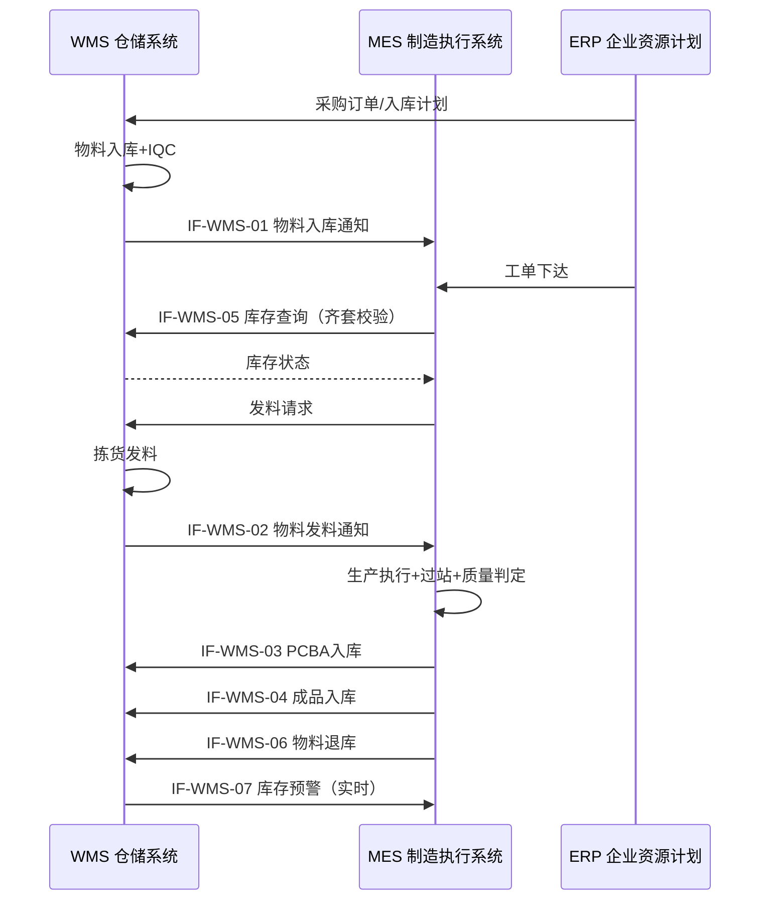
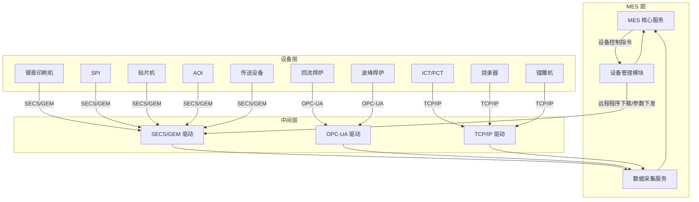
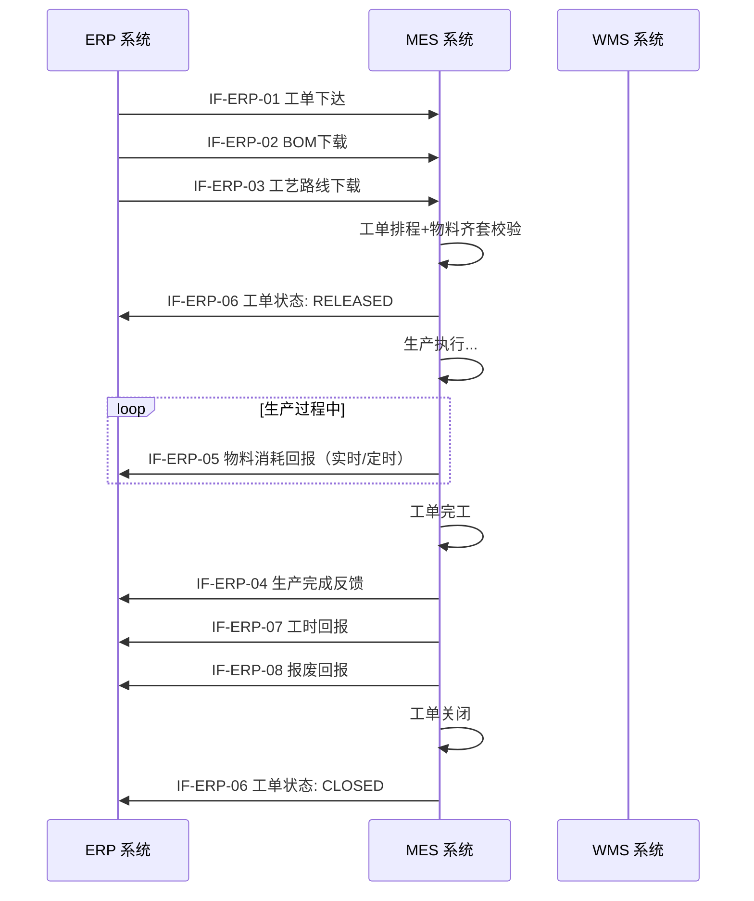

# PCBA 系统集成域（System Integration Bounded Context）

> **限界上下文**：系统集成域  
> **统一语言**：IntegrationInterface, WMSConnector, EquipmentConnector, ERPConnector, InspectionDependency  
> **核心关注**：定义MES与WMS、设备、ERP等外部系统的集成接口，以及设备点检状态对工序就绪的前置依赖  

---

## 领域概述

系统集成域是 PCBA MES 系统的**通用域**，负责MES与外部系统（WMS、ERP、设备）之间的数据交换和流程协作，以及设备点检状态对生产执行的前置约束。本域定义了完整的集成接口规范、通信架构、数据流向和点检依赖规则。

**跨领域协作**：
- WMS集成接口与 **物料域** 的物料入库/发料/退库流程协作
- ERP集成接口与 **制造实体域** 的工单下达/BOM下载/完工反馈流程协作
- 设备集成与 **数据采集域** 的设备数据采集协议协作
- 点检状态依赖与 **制造实体域** 的工序就绪校验协作
- 关键测试设备冻结规则与 **质量域** 的检测结果有效性评估协作

---

# 系统集成架构

## 13.1 MES-WMS 集成

MES 与 WMS（仓储管理系统）之间的集成实现物料从入库、发料到产线、PCBA/成品入库的全链路闭环管理。

### 13.1.1 集成接口定义

| 序号 | 接口名称 | 方向 | 触发时机 | 数据内容 | 接口协议 |
|------|----------|------|----------|----------|----------|
| IF-WMS-01 | 物料入库通知 | WMS -> MES | 物料入库完成（IQC检验合格后） | 物料编码（material_code）、物料名称、批次号（lot_no）、入库数量、库位编码（location_code）、生产日期、有效期（expiry_date）、供应商批次号、IQC检验结果 | WebService / REST API |
| IF-WMS-02 | 物料发料通知 | WMS -> MES | 物料发料至产线（拣货完成） | 发料单号、工单号、物料编码、批次号、发料数量、目标线体/工位、发料时间、操作员ID | WebService / REST API |
| IF-WMS-03 | PCBA入库 | MES -> WMS | PCBA终检合格（QG-FINAL-01 通过）入库扫码 | SN列表、产品编码（product_code）、产品名称、数量、目标库位、入库时间、工单号、质量状态（合格） | WebService / REST API |
| IF-WMS-04 | 成品入库 | MES -> WMS | 整机终检合格（ASSY-06 通过）包装入库 | SN列表、产品编码、产品名称、数量、目标库位、入库时间、工单号、质量状态（合格）、包装方式 | WebService / REST API |
| IF-WMS-05 | 库存查询 | MES -> WMS | 上料前物料校验、产线物料盘点 | 查询条件：物料编码 + 批次号（可选）；返回：库存状态（可用/冻结/预留）、当前库存量、库位、有效期、MSD状态 | WebService / REST API（同步实时） |
| IF-WMS-06 | 物料退库 | MES -> WMS | 工单完工后退料、异常物料退回 | 退料单号、物料编码、批次号、退料数量、退料原因（工单完工/来料不良/超期等）、来源工单号 | WebService / REST API |
| IF-WMS-07 | 库存预警 | WMS -> MES | 安全库存低于阈值、物料即将过期 | 物料编码、当前库存、安全库存阈值、预警类型（低库存/即将过期/MSD即将超时） | 消息队列 / MQ |

### 13.1.2 集成数据流



---

## 13.2 MES-设备集成

MES 与产线设备之间的集成实现生产参数的自动采集、设备状态的实时监控和工艺程序的远程管理。

### 13.2.1 设备集成方案

| 设备类型 | 通信协议 | 数据采集内容 | 采集触发 | 数据量级 | 备注 |
|----------|----------|-------------|----------|----------|------|
| 锡膏印刷机 | SECS/GEM | 印刷压力、印刷速度、脱模速度、钢网ID、锡膏批号、刮刀角度、印刷周期时间 | 工序完成（每板） | ~2KB/板 | 同时接收设备报警事件（E5/F0） |
| SPI（锡膏检测机） | SECS/GEM | 检测结果（PASS/FAIL）、偏移量（X/Y/Theta）、锡膏厚度、覆盖面积、体积、3D形貌数据 | 检测完成（每板） | ~50KB/板 | 3D数据量较大，可根据需要配置为仅保存异常板数据 |
| 贴片机（高速+多功能） | SECS/GEM | 贴装程序名称与版本、料站表（站位-料号映射）、贴装数量、抛料率、吸嘴编号、贴装周期时间、各站位物料余量 | 工序完成（每板） | ~10KB/板 | 支持远程程序下载（料站表校验） |
| 回流焊炉 | OPC-UA / SECS/GEM | 各温区设定温度、各温区实测温度、链速、峰值温度、保温时间、液相线以上时间、炉温曲线数据 | 持续采集（周期1s-5s）+ 每板关联 | ~1KB/s（持续） | 曲线数据与每块PCBA关联；支持炉温曲线实时监控与超差报警 |
| AOI（自动光学检测） | SECS/GEM | 检测结果（OK/NG/REVIEW）、缺陷类型编码、缺陷坐标（X/Y）、缺陷图像（缩略图+原图路径）、检测程序版本 | 检测完成（每板） | ~200KB/板（含图像） | 缺陷图像可存储至文件服务器，MES记录路径 |
| 波峰焊炉 | OPC-UA | 预热温度（多区）、锡槽温度、波峰高度、链速、助焊剂喷涂量、氮气浓度（如有） | 持续采集（周期2s-5s）+ 每板关联 | ~0.5KB/s（持续） | 关键参数与每块PCBA关联 |
| ICT/FCT（工装测试机） | TCP/IP 自定义协议 / SECS/GEM | 测试程序版本、测试项明细（各子项PASS/FAIL）、测试数值、上下限值、测试时间 | 测试完成（每板） | ~5KB/板 | 测试数据明细JSON格式；支持Golden Unit验证 |
| 烧录器 | USB / TCP/IP 自定义协议 | 固件版本、烧录结果（PASS/FAIL）、烧录校验结果（read-back checksum）、烧录时间、芯片型号 | 烧录完成（每板） | ~1KB/板 | 校验失败的板标记隔离 |
| 镭雕机 | TCP/IP 自定义协议 | 打标内容、打标结果、激光功率、打标时间 | 打标完成（每板） | ~0.5KB/板 | 打标内容与MES分配的SN比对校验 |
| 上板机/翻板机/传送轨道 | SECS/GEM 或 I/O 信号 | 板通过信号、设备状态（运行/待机/故障） | 板通过时 | ~0.2KB/板 | 主要用于WIP位置跟踪 |

### 13.2.2 通信架构



### 13.2.3 设备数据采集时效

| 数据类型 | 采集方式 | 延迟要求 | 用途 |
|----------|----------|----------|------|
| 过站结果 | 事件驱动（工序完成即上传） | < 5s | WIP状态更新、实时看板 |
| 工艺参数 | 事件驱动 + 周期性上报 | < 10s | 参数追溯、SPC分析 |
| 检测数据 | 事件驱动（检测完成即上传） | < 5s | 质量判定、门禁执行 |
| 炉温曲线 | 周期性持续采集 | < 5s/次 | 实时监控、超差报警 |
| 设备状态 | 周期性上报 + 状态变化事件 | < 10s | 设备OEE、状态看板 |
| 设备报警 | 事件驱动（报警即上传） | < 2s | 异常响应、Andon系统 |

---

## 13.3 MES-ERP 集成

MES 与 ERP 之间的集成实现从计划到执行再反馈的完整闭环，确保生产数据与财务/供应链数据的一致性。

### 13.3.1 集成接口定义

| 序号 | 接口名称 | 方向 | 触发时机 | 数据内容 | 接口协议 |
|------|----------|------|----------|----------|----------|
| IF-ERP-01 | 工单下达 | ERP -> MES | ERP中工单状态变更为"已下达" | 工单号（wo_id）、产品编码（product_code）、产品名称、计划数量（planned_qty）、计划开始时间、计划完成时间、优先级、关联销售订单号 | WebService / REST API / ESB |
| IF-ERP-02 | BOM下载 | ERP -> MES | 工单下达后、生产开始前 | 工单号、BOM版本号、BOM行项目列表：行号、物料编码、物料名称、规格型号、单位用量、位号（RefDes）、替代料信息、发料方式（推式/拉式） | WebService / REST API / ESB |
| IF-ERP-03 | 工艺路线下载 | ERP -> MES | 工单下达后 | 工单号、工艺路线编码、路线版本、工序列表：工序编码、工序名称、工序顺序号、标准工时、设备类型要求 | WebService / REST API / ESB |
| IF-ERP-04 | 生产完成反馈 | MES -> ERP | 工单完工（状态变为 COMPLETED） | 工单号、实际完工数量（completed_qty）、报废数量（scrapped_qty）、实际开始时间、实际完成时间、总工时 | WebService / REST API / ESB |
| IF-ERP-05 | 物料消耗回报 | MES -> ERP | 实时（关键物料）/ 定时（非关键物料）/ 工单关闭时汇总 | 工单号、物料编码、批次号、消耗数量、消耗时间、消耗工序、反冲标识 | WebService / REST API / MQ |
| IF-ERP-06 | 工单状态同步 | MES -> ERP | 工单状态变更（HOLD/CANCELLED/CLOSED） | 工单号、状态变更类型、变更时间、变更原因、操作人员 | WebService / REST API / MQ |
| IF-ERP-07 | 工时回报 | MES -> ERP | 工单完工或按班次定时 | 工单号、工序编码、直接工时、间接工时、人员ID、班次 | WebService / REST API |
| IF-ERP-08 | 报废回报 | MES -> ERP | 在制品报废审批通过 | 报废单号、工单号、SN、产品编码、报废工序、报废原因编码、报废数量 | WebService / REST API |

### 13.3.2 集成时序



---

## 13.4 设备点检状态依赖

MES 工序执行与设备点检状态之间存在严格的耦合规则，确保只有点检合格的设备才能用于生产。

### 13.4.1 工序就绪前置校验规则

工序从 IDLE 状态转换到 READY 状态时，MES 须执行以下校验链：

```
工序状态 IDLE
    │
    ▼
校验1: 指定设备编号的最近一次点检结果是否为"合格"？
    │
    ├── 是 ──► 校验2
    │
    └── 否 ──► 工序不允许进入 READY
                ├── 点检不合格 → 触发 EX-EQP-02，须维修并复检合格
                └── 未执行点检 → 提示须先完成点检
    │
    ▼
校验2: 点检时间是否在有效期内？
    │
    ├── 是 ──► 校验3
    │
    └── 否 ──► 工序不允许进入 READY
                └── 点检超期 → 提示须重新执行点检
    │
    ▼
校验3: 关键设备校准是否在有效期内？
    │
    ├── 是 ──► 工序进入 READY，允许过站
    │
    └── 否 ──► 触发 EX-EQP-03，冻结该设备关联工站
```

### 13.4.2 点检有效期规则

| 点检类型 | 有效期 | 说明 |
|----------|--------|------|
| 班前点检 | 当班有效 | 换班后须重新执行班前点检；跨班生产时须在下一班开工前完成点检 |
| 日点检 | 24小时 | 从点检完成时间起算，24小时内有效 |
| 周点检 | 7天 | 从点检完成时间起算，7天内有效 |
| 月保养 | 30天 | 从保养完成时间起算，30天内有效 |
| 季保养 | 90天 | 从保养完成时间起算，90天内有效 |
| 异常复检 | 单次有效 | 仅针对当前维修/调整后的首次开工有效，正常生产后回归常规点检周期 |

### 13.4.3 点检数据接口

| 接口 | 方向 | 触发时机 | 数据内容 |
|------|------|----------|----------|
| 点检结果推送 | 点检系统 -> MES | 点检任务完成（判定合格/不合格） | 设备编号、点检类型、点检项目明细（项目名称-标准值-实测值-判定结果）、总体判定、执行人、执行时间、有效期截止时间 |
| 点检状态查询 | MES -> 点检系统 | 工序就绪校验时（实时同步查询） | 查询条件：设备编号 + 点检类型；返回：最近一次点检结果、执行时间、有效期截止时间、是否合格 |
| 点检异常通知 | MES -> 点检系统 | 设备在点检有效期内发生异常（如设备故障维修后） | 设备编号、异常描述、请求异常复检 |

### 13.4.4 关键测试设备冻结规则

以下关键测试设备点检不合格时，MES 执行自动冻结：

| 设备类型 | 冻结范围 | 冻结动作 | 受影响在制品处置 | 解除条件 |
|----------|----------|----------|-----------------|----------|
| SPI | 该SPI所在工站的出站 | 禁止该工站在制品出站（过站结果不确认） | 点检不合格前已出站的在制品，评估SPI检测结果的有效性；点检不合格后未出站的在制品，等待复检合格后重新检测 | 设备复检合格 + 用标准板验证通过 |
| AOI | 该AOI所在工站的出站 | 禁止该工站在制品出站 | 点检不合格前已出站的在制品，评估AOI检测结果的有效性（抽样人工复判）；点检不合格后未出站的在制品，等待复检合格后重新检测 | 设备复检合格 + 标准缺陷样片验证通过 |
| ICT/FCT | 该测试工站的出站 | 禁止该工站在制品出站 | 点检不合格前已测试的在制品，评估测试结果的有效性（抽样用Golden Unit复测）；点检不合格后未测试的在制品，等待复检合格后重新测试 | 设备复检合格 + Golden Unit测试PASS |
| 联测设备 | 整个联测工站 | 禁止该联测工站所有在制品出站 | 同上，评估已测产品有效性 | 全部子系统复检合格 + Golden Unit联测PASS |

---

