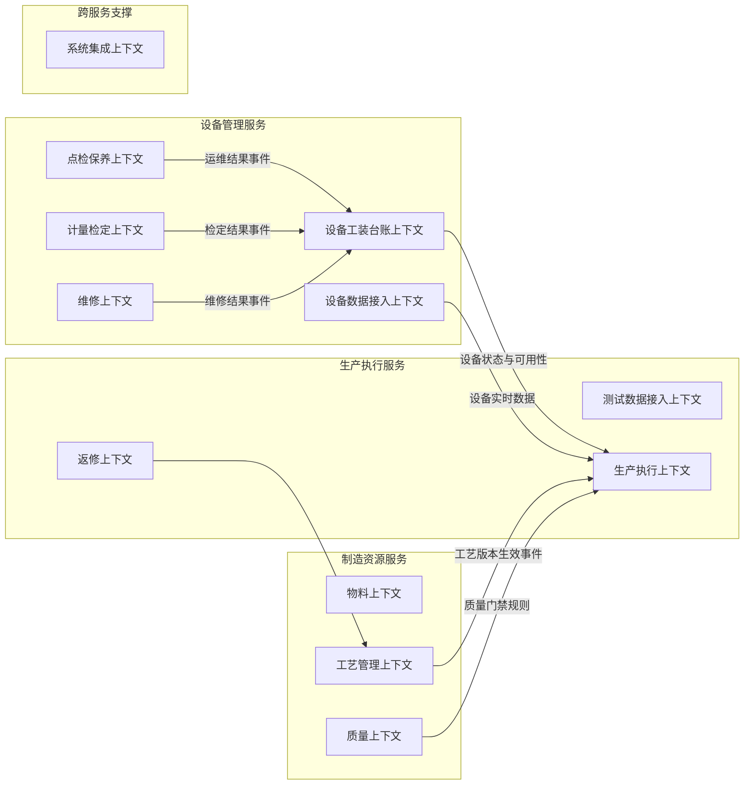

# MES 领域模型总览

## 1. 建模背景

本 MES 面向**电子制造（SMT/PCBA）+ 整机组装（Box Build/Final Assembly）**混合型车间，采用前段 PCBA 电子制造、后段整机装配与交付的两段式生产架构。

两类产品在物料形态、工艺路径与质量管控点上存在差异，但在工单、批次、设备、人员与质量数据层面需要统一建模，并支撑贯通追溯、防错校验与实时生产执行。

系统计划拆分为三个核心服务：

| 服务 | 领域定位 | 核心职责 | 建模状态 |
|------|----------|----------|----------|
| 制造资源服务 | 生产执行的数据基座 | 基础台账、工艺路线、产品/BOM、质量规则等配置性数据管理 | 待建模 |
| 设备管理服务 | 设备全生命周期与运维中心 | 设备资产台账、数据接入、点检保养、计量检定、维修 | 已建模 |
| 生产执行服务 | 现场生产活动执行引擎 | 过点、工位数据采集、返修、在制品追踪、工艺缓存 | 部分建模 |

---

## 2. 已建模的限界上下文

以下限界上下文已完成事件风暴建模，按所属服务组织在 `MES领域模型/` 目录下：

### 2.1 设备管理服务（已建模）

| 限界上下文 | 目录 | 建模深度 | 核心职责 |
|-----------|------|---------|---------|
| 设备工装台账上下文 | `设备管理服务/事件风暴/` | 事件风暴 + 领域建模 | 实物资产（设备/工装夹具/计量器具）从入账到报废的全生命周期管理，负责身份、归属、状态与可用性聚合视图 |
| 设备数据接入上下文 | `设备管理服务/事件风暴/` | 事件风暴 | 从设备原始信号到被 MES 可靠接收的完整采集链路，涵盖边缘网关、协议适配、补传与数据质量标记 |
| 点检保养上下文 | `设备管理服务/事件风暴/` | 事件风暴 | 预防性运维：规则定义、计划调度、任务执行到结果签核 |
| 计量检定上下文 | `设备管理服务/事件风暴/` | 事件风暴 | 计量器具的周期检定计划、送检/收回流程、证书管理与过期预警 |
| 维修上下文 | `设备管理服务/事件风暴/` | 事件风暴 | 纠正性运维：故障报告、派工、诊断、维修执行、验收到关单 |

### 2.2 生产执行服务（部分建模）

| 限界上下文 | 目录 | 建模深度 | 核心职责 |
|-----------|------|---------|---------|
| 测试数据接入上下文 | `生产执行服务/事件风暴/` | 事件风暴 | 从多种异构渠道（FTP 文件、HTTP 回调、手工填报）汇集测试数据到生产执行服务 |

### 2.3 跨服务

| 限界上下文 | 目录 | 建模深度 | 核心职责 |
|-----------|------|---------|---------|
| 系统集成上下文 | `跨服务/事件风暴/` | 事件风暴 | MES 与 WMS、设备、ERP 等外部系统的集成接口定义，以及设备点检状态对工序就绪的前置依赖 |

---

## 3. 待建模的限界上下文

以下上下文在架构规划中已定义但尚未落地文档，待后续补建：

### 3.1 制造资源服务（待建模）

| 限界上下文 | 预期职责 |
|-----------|---------|
| 物料上下文 | 物料主数据、产品 BOM、供应商、替代料等基础数据 |
| 工艺管理上下文 | 工序定义、参数模板、工艺路线、版本生命周期、步骤配置与生效发布 |
| 质量上下文 | 检验标准、缺陷分类、质量门禁规则配置 |

### 3.2 生产执行服务（待建模）

| 限界上下文 | 预期职责 |
|-----------|---------|
| 生产执行上下文 | 扫码过点、放行/拦截、过点记录、在制品位置与流转历史 |
| 返修上下文 | 返修工单、返修流程、返修结果、再入点判定 |

---

## 4. 领域划分全局视图

---

## 5. 限界上下文与服务映射

| DDD 领域 | 归属服务 | 建模状态 | 说明 |
|----------|----------|----------|------|
| 设备工装台账上下文 | 设备管理服务 | 已建模 | 资产生命周期、身份归属、状态管理与可用性聚合视图 |
| 设备数据接入上下文 | 设备管理服务 | 已建模 | 边缘网关接入、协议适配、原始信号采集、补传与质量标记 |
| 点检保养上下文 | 设备管理服务 | 已建模 | 预防性运维规则、计划、执行与结果 |
| 计量检定上下文 | 设备管理服务 | 已建模 | 计量器具周期检定、送检流程与证书管理 |
| 维修上下文 | 设备管理服务 | 已建模 | 纠正性运维全流程与备件消耗 |
| 测试数据接入上下文 | 生产执行服务 | 已建模 | 多渠道异构测试数据汇集与结构化 |
| 系统集成上下文 | 跨服务 | 已建模 | 外部系统集成接口与跨服务事件编排 |
| 物料上下文 | 制造资源服务 | 待建模 | 物料主数据、BOM、替代料 |
| 工艺管理上下文 | 制造资源服务 | 待建模 | 工序、参数模板、工艺路线与版本管理 |
| 质量上下文 | 制造资源服务 | 待建模 | 检验标准、缺陷分类、质量门禁 |
| 生产执行上下文 | 生产执行服务 | 待建模 | 过点引擎、WIP 管理、放行/拦截 |
| 返修上下文 | 生产执行服务 | 待建模 | 返修工单与再入点判定 |

---

## 4. 跨服务协作模型

### 4.1 服务调用关系

| 调用方 | 被调用方 | 调用方式 | 场景 | 延迟要求 |
|--------|----------|----------|------|----------|
| 生产执行服务 | 制造资源服务 | 事件订阅 | 工艺版本同步 | 秒级 |
| 生产执行服务 | 制造资源服务 | REST 查询 | 工艺缓存未命中降级查询 | ≤500ms |
| 生产执行服务 | 设备管理服务 | REST 查询 | 过点时查询设备实时数据 | ≤200ms |
| 生产执行服务 | 设备管理服务 | 事件订阅 | 设备状态变更同步 | 秒级 |
| 制造资源服务 | 生产执行服务 | 单向事件发布 | 工艺版本生效通知 | — |
| 设备管理服务 | 生产执行服务 | 单向事件发布 | 设备状态变更通知 | — |

### 4.2 关键协作场景

| 场景 | 主导服务 | 协作服务 | 协作方式 |
|------|----------|----------|----------|
| 工艺变更生效 | 制造资源服务 | 生产执行服务 | 发布事件，生产执行服务刷新工艺缓存 |
| 过点校验 | 生产执行服务 | 制造资源服务 | 优先读本地缓存，缓存未命中时降级远程查询 |
| 过点设备数据校验 | 生产执行服务 | 设备管理服务 | 按需同步查询设备实时数据 |
| 设备状态变更 | 设备管理服务 | 生产执行服务 | 发布状态变更事件，生产执行服务刷新设备状态缓存 |
| 点检超期锁定 | 设备管理服务 | 生产执行服务 | 设备状态变为不可用，过点时拦截 |
| 保养完成恢复 | 设备管理服务 | 生产执行服务 | 设备状态变为可用，过点时放行 |
| 质量门禁拦截 | 生产执行服务 | 制造资源服务 | 读取缓存中的质量门禁规则并执行判定 |
| 返修再入点判定 | 生产执行服务 | 制造资源服务 | 读取返修规则与再入点配置 |

### 4.3 领域事件

| 事件 | 发布服务 | 订阅服务 | 作用 |
|------|----------|----------|------|
| ProcessRouteActivated | 制造资源服务 | 生产执行服务 | 工艺版本生效后刷新生产执行服务的工艺路线缓存 |
| 设备状态变更事件 | 设备管理服务 | 生产执行服务 | 设备状态变化后刷新生产执行服务的设备状态缓存 |

---

## 5. 一致性与追溯原则

### 5.1 工艺一致性

- 工艺数据写少读多，写入主要发生在版本发布时。
- 生产执行服务通过订阅工艺版本生效事件维护本地缓存。
- 缓存未命中时允许实时查询制造资源服务作为降级路径。
- 工艺版本变更仅影响变更后首次过点的在制品。
- 过点记录保存 `routeVersion`，保证历史追溯不受后续工艺变更影响。

### 5.2 设备状态一致性

- 设备管理服务是设备状态事实来源。
- 生产执行服务订阅设备状态变更事件并维护本地缓存。
- 过点时优先读取本地设备状态缓存。
- 缓存未命中时降级查询设备管理服务。

### 5.3 事务边界

- 过点记录、放行/拦截结果、装配数据与 AOI/SPI 工位级数据采集属于生产执行服务内的同一业务事务。
- 设备级高频数据采集属于设备管理服务，与生产过点解耦。
- 跨服务同步通过事件或查询完成，不在过点主事务中引入分布式事务。

### 5.4 消息可靠性

- 工艺版本生效事件采用事务发件箱模式，保证至少一次投递。
- 生产执行服务消费事件时需要幂等处理，避免重复消费产生副作用。
- 设备状态变更事件用于刷新本地状态缓存，消费端同样需要幂等处理。

---
