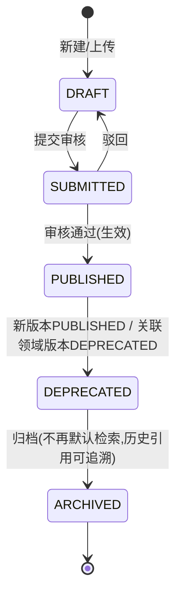

# 文档型 RAG 详细设计（向量检索 + 版本治理）

> 本文是 [RAG服务引入路线.md](../RAG服务引入路线.md) §2.2 路线 B（文档型 RAG）的落地展开，输出**技术栈、文档领域建模、摄入与切分、版本治理与重索引、检索生成、与领域耦合点、关键设计决策与约束落地**。
> **技术栈**：Python（FastAPI + **ChromaDB** + LlamaIndex + Pydantic）。RAG 服务与三大 MES 服务（Java/Spring）跨语言共存，通过 Kafka 只读事件 + REST 只读查询解耦，互不侵入。
> **口径纪律**：文档型 RAG 在本项目中是**设计阶段的引入规划**，不是线上已落地能力。讲法遵循 [项目亮点与指标卡片.md](../../面试指南/项目亮点与指标卡片.md) §0 的口径纪律--说"规划方向 / 设计取舍"，不说"我们已经做了文档 RAG"。MES 领域对错误答案零容忍（错给一条已失效 SOP 会直接导致批量不良），所以本文强调**向量是主体，但版本治理才是灵魂**--检索必须带版本锚点（`version_kind`+`version`+`version_ref_id`）/ 生效状态过滤，且由领域事件驱动重索引，而非堆模型。

---

## 1. 设计目标与边界

### 1.1 目标

把 MES 车间的**半结构化 / 非结构化知识**（SOP、作业指导书、IPC 标准、设备维修手册、检验标准、历史 8D 报告、培训资料）做成可被 LLM 检索 + 综合的**向量知识库**，让"SPI 报警怎么处置""首件检验流程是什么"这类问题不再依赖工程师翻文档 / 翻历史聊天，而是一次向量检索 + LLM 综合即给答案 + **可点开的来源引用**。

典型场景：

1. **操作工 / 线长**："SPI 3 号机报 solder_insufficient 怎么处置？" -> 检索 SPI 报警处置 SOP + 设备维修手册对应章节 -> 给一句话原因 + 一个动作 + 引用片段。
2. **工艺 / 质量工程师**："首件检验流程是什么？" -> 检索首件检验标准（绑定当前生效工艺版本）-> 给流程步骤 + 引用。
3. **设备工程师**："贴片机 M-200 报 E027 怎么修？" -> 检索该设备型号维修手册 + 历史同类维修记录 -> 给处置步骤 + 引用。
4. **与追溯型协同**：追溯型 RAG 给"这条单件用了哪批锡膏、哪台设备"（结构化事实链），本文档给"SPI 报警怎么处置"（处置知识）--两者版本过滤都对齐 `ProcessRouteActivated`。

### 1.2 硬边界（一开口就要讲）

| 边界 | 说明 | 落地 |
|------|------|------|
| **只读 MES** | 文档库归 RAG 服务自有；RAG 对 MES 只读--订阅事件 + 只读 REST 查文档绑定关系，从不回写 MES | 文档元数据 / 向量存 ChromaDB（RAG 自有库）；订阅 `process.*` / `material.*` / `quality.*` 只读事件；降级查询只读 REST |
| **不进过点主事务** | 摄入 / 重索引异步消费事件，与过点判定完全解耦 | 过点 P99 ≤200ms（[领域总览.md](../../领域模型/领域总览.md) §4.1）不受文档索引影响；文档检索容忍秒级延迟（[RAG服务引入路线.md](../RAG服务引入路线.md) §4） |
| **版本一致性** | 工艺 / BOM / 质量规则有版本生命周期，检索 SOP / 作业指导书必须带版本过滤，否则答出**已失效工艺** | 文档版本绑定版本锚点（`version_kind`+`version`+`version_ref_id`） / `bom_version` / `rule_version`；订阅 `ProcessRouteActivated` 等触发重索引；检索带 `version` + `status=PUBLISHED` 过滤（§5.4 / §6.2） |
| **权限隔离** | 不同车间 / 产线 / 角色能看的文档不同，检索层带租户 / 权限上下文 | 文档元数据带 `tenant_scope`，向量检索时**前置过滤**（ChromaDB where pre-filter），不是答完再裁剪 |
| **可观测兜底** | 所有答案带来源引用 + 置信度，低置信度转人工 / 转规则引擎 | 检索结果结构化（chunk_id + 文档版本 + 页码/定位）+ 置信度阈值；与 MES 防错理念一致：宁可拦下让人判 |
| **部署形态** | 车间网络常与办公网隔离，需本地化向量库 / Embedding / 模型 | ChromaDB + bge-m3 本地化部署；LLM 视安全策略云端 API 或本地化模型二选一（§2.5） |

### 1.3 与追溯型 RAG、L1 Agent 的关系

文档型 RAG（路线 B）与追溯型 RAG（路线 A，[追溯型 RAG-详细设计.md](../追溯型 RAG/追溯型 RAG-详细设计.md)）不是替代，是**互补分工**，二者共享同一套版本治理契约：

| | 追溯型 RAG（路线 A） | 文档型 RAG（路线 B，本文） |
|---|-------------------|--------------------------|
| 检索主体 | 属性图（GraphRAG + 领域事件流） | 向量库（ChromaDB） |
| 答的是 | "这条单件 5M1E 全貌"（结构化事实链） | "SPI 报警怎么处置"（处置知识） |
| 数据来源 | 14 上下文聚合根的事件投影 | SOP / 手册 / 标准 / 8D 等文档 |
| 版本一致性 | `SNAPSHOT_OF_ROUTE` 快照边锁当时版本 | 文档版本绑定版本锚点（`version_kind`+`version`+`version_ref_id`） + 重索引 |
| 协同点 | `TraceAnswer.suggested_action` 调本文 `search_docs(query, version_anchor)` | 本文接收追溯型发布的 `rag.reindex.request` 事件触发重索引 |

- **L1 诊断型 Agent**（[AGENT服务引入路线.md](../../AGENT服务/AGENT服务引入路线.md) §2.2）把本文 `POST /rag/docs/query` 封装成 `search_docs` 工具，作为其多步推理的"处置知识"工具之一；与 `query_traceability_graph`（追溯型）并列。
- **落地顺序**：先 B 后 A（[RAG服务引入路线.md](../RAG服务引入路线.md) §3）。文档型 2–4 周可出 demo，先验证"车间到底有没有人用 RAG"；追溯型建立在领域事件和过点记录上，是护城河但建模重。

### 1.4 与 Java 技术栈的关系

- RAG 服务用 Python，**不替换** MES 三大服务的 Java/Spring 栈--只订阅 Kafka 只读事件、调只读 REST 查文档绑定关系。
- 跨语言的物理边界反而是好事：RAG 服务无法共享 Java 事务 / 内存，天然强制只读、不进过点主事务、不旁路应用服务写路径。
- 复用 [实现说明](../../实现说明/) 既有的 Kafka topic、REST 只读接口、领域事件 envelope（`event_id` / `event_type` / `event_version` / `occurred_at` / `source_service` / `trace_id` / `partition_key`，见 [消息处理实现说明.md](../../实现说明/业务事件/消息处理实现说明.md) §4.3）、消费侧幂等模式（§6 同事务幂等 + 手动 ack），不造新契约。

---

## 2. 技术栈

### 2.1 选型总览

| 层次 | 选型 | 选型理由 |
|------|------|---------|
| 语言 | Python 3.11+ | 类型提示 + Pydantic 校验，AI 生态最成熟，与追溯型 RAG / L1 Agent 同栈复用 LLM 抽象 |
| Web 框架 | **FastAPI** | 异步、原生 OpenAPI，与追溯型一致，适合做检索 HTTP 入口 |
| 向量存储 | **ChromaDB** 0.5+（嵌入式 persistent client，Parquet 持久化） | 跟随 rag-service 进程，零额外 DB service；LlamaIndex `llama-index-vector-stores-chroma` 的 `ChromaVectorStore`；distance=cosine（bge-m3 1024 维）；chunk 不可变 + 强制带版本绕开写事务弱点，见 §2.3 |
| 向量存储（未来甜区备选） | Milvus / Qdrant | 文档量或 QPS 上到专用向量库甜区时切换，LlamaIndex `VectorStoreIndex` 抽象兜底，见 §2.3 |
| 检索编排 | **LlamaIndex** `VectorStoreIndex` | 文档摄入 / 切分 / 向量检索 / Rerank 的上层抽象，文档型 RAG 的主场 |
| LLM 抽象 | `langchain-core` 的 `BaseChatModel` | 模型可插拔，配置切换 Claude / 通义千问 / DeepSeek / 本地化模型，与追溯型 / L1 一致 |
| Embedding | **bge-m3**（多语种，可本地化，1024 维） | SOP / 手册 / 问题的语义向量化，覆盖中英文，与追溯型同模型同维度 |
| Rerank | **bge-reranker-v2-m3**（可本地化） | 向量召回后精排，提升 top-k 相关性，中英文兼顾 |
| 数据校验 | **Pydantic v2** | 检索请求 / 文档视图 / 答案 DTO 的 schema 即类型 |
| HTTP 客户端 | **httpx**（异步） | 降级查询各上下文只读 REST（查文档与领域版本的绑定关系） |
| 消息 | **aiokafka** | 订阅领域事件（`process.*` / `material.*` / `quality.*`）触发重索引，异步非阻塞 |
| 元数据持久化 | **ChromaDB client**（向量+元数据）+ **MySQL**（幂等/位点/审计表） | ChromaDB 存向量 + chunk 元数据（`version_kind` / `version_ref_id` / `version` / `state` / `tenant_scope` / `doc_id` / `doc_type` / `chunk_seq` / `locator`）；MySQL 存储幂等表、位点表、审计表（治理/审计 GROUP BY 聚合在 MySQL 做，ChromaDB 无聚合查询） |
| 对象存储 | **MinIO**（与既有 [MinIO配置说明.md](../../实现说明/基础设施/MinIO配置说明.md) 一致） | 原始文档文件（PDF / Word / 图片）存对象存储，向量库只存文本 chunk + 向量 + 定位 |
| 缓存 | **redis-py (async)** | 检索结果短期缓存（同 query + 版本 + 租户命中即用） |
| 可观测 | **OpenTelemetry Python** + `prometheus-client` | trace 串联、指标告警 |
| 配置 | pydantic-settings | 环境变量 / 配置文件统一管理 |
| 部署 | 独立微服务 `rag-doc-service`（uvicorn + gunicorn worker） | 与三大服务同网格，K8s 部署 |

### 2.2 为什么是纯向量检索（而非 GraphRAG）

- 文档型 RAG 处理的是**非结构化文本**：SOP 的某段处置步骤、手册的某章故障代码说明，答案集中在少数段落，是"局部、事实性"查询（见 [基础问题.md](../问题归纳/基础问题.md) §二"传统 RAG 适用场景"）。
- 文档之间是**弱关联**（一份 SOP 和一份手册之间没有 `source_work_order_id` 这种显式引用），向量相似度足以召回，不需要图遍历。
- 这区别于追溯型 RAG（路线 A）：追溯链是结构化关系（`SN -> 过点记录 -> 设备 / 工艺版本 / 物料批次`），必须 GraphRAG 把引用建成图边（[追溯型 RAG-详细设计.md](../追溯型 RAG/追溯型 RAG-详细设计.md) §2.2）。
- **一句话**：答案藏在某段话里 -> 向量检索（本文）；答案靠"关系拼出来" -> GraphRAG（追溯型）。两者在 MES 里分工互补（[基础问题.md](../问题归纳/基础问题.md) §五）。

### 2.3 为什么选 ChromaDB（而非 PGVector / Milvus / Qdrant）

车间 ToB 文档量小（数千文档、数十万 chunk 以内），查询强制带版本锚点（`version`+`version_kind`）（版本过滤退化成单字段等值，ChromaDB `where` 能做且 pre-filter），开发求简（嵌入式零额外服务、LlamaIndex `ChromaVectorStore` 最成熟、不用装 PG+pgvector+asyncpg+Alembic PG 方言）。**chunk 不可变**绕开 ChromaDB 多记录翻转无事务的弱点。

| 维度 | ChromaDB（本文选择） | PGVector | Milvus / Qdrant |
|------|---------------------|----------|-----------------|
| 部署复杂度 | **嵌入式 persistent client**，跟随 rag-service 进程，零额外 DB service | 需 PostgreSQL 实例 + pgvector 扩展 | 独立集群，运维 + 资源开销更大 |
| 标量过滤 | `where={"state":"PUBLISHED","version_kind":"route","version":rv,"tenant_scope":{"$in":scopes}}` pre-filter，等值+IN 够用 | 完整 SQL，表达力最强 | 标量字段过滤，复杂组合表达力弱于 SQL |
| 元数据与向量一致性 | 元数据与向量同 collection，ChromaDB 单条原子 upsert；chunk 不可变绕开多记录翻转无事务 | 同库同事务，原子提交 | 元数据与向量常分库，跨库一致性需额外保证 |
| 检索吞吐 | 数十万 chunk + 等值 pre-filter 足够 | 数百万级 chunk 足够 | 千万级以上向量 + 高 QPS 时更优 |
| HA / 备份 | **弱**：Parquet 持久化 + MinIO 原始文件重建兜底（§5.6） | PostgreSQL 原生 HA/备份成熟 | 各库自带 HA 方案 |
| 聚合查询 | **无**：治理/审计聚合导出 MySQL（幂等/位点/审计表本就在 MySQL） | SQL GROUP BY 同库完成 | 各库自带聚合能力 |
| 规模上限 | 数十万 chunk 以内舒适，文档少不触发 | 数百万 chunk 可扩展 | 千万级以上 |

代价：HA/备份弱（MinIO 重建兜底）、无聚合（导出 MySQL）、规模上限（文档少不触发）、单写者并发（重索引量小可接受）。

对比结论：在文档少 + 强制带版本 + 求简的前提下，**ChromaDB 的简大于其弱**；PGVector 的 SQL 过滤 / 同库事务优势在本场景（等值版本过滤 + chunk 不可变）不再决定性。Milvus / Qdrant 保留为"未来甜区备选"（文档量或 QPS 上到专用向量库甜区时切换，LlamaIndex `VectorStoreIndex` 抽象保证切换成本可控）。

### 2.4 为什么版本治理建立在领域事件之上

- 文档型 RAG 最危险的环节是**工艺变更后文档没跟上**：工艺路线从 v1 升到 v2，若 SOP 还停在 v1 的处置步骤，操作工按失效 SOP 操作 -> 批量不良。这是和通用 RAG 最大的区别（[RAG服务引入路线.md](../RAG服务引入路线.md) §2.2 / §5 Q&A）。
- 版本一致性不是文档型 RAG 自己保证的，是**从领域模型兜上来的**--工艺版本有生命周期（`RouteVersionState`：DRAFT/SUBMITTED/ACTIVATED/DEPRECATED/ARCHIVED）、变更发 `ProcessRouteActivated` 事件、过点记录绑 `routeVersion`（[领域总览.md](../../领域模型/领域总览.md) §5.1）。文档型 RAG 只是严格遵循这套契约：
  1. 订阅 `ProcessRouteActivated` / `ProcessRouteDeprecated` / `BomActivated` / `QualityGateRuleActivated` 事件，触发关联文档重索引 / 重新绑定 / 状态流转（§5.4）。
  2. 检索时带版本锚点（`version_kind`+`version`）+ `status=PUBLISHED` 过滤，从结构上杜绝失效文档（§6.2）。
  3. 接收追溯型 RAG 发布的内部 `rag.reindex.request` 事件（[追溯型 RAG-详细设计.md](../追溯型 RAG/追溯型 RAG-详细设计.md) §5.4），与追溯型重索引对齐。
- 这套机制与追溯型 RAG 的"版本即节点 + 快照边"（[追溯型 RAG-详细设计.md](../追溯型 RAG/追溯型 RAG-详细设计.md) §4.4）是**同一套版本契约的两个投影面**：追溯型把版本做成图节点，本文把版本做成文档元数据过滤维度。两者都由 `ProcessRouteActivated` 驱动，保证"图里的工艺版本"与"文档绑定的工艺版本"一致。

### 2.5 部署形态（车间网隔离）

- 车间网络常与办公网隔离（[RAG服务引入路线.md](../RAG服务引入路线.md) §4 硬约束）。**建议**：向量库（ChromaDB）与 Embedding（bge-m3）/ Rerank（bge-reranker）本地化部署，LLM 视车间安全策略二选一--云端 API（质量高、需出网）或本地化模型（离线、质量折衷）。`BaseChatModel` 抽象保证两者切换零代码改动。
- 原始文档文件（PDF / Word / 图片）存 MinIO（与既有对象存储一致），向量库只存文本 chunk + 向量 + 定位（页码 / 段落偏移），避免大文件进 ChromaDB。
- 车间网若严格离线，LLM 走本地化模型（如 Qwen / DeepSeek 本地部署），bge-m3 / bge-reranker 本地 GPU 或 CPU 推理均可（文档型对延迟不敏感，CPU 推理可接受）。

---

## 3. 总体架构

```text
┌──────────────────────────────────────────────────────────────────┐
│ rag-doc-service（独立微服务，Python + FastAPI + ChromaDB）         │
│                                                                    │
│  ┌──────────────┐  ┌──────────────────────────────────────────┐  │
│  │ FastAPI      │─▶│ DocumentRetrievalService                  │  │
│  │ /rag/docs/*  │  │  query改写 -> 向量检索+过滤 -> rerank -> LLM │  │
│  └──────────────┘  └─────────────────┬────────────────────────┘  │
│                                      │                            │
│              ┌───────────────────────┼───────────────────────┐    │
│              ▼                       ▼                       ▼    │
│  ┌───────────────────┐  ┌─────────────────────┐  ┌──────────┐ │
│  │ DocumentIngestion │  │ VectorRetriever     │  │ LLM      │ │
│  │ Service           │  │ (ChromaDB where     │  │ Synth    │ │
│  │ 解析->切分->向量化 │  │  pre-filter)        │  └──────────┘ │
│  └────────┬──────────┘  └──────────┬──────────┘              │
│           │                        ▼                            │
│  ┌────────▼────────┐        ┌──────────────────┐                │
│  │ ReindexCoordinator│       │ MinIO            │                │
│  │ 事件 -> 重索引/绑定 │       │ (原始文档文件)    │                │
│  └────────┬────────┘        └──────────────────┘                │
│           │                                                        │
│  ┌────────▼──────────────────────────────────────┐               │
│  │ ChromaDB（persistent client，Parquet 持久化）    │               │
│  │  collection: document_chunks                   │               │
│  │  metadata: version_kind / version_ref_id / version / state / tenant_scope│               │
│  │  / doc_id / doc_type / chunk_seq / locator     │               │
│  │  + embedding（bge-m3, 1024 维, cosine）         │               │
│  └───────────────────────────────────────────────┘               │
│  ┌───────────────────────────────────────────────┐               │
│  │ MySQL（幂等 / 位点 / 审计 / 治理聚合）          │               │
│  │  index_idempotency / index_offset / audit_log │               │
│  └───────────────────────────────────────────────┘               │
└───────────────────────────────────┼──────────────────────────────┘
                                    │ 订阅领域事件（只读，触发重索引）
                          ┌─────────▼──────────┐
                          │ aiokafka Consumer   │
                          │ process.* material.*│
                          │ quality.*           │
                          │ + rag.reindex.*     │← 追溯型 RAG 重索引请求
                          └─────────────────────┘
                                    ▲
                                    │ 各上下文 Outbox 投递（至少一次）
              ┌─────────────────────┴─────────────────────┐
              │  制造资源 / 设备管理 / 生产执行 三大服务    │
              │  （Java/Spring，事实源）                   │
              └───────────────────────────────────────────┘
```

### 3.1 关键设计决策

- **文档库即 RAG 自有读模型**：`knowledge_document` / `document_version` / `document_chunk` 归 RAG 服务自有，是文档领域事件的投影。事实源是文档本身（MinIO 原始文件）+ 领域版本（MES 聚合根）；文档库崩溃不影响生产，重建即可（文档文件 + 事件回放）。
- **摄入与检索分离**：`DocumentIngestionService`（写：解析+切分+向量化+持久化）与 `VectorRetriever`（读：向量检索+过滤）解耦，摄入滞后不阻塞检索--检索带 `version` + `status=PUBLISHED` 过滤，未生效的新版本天然不召回。
- **版本治理三道闸**：① 摄入闸（文档版本绑定领域版本，状态机管控生效）；② 重索引闸（领域事件驱动文档状态流转 / 重新绑定）；③ 检索闸（向量检索带 `version` + `status` 前置过滤）。不靠口头约束（§5.4 / §6.2）。
- **元数据与向量同 collection**：ChromaDB 让文档版本 / 生效状态 / 租户 / 绑定关系与向量同存，组合过滤走 `where` pre-filter--这是版本治理能兜住的技术根基。chunk 不可变（写入后 metadata 固定），工艺升版追加新版本 chunk 而非翻转老 chunk，版本隔离靠查询过滤 `where version_kind`+`version`（§2.3 / §5.3）。
- **ACL 防腐层**：降级查询各上下文只读 REST（查文档与领域版本的绑定关系）经 ACL 适配，外部 DTO -> 内部视图（`DocumentVersionView` / `BindingView`），外部 schema 变化不污染检索核心。符合 CLAUDE.md 的低耦合 / ACL 约束。

---

## 4. 文档领域建模

文档型 RAG 自有一个轻量**文档子域**（RAG 服务内部，非 MES 14 上下文之一）。建模遵循 CLAUDE.md 的 OOD / DDD 约束：聚合根管一致性，值对象管不变量，领域服务编排跨实体逻辑。

### 4.1 文档类型分类（按是否绑定领域版本）

文档按"是否随领域版本变化"分三类，直接决定版本治理策略：

| 类别 | 文档类型 | 是否绑定领域版本 | 版本治理策略 |
|------|---------|----------------|-------------|
| **工艺绑定型** | SOP、作业指导书、检验标准 | ✅ 绑定版本锚点（`version_kind`+`version`+`version_ref_id`） | 随工艺版本生命周期重索引；检索必须带版本过滤 |
| **设备绑定型** | 设备维修手册、设备操作手册 | ✅ 绑定 `asset_id` / 设备型号 | 按文档自身版本管理，不随工艺版本变；检索按设备 / 型号过滤 |
| **通用知识型** | IPC 标准、培训资料、8D 报告 | ✗ 不绑定具体领域版本 | 按文档自身版本 + 生效状态管理；检索按主题 / 标签过滤 |

> 🔴 **8D 报告是否纳入 MVP**：8D 是历史处置案例（"曾经怎么处理的"），与 SOP / 手册（"应该怎么做"）性质不同--前者是案例检索，后者是规范检索。是否在 MVP 阶段纳入 8D、是否单独做案例型检索（可能需不同切分 / 提示词策略）交还用户决策。本文 MVP 先不纳入，放 §9 扩展。

### 4.2 聚合根 / 实体 / 值对象

```text
KnowledgeDocument（聚合根）
  ├─ document_id            文档唯一标识
  ├─ doc_type               文档类型（SOP / MANUAL / STANDARD / ...）
  ├─ title                  标题
  ├─ category               类别（工艺绑定型 / 设备绑定型 / 通用知识型）
  ├─ tenant_scope           租户范围（workshop/line，权限过滤）
  └─ DocumentVersion（实体，版本集合）
       ├─ version_id            版本唯一标识
       ├─ document_id           归属文档
       ├─ version_no            版本号
       ├─ state                 版本状态（DRAFT/SUBMITTED/PUBLISHED/DEPRECATED/ARCHIVED）
       ├─ source                DocumentSource（值对象：上传 / 同步 / 来源系统）
       ├─ file_ref              原始文件 MinIO URI
       ├─ effective_at          生效时间
       ├─ deprecated_at         废弃时间
       ├─ DocumentBinding（值对象，绑定关系集合）
       │    ├─ binding_type     绑定维度（route / bom / rule / asset / standard）
       │    ├─ target_ref       绑定目标（如 version_ref_id+version+version_kind）
       │    └─ inherited        是否继承自上一版本（§4.4）
       └─ DocumentChunk（实体，分块集合）
            ├─ chunk_id             分块唯一标识
            ├─ version_id           归属版本
            ├─ ordinal              分块序号
            ├─ text                 分块文本
            ├─ embedding            向量（bge-m3, 1024 维）
            ├─ locator              ChunkLocator（值对象：页码 / 段落偏移 / 标题路径）
            └─ section_type         章节类型（步骤 / 故障代码 / 参数 / 注意事项 / ...）
```

- **`KnowledgeDocument` 是聚合根**：管文档元信息 + 版本集合的一致性。一个文档可有多个版本，但同一时间**同类绑定唯一 PUBLISHED**（对齐工艺 INV-02"同 route 唯一 ACTIVE"、物料 INV-02"同 product 同 bom_type 唯一 ACTIVE"）。
- **`DocumentVersion` 是聚合内实体**：版本是文档的不可变快照，一旦 PUBLISHED 后内容不可改（对齐 `CheckpointRecord` INV-12 不可变）。改内容只能发新版本。
- **`DocumentChunk` 是版本内实体**：分块属于某个版本，随版本生命周期。向量挂在 chunk 上。
- **`DocumentBinding` 是值对象**：绑定关系是不可变的，描述"这个文档版本对齐哪个领域版本"。`inherited` 标记绑定是否从上一版本继承（§4.4）。
- **领域服务**：
  - `DocumentIngestionService`：编排摄入（解析 -> 切分 -> 向量化 -> 持久化 + 发 `DocumentVersionPublished` 事件），单一职责（SRP）。
  - `ReindexCoordinator`：响应领域事件（`ProcessRouteActivated` 等），协调文档版本状态流转 / 重新绑定 / 重索引，跨多文档版本逻辑放服务而非实体（CLAUDE.md 领域服务约束）。
  - `DocumentRetrievalService`：编排检索（query 改写 -> 向量检索 + 过滤 -> rerank -> LLM 综合），SRP。

### 4.3 文档版本生命周期

文档版本状态机对齐工艺路线版本生命周期（`RouteVersionState`）：



- **PUBLISHED** = 可被默认检索（对应工艺 `ACTIVATED`）。
- **DEPRECATED** = 不再被默认检索，但**已发布的引用仍可追溯**（历史答案里引用过的 SOP 片段仍能点开）--不删除，对应工艺版本 `DEPRECATED` 不删（[追溯型 RAG-详细设计.md](../追溯型 RAG/追溯型 RAG-详细设计.md) §4.4）。
- **新版本 PUBLISHED 时旧版本自动 DEPRECATED**：同文档同类绑定唯一 PUBLISHED（§4.2），与工艺 / BOM 同构。
- 🔴 **状态机是否完全对齐工艺路线状态机**：工艺有 `SUBMITTED` 审核态，文档是否也需要独立的文档审核流（与工艺审核解耦）？还是文档随工艺 `ProcessRouteActivated` 联动 PUBLISHED（工艺生效即文档生效）？两种策略影响文档发布的责任归属（文档 owner vs 工艺 owner），交还用户决策。本文默认文档有独立审核流，工艺生效事件触发的是"重新绑定 / 重索引"而非"直接 PUBLISHED"。

### 4.4 文档与领域版本的绑定（🔴 核心决策点）

这是文档型 RAG 最关键的设计点，直接决定重索引行为。工艺从 v1 升到 v2 时，绑定的 SOP 怎么变？三种方案：

| 方案 | 绑定粒度 | 工艺 v1->v2 时文档行为 | 优缺点 |
|------|---------|---------------------|--------|
| **A. 1:1 绑定 routeVersion** | 文档版本绑定具体 `route_version` | 必须为新工艺 v2 发新 SOP 版本并绑定 | 强一致，但工艺微调（SOP 内容无需变）也要重发文档，开销大 |
| **B. 文档独立版本化 + 绑定关系（推荐）** | 文档版本独立版本化，通过 `DocumentBinding` 多对多关联 `route_version` | 若 SOP 内容不变，绑定 `inherited=true` 继承到 v2；若内容变则发新文档版本绑定 v2 | 灵活，SOP 不随工艺微调重发；但需"内容是否需变"的判断（人工 or 比对） |
| **C. 绑定 route（工艺路线）而非 routeVersion** | 文档绑定 `route_id`，检索时按当前生效版本取关联文档 | 工艺升版文档不动，检索自动取当前生效工艺对应的文档 | 最省事，但**无法回溯历史**--查历史单件时取不到当时对应的 SOP（违背版本一致性） |

- 🔴 **本文推荐方案 B**，理由：① 不因工艺微调就重发 SOP（避免无效文档版本膨胀）；② 保留历史可回溯（绑定关系带版本锚点（`version_kind`+`version`+`version_ref_id`），查历史单件按当时版本取 SOP）；③ `inherited` 标记区分"主动绑定"与"继承绑定"，继承绑定时若内容需变可告警提示人工确认。
- 🔴 但"工艺升版时 SOP 内容是否需要变更"的判断逻辑（自动比对 vs 人工确认 vs 工艺工程师声明）交还用户决策。本文 MVP 默认：工艺升版时关联文档进入"待确认"状态（`PENDING_REBIND`），由文档 owner 人工确认是否发新版本或继承绑定--宁可让人确认，不可自动假设 SOP 不变（与 MES 防错理念一致）。
- **设备绑定型 / 通用知识型**不绑工艺版本锚点，按自身文档版本 + `version_ref_id`（asset） / 标签管理，不受工艺变更事件影响。

### 4.5 与 14 个限界上下文的关系

文档型 RAG 不投影 14 个上下文的聚合根（那是追溯型 RAG 的活），而是通过**文档绑定关系**与领域版本对齐：

| 文档类别 | 绑定的领域对象 | 对齐的上下文 | 驱动重索引的事件 |
|---------|--------------|-------------|----------------|
| 工艺绑定型 | 版本锚点（`version_kind`="route", `version_ref_id`=route_id, `version`=route_version） | 工艺管理 | `ProcessRouteActivated` / `ProcessRouteDeprecated` |
| 工艺绑定型（检验标准） | `rule_id` + `rule_version` | 质量 | `QualityGateRuleActivated` |
| 工艺绑定型（BOM 相关） | `bom_id` + `bom_version` | 物料 | `BomActivated` |
| 设备绑定型 | `asset_id` / 设备型号 | 设备工装台账 | `AssetCommissioned`（型号变更时）/ 一般不随事件变 |
| 通用知识型 | 无领域版本绑定 | - | 无（按自身版本管理） |

- 文档型 RAG 是 MES 领域的**只读消费者**：只订阅上述事件做重索引 / 重新绑定，不回写任何上下文。
- 与追溯型 RAG 的边界：追溯型投影聚合根实例（`WipUnit` / `CheckpointRecord` ...）成图节点；文档型不投影聚合根，只把"文档版本绑定哪个领域版本"作为元数据过滤维度。两者通过 `rag.reindex.request` 事件协同（§5.4）。

---

## 5. 文档摄入与索引构建

### 5.1 摄入管线

```text
原始文档(PDF/Word/HTML/MD) ──▶ MinIO(file_ref)
        │
        ▼
DocumentIngestionService
  ├─ 1. 加载：从 MinIO 拉原始文件
  ├─ 2. 解析：unstructured / pypdf / python-docx -> 结构化文本(带标题层级)
  ├─ 3. 切分：LlamaIndex NodeParser（按文档类型选策略，§5.2）
  ├─ 4. 向量化：bge-m3 批量 embed 每个 chunk（1024 维）
  ├─ 5. 持久化：knowledge_document / document_version 入 MySQL（幂等/位点/审计），document_chunk(+embedding) 入 ChromaDB（batch add+upsert）
  └─ 6. 发事件：DocumentVersionPublished（供检索侧 / 审计消费）
```

- **解析保留结构**：PDF / Word 的标题层级、表格、步骤编号是切分的关键依据，解析阶段要保留（`unstructured` 库对结构化解析支持好）。
- **批量向量化**：bge-m3 支持批量 embed，按 batch（如 32）批量推理，降低单文档摄入延迟。
- **持久化策略**：文档元数据（`knowledge_document` / `document_version`）入 MySQL 事务提交；chunk+向量入 ChromaDB batch `add`/`upsert`（`(doc_id, version, chunk_seq)` 去重幂等）。ChromaDB 单条原子 upsert，chunk 写入后不可变。重索引重跑时同一 `event_id` + `(doc_id, version, chunk_seq)` 去重，可安全重跑。
- **幂等摄入**：同一文件（按内容 hash）重复摄入不产生重复 chunk--`file_content_hash` 唯一约束兜底（§5.5）。

### 5.2 文档切分策略

切分质量直接决定召回质量，按文档类型选不同 `NodeParser`：

| 文档类型 | 切分策略 | 理由 |
|---------|---------|------|
| SOP / 作业指导书 | **按工序步骤切**（`RouteStep` 对齐）+ 步骤内按段落 | 检索"某站怎么操作"能命中整步骤，不切断步骤上下文 |
| 设备维修手册 | **按故障代码 / 章节切**（标题层级感知） | 检索"E027 怎么修"能命中完整故障代码章节 |
| 检验标准 | **按检验项切**（参数表保留为表格） | 检索"某项标准值"能命中参数表行 |
| IPC 标准 | **按章节 + 固定长度兜底**（语义 + 长度混合） | 标准文档结构规整，章节切分 + 长度上限兼顾 |
| 培训资料 | **语义切分**（SentenceSplitter） | 弱结构，按语义边界切 |

- **chunk 大小**：SOP / 手册建议 256–512 token（中文约 200–400 字），重叠 10%--太大切不准、太小丢上下文。🔴 具体 chunk size / overlap 需按真实文档评测调优，交还用户在评测阶段确认。
- **`section_type` 标注**：切分时识别章节类型（步骤 / 故障代码 / 参数 / 注意事项），作为元数据存入 chunk，检索时可按 `section_type` 过滤（如"只查故障代码章节"）。
- **`locator` 定位**：每个 chunk 带页码 / 段落偏移 / 标题路径，答案引用能定位到原文档具体位置，可点开回溯。

### 5.3 向量化与元数据（ChromaDB collection 结构）

每个 chunk 写入 ChromaDB collection `document_chunks`，metadata 结构如下。**chunk 写入后不可变**（metadata 固定），工艺升版时追加新版本 chunk，不翻转老 chunk。版本隔离靠查询时 `where version_kind`+`version` 过滤。

| 字段 | 类型 | 说明 |
|------|------|------|
| `id` | str | chunk 唯一标识（`{doc_id}:{version_id}:{chunk_seq}`） |
| `embedding` | list[float] | bge-m3 向量，1024 维，distance=cosine |
| `text` | str | 分块文本 |
| `doc_id` | str | 归属文档 |
| `version_id` | str | 归属文档版本 |
| `doc_type` | str | 文档类型（SOP/MANUAL/STANDARD/...） |
| `version_kind` | str | 版本锚点种类（route/bom/rule/asset/standard） |
| `version_ref_id` | str | 版本锚点绑定的目标 ID（如 route_id） |
| `version` | str | 版本号（工艺绑定型，查询过滤主维度） |
| `version_ref_id` | str | 版本锚点绑定的目标 ID（同 version_ref_id） |
| `state` | str | 写入时固定 `PUBLISHED`（chunk 不可变，不随版本状态流转而翻转） |
| `tenant_scope` | str | 租户范围（workshop/line） |
| `chunk_seq` | int | 分块序号 |
| `section_type` | str | 章节类型（步骤/故障代码/参数/注意事项） |
| `locator` | str (JSON) | 定位（页码/偏移/标题路径） |
| `version_ref_id` | str | 绑定的设备 ID（设备绑定型，version_kind="asset"） |
| `file_content_hash` | str | 源文件内容 hash（幂等） |

- **chunk 不可变（核心设计决策）**：chunk 写入 ChromaDB 后 metadata 不再修改。工艺升版时不翻转老 chunk 的 `state`，而是追加新版本 chunk（带新版本锚点）。版本隔离靠查询 `where version_kind`+`version` 过滤，老 chunk 保留 `PUBLISHED` + 老 `version_kind`+`version`，靠版本号隔离不召回当前版本。**删除 §5.3 下"状态流转时同步 chunk.state"的批量翻转逻辑（`sync_chunk_state`）--chunk 不可变不需要。**
- **document_version.state 与 chunk.state 解耦**：`document_version.state` 是版本层状态（DRAFT/SUBMITTED/PUBLISHED/PENDING_REBIND/DEPRECATED/ARCHIVED），保留原样；`chunk.state` 写入时固定 `PUBLISHED`，两者解耦。查询带 `state=PUBLISHED` + `version_kind`+`version` 过滤，老 chunk 保留 `PUBLISHED` + 老 `version_kind`+`version`，靠 `version`+`version_kind` 隔离不召回当前版本。
- **单条软删可接受**：文档撤回/废弃时单条 upsert 改 chunk `state=DEPRECATED`（ChromaDB 单条原子），能做。区别于"批量翻转"（不行）。
- **绑定字段冗余到 chunk metadata**：`version_kind` / `version_ref_id` / `version` 等从 `DocumentBinding` 冗余到 chunk metadata，ChromaDB `where` pre-filter 直接用，避免跨表查询。
- **HNSW 索引**：ChromaDB 默认 HNSW（内部实现，不暴露 `m` / `ef_construction` 参数），cosine 距离，数十万 chunk 检索延迟可控。
- **备份兜底（§5.6）**：原始文档留 MinIO，ChromaDB Parquet 文件定期备份；向量库可从 MinIO 原始文件 + chunk 策略重建。ChromaDB 不可用时从 MinIO 重建，不影响 MES 生产。

### 5.4 版本治理与重索引（事件驱动）

工艺版本变更是文档型 RAG 最危险的环节。本文从事件驱动 + 状态流转 + 检索过滤三层面兜住：

**A. 重索引事件订阅**

| 领域事件 | 主题 | 重索引动作 |
|---------|------|-----------|
| `ProcessRouteActivated` | `process.route.lifecycle` | ① 旧版本关联文档若仅绑此 route 则进入 `PENDING_REBIND`；② 提示文档 owner 确认 SOP 是否需发新版本（§4.4 方案 B）；③ 新版本若已有继承绑定，标记可检索 |
| `ProcessRouteDeprecated` | `process.route.lifecycle` | 关联文档版本 `state` -> `DEPRECATED`（不删），历史引用仍可追溯 |
| `BomActivated` | `material.bom.lifecycle` | 同上，BOM 相关文档重绑定 |
| `QualityGateRuleActivated` | `quality.gate.lifecycle` | 检验标准文档重绑定 |
| `rag.reindex.request` | `rag.reindex.*`（内部） | 追溯型 RAG 发布的重索引请求（[追溯型 RAG-详细设计.md](../追溯型 RAG/追溯型 RAG-详细设计.md) §5.4），按版本锚点（`version_ref_id`+`version`+`version_kind`）重索引关联文档 |
| `DocumentVersionPublished` | `rag.doc.lifecycle`（内部） | 文档版本发布，刷新检索可见性 |

**B. 状态流转闸**

- `ProcessRouteActivated` 触发后，关联文档**不自动 PUBLISHED**（🔴 §4.3：文档有独立审核流），而是进入 `PENDING_REBIND`，由文档 owner 人工确认：发新版本（内容变）或继承绑定（内容不变）。
- 旧版本锚点关联文档若仅此绑定，`ProcessRouteDeprecated` 后 `document_version.state` -> `DEPRECATED`，**不删除**--历史答案引用仍可点开（对齐追溯型"版本即节点不删"）。
- **注意区分**：`document_version.state` 是版本层状态（DRAFT/SUBMITTED/PUBLISHED/PENDING_REBIND/DEPRECATED/ARCHIVED），保留原样；`chunk.state` 写入时固定 `PUBLISHED`（chunk 不可变），两者解耦。不再 sync chunk.state--工艺升版时追加新版本 chunk（带新版本锚点），不翻转老 chunk 的 state。版本隔离靠查询 `where version_kind`+`version` 过滤。

**C. 检索过滤闸**

- 检索时 `where state='PUBLISHED'` + 版本过滤（§6.2），`DEPRECATED` / `PENDING_REBIND` 文档天然不召回。
- 查历史单件 SOP 时带版本锚点（`version`+`version_kind`）= 当时版本（与追溯型 `SNAPSHOT_OF_ROUTE` 同构），不取"当前生效版"。

> **版本一致性不是文档型 RAG 自己保证的，是从领域模型兜上来的**--工艺版本有生命周期、变更发 `ProcessRouteActivated`、文档绑定对齐版本锚点（`version_kind`+`version`+`version_ref_id`）。RAG 只是严格遵循这套契约，不另搞一套版本管理。这与追溯型 RAG 的版本契约（[追溯型 RAG-详细设计.md](../追溯型 RAG/追溯型 RAG-详细设计.md) §5.4）是同一套，两个投影面。

### 5.5 幂等与去重

事件经各上下文 Transactional Outbox **至少一次**投递（[消息处理实现说明.md](../../实现说明/业务事件/消息处理实现说明.md) §1），RAG 侧必须幂等消费，否则重复投递会产生重复重索引 / 重复 chunk。

- **重索引幂等**：`event_id + consumer_group` 幂等表（MySQL，与追溯型同构），重复投递的重索引事件被挡住。chunk 不可变让幂等更容易：同一 `event_id` + `(doc_id, version, chunk_seq)` 去重，可安全重跑。
- **摄入幂等**：`file_content_hash` 唯一约束--同一文件重复摄入不产生重复 chunk。
- **chunk 幂等**：`(doc_id, version, chunk_seq)` 去重--ChromaDB upsert 按 id 覆盖，重复写入幂等。
- **位点上移**：幂等记录与位点更新同 MySQL 事务，保证"已处理 ⇒ 已 ack"。

### 5.6 备份与重建

- **原始文件兜底**：原始文档（PDF/Word/图片）存 MinIO，是文档内容的事实源。
- **ChromaDB Parquet 定期备份**：ChromaDB persistent client 数据以 Parquet 格式持久化，定期备份到 MinIO 或 NAS。
- **向量库重建**：ChromaDB 不可用时，可从 MinIO 原始文件 + chunk 策略重建整库（`DocumentIngestionService` 重跑摄入管线）。重建过程不依赖 PG 备份。
- **MySQL 备份**：幂等表、位点表、审计表在 MySQL，按既有 MySQL 备份策略覆盖。
- **聚合导出 MySQL**：治理/审计类聚合查询（GROUP BY chunk 数、按 doc_type 统计等）在 MySQL 审计表做，ChromaDB 无聚合查询能力。

---

## 6. 检索与生成

### 6.1 检索入口

检索从用户问题出发，可选带领域上下文（`version`+`version_kind`+`version_ref_id` / `station_id`）做版本 / 设备过滤：

```text
用户问题："SPI 报 solder_insufficient 怎么处置？" + 上下文：{station_id: SPI-3, version: v2, version_kind: "route"}
        │
        ▼
DocumentRetrievalService
  ├─ 1. query 改写（可选）：补全术语 / 扩展同义词
  ├─ 2. 向量化：bge-m3 embed query
  ├─ 3. 向量检索 + 元数据过滤（ChromaDB where pre-filter，§6.2）
  ├─ 4. Rerank：bge-reranker 精排 top-k -> top-n
  ├─ 5. LLM 综合：question + chunks -> 答案 + 引用
  └─ 6. 置信度判断：低置信度转人工
```

- **领域上下文注入**：调用方（工位屏幕 / 工程师 UI / L1 Agent）可带版本锚点（`version`+`version_kind`+`version_ref_id`）等上下文，检索时前置过滤--如过点拦截辅助场景带当前版本锚点（`version`+`version_kind`），保证召回的 SOP 与生产执行侧工艺版本一致。
- **强制带版本（工艺绑定型）**：`DocumentRetrievalService` 入口校验 版本锚点必填（`version`+`version_kind`）（工艺绑定型查询），缺失直接拒绝，不退回"查最新 ACTIVE"。理由：避开"在制品不切换工艺"语义陷阱（W1 绑 v3，最新 ACTIVE 是 v4，退回查 v4 会答出不适用 SOP）。设备绑定型按 `asset_id` 过滤，通用知识型不带版本。
- **query 改写可选**：术语补全（"SPI" -> "Solder Paste Inspection"）提升召回，但增加延迟；MVP 可先不做，按评测决定。

### 6.2 向量检索 + 元数据过滤（ChromaDB where pre-filter）

```python
# 工艺绑定型查询：版本锚点必填（§6.1 强制版本约束）
# 设备绑定型：按 version_ref_id 过滤（version_kind="asset"），不带工艺版本
# 通用知识型：不带版本，按 doc_type 过滤

import chromadb
from chromadb.config import Settings

client = chromadb.PersistentClient(
    path="./chroma_data",
    settings=Settings(anonymized_telemetry=False)
)
collection = client.get_collection("document_chunks")

# 构造 where 条件（pre-filter：先过滤再近邻）
where = {"state": "PUBLISHED"}
if version:
    where["version_kind"] = "route"
    where["version"] = version          # 版本精确过滤
if tenant_scopes:
    where["tenant_scope"] = {"$in": tenant_scopes}  # 租户前置过滤
if asset_id:
    where["version_kind"] = "asset"
    where["version_ref_id"] = asset_id            # 设备过滤
if doc_types:
    where["doc_type"] = {"$in": doc_types}          # 文档类型过滤

results = collection.query(
    query_embeddings=[query_vec],     # bge-m3 1024 维
    n_results=top_k,                   # 召回 top_k
    where=where,                       # ChromaDB pre-filter
    include=["documents", "metadatas", "distances"]
)

# results["ids"][0]          -> chunk_id 列表
# results["documents"][0]    -> 分块文本列表
# results["metadatas"][0]    -> metadata dict 列表
# results["distances"][0]    -> cosine 距离列表（越小越近）
```

- **`state='PUBLISHED'` 前置**：`DEPRECATED` / `PENDING_REBIND` / `ARCHIVED` 文档根本不进候选，从结构上杜绝失效文档（§5.4 检索闸）。
- **版本过滤**：工艺绑定型查询强制带版本锚点（`version`+`version_kind`）（§6.1），精确取当时版本 SOP（历史回溯）。设备绑定型按 `asset_id` 过滤，通用知识型不带版本。
- **租户前置过滤**：`tenant_scope = {"$in": tenant_scopes}` 在向量近邻前裁剪，权限不达标看不到 chunk，不是答完再裁剪（§1.2）。
- **ChromaDB pre-filter**：先 `where` 过滤再余弦近邻，版本 / 权限 / 设备组合过滤全在向量检索前完成。chunk 不可变 + 等值版本过滤让 ChromaDB `where` 表达力完全够用（§2.3）。

### 6.3 Rerank

向量召回 top-k（如 20）后，用 bge-reranker-v2-m3 精排到 top-n（如 5）：

- 向量检索重召回、轻精度（cosine 近邻快但粗）；rerank 重精度（cross-encoder 逐对打分准但慢）。
- 两段式是文档型 RAG 标配，bge-reranker 与 bge-m3 同系列，中英文兼顾，可本地化。
- 🔴 top-k / top-n 参数需按真实查询评测调优，交还用户在评测阶段确认。

### 6.4 LLM 综合与引用

`DocumentRetrievalService` 把 question + rerank 后的 chunks 交给 LLM，产出带引用的答案：

```python
class DocCitation(BaseModel):
    chunk_id: str
    document_id: str
    version_no: str
    title: str
    locator: dict            # 页码/偏移/标题路径，可点开回溯
    quoted_text: str         # 引用的原文片段

class DocAnswer(BaseModel):
    answer: str
    citations: list[DocCitation]     # 强制引用，无引用的答案判失败重试
    confidence: float                # 0.0 ~ 1.0
    version: str | None
    version_kind: str | None = "route"  # 本次检索的版本锚点（溯源用）
    disclaimer: str = "本答案来自文档型 RAG，处置需按现行 SOP 确认"
    needs_human_review: bool = False
```

- **强制引用 `chunk_id`**：每个答案必须引用至少一个 chunk，无引用的答案判失败重试--与追溯型 RAG"证据强制引用 node_id"同思路（[追溯型 RAG-详细设计.md](../追溯型 RAG/追溯型 RAG-详细设计.md) §6.4），杜绝 LLM 编造。
- **置信度阈值**：`confidence < 0.6` 或无引用 -> `needs_human_review=True`，不展示给操作工，只推工程师；与 MES 防错理念一致，宁可拦下让人判。
- **系统提示词约束**：明确告诉模型"只能基于提供的 chunks 回答，不得编造未提供的文档内容；若 chunks 无关则回答'未找到相关文档'而非编造；输出严格遵循 DocAnswer 结构"。

### 6.5 检索结果结构化

检索的 chunks 与答案都是**结构化 DTO**（Pydantic 强约束），既给 LLM 综合做上下文，也给 UI 直接渲染引用卡片：

- 每个 citation 带 `locator`（页码 / 偏移 / 标题路径），工程师点击能跳到原文档（MinIO 拉取 + 定位）具体位置。
- `version`+`version_kind` 记录本次检索的版本锚点，答案可溯源"是基于哪个工艺版本的 SOP 答的"。

### 6.6 与追溯型 RAG、L1 Agent 的协同

- **与追溯型 RAG 协同**：追溯型 `TraceAnswer.suggested_action` 可调本文 `search_docs(query, version_anchor)` 补 SOP 片段（[追溯型 RAG-详细设计.md](../追溯型 RAG/追溯型 RAG-详细设计.md) §6.5）--追溯型给"哪批锡膏、哪台设备"（事实链），本文给"SPI 报警怎么处置"（处置知识），两者版本过滤都对齐 `ProcessRouteActivated`。
- **与 L1 Agent 协同**：L1 的 `search_docs` 工具封装本文 `POST /rag/docs/query`（[L1诊断型Agent-实现方案.md](../../AGENT服务/L1诊断型Agent/L1诊断型Agent-实现方案.md)）；L1 在追溯型图检索基础上，按需要调本文补充处置知识。
- **不互相替代**：追溯型答"是什么、为什么"（事实链），本文答"怎么办"（处置知识）。简单处置用本文够了，复杂根因诊断用追溯型 + L1。

---

## 7. 实现方案（概要）

本文是设计层全景。**实现层落地**见 [文档型 RAG-实现方案.md](./文档型 RAG-实现方案.md)，聚焦 MVP 一刀（SOP + 设备维修手册 + 检验标准，对齐 [RAG服务引入路线.md](../RAG服务引入路线.md) §3 起步建议），补全：

- 依赖清单（`pyproject.toml`）与 ChromaDB collection 初始化；
- 摄入管线代码（解析 / 切分 / 向量化 / 持久化）；
- 重索引消费者代码（订阅 `ProcessRouteActivated` 等）；
- 检索服务代码（向量检索 + 过滤 + rerank + LLM 综合）；
- ACL 只读 REST 契约（查文档绑定关系）；
- Docker 部署与测试策略。

其余文档类型（IPC 标准 / 8D / 培训）按 §4.1 相同范式扩展，MVP 不展开。

---

## 8. 可观测性与兜底

### 8.1 指标（prometheus-client）

| 指标 | 含义 |
|------|------|
| `rag_doc_ingest_total` | 文档摄入数（按 doc_type label） |
| `rag_doc_ingest_latency_seconds` | 摄入延迟（解析+切分+向量化，Histogram） |
| `rag_doc_ingest_error_total` | 摄入失败次数 |
| `rag_doc_chunk_total` | chunk 总数（按 doc_type / state label） |
| `rag_doc_reindex_total` | 重索引事件数（按 event_type label） |
| `rag_doc_reindex_lag_seconds` | 重索引滞后（事件 `occurred_at` 与处理完成时间差） |
| `rag_doc_retrieval_total` | 检索次数 |
| `rag_doc_retrieval_latency_seconds` | 检索延迟（向量+rerank+LLM，Histogram） |
| `rag_doc_retrieval_cache_hit_total` | 检索缓存命中 |
| `rag_doc_low_confidence_total` | 置信度 <0.6 转人工次数 |
| `rag_doc_no_citation_total` | 无引用判失败重试次数 |
| `rag_doc_acl_fallback_total` | 降级查询各上下文 REST 次数 |
| `rag_doc_deprecated_leak_total` | 检索结果误含 DEPRECATED 文档（应为 0，告警） |

### 8.2 trace 串联

- 每次检索一个 `trace_id`，OpenTelemetry 在 `VectorRetriever`、rerank、LLM 调用都注入 span，透传到下游 Java 服务（`traceparent` header）。
- `DocAnswer.citations` 的 `chunk_id` + `locator` 让工程师从答案回溯到原文档具体位置--证据链可点开回溯。

### 8.3 兜底

- **重索引滞后兜底**：`rag_doc_reindex_lag_seconds` 超阈值 -> 告警 + 检索置信度降权，提示"文档可能未与最新工艺同步"。
- **置信度兜底**：`confidence < 0.6` 或无引用 -> `needs_human_review`，不展示给操作工，只推工程师；与 MES 防错理念一致，宁可拦下让人判。
- **LLM 输出兜底**：`DocAnswer` 经 Pydantic 校验，不符合 schema（无引用 / 字段缺失）判失败重试；重试仍失败转人工，不硬答。
- **DEPRECATED 泄漏兜底**：`rag_doc_deprecated_leak_total` 应为 0--检索 `where` 强制 `state='PUBLISHED'`，若结果误含 DEPRECATED 文档即告警，说明过滤逻辑有漏洞。
- **向量库故障兜底**：ChromaDB 不可用时，`/rag/docs/query` 返回 503 + 降级提示，不阻塞 MES 生产；文档库可从 MinIO 原始文件 + chunk 策略重建（ChromaDB Parquet 文件定期备份，原始文件是事实源）。

---

## 9. 实现步骤

### 阶段一：骨架与最小摄入检索（2 周）

1. 搭 `rag-doc-service` 骨架（FastAPI + uvicorn），对齐实现方案包结构。
2. 接 ChromaDB（persistent client），初始化 `document_chunks` collection 与 metadata schema（`version_kind` / `version_ref_id` / `version` / `state` / `tenant_scope` / `doc_id` / `doc_type` / `chunk_seq` / `locator`）。
3. 实现摄入管线（解析 -> 切分 -> bge-m3 向量化 -> 持久化），跑通一份 SOP 摄入。
4. 实现向量检索 + 元数据过滤（§6.2 ChromaDB `collection.query` with `where`），带 `state` + `tenant_scope` + `version_kind` + `version` 前置过滤。
5. 实现 LLM 综合（§6.4），`DocAnswer` Pydantic 强约束 + 强制引用 + 置信度阈值。

### 阶段二：版本治理与重索引（2 周）

6. 实现文档版本状态机（DRAFT/SUBMITTED/PUBLISHED/DEPRECATED/ARCHIVED，§4.3）。
7. 实现文档与领域版本绑定（§4.4 方案 B，含 `inherited` 继承绑定）。
8. 实现重索引消费者：订阅 `ProcessRouteActivated` / `ProcessRouteDeprecated` / `BomActivated` / `QualityGateRuleActivated`，触发 `PENDING_REBIND` / `DEPRECATED` 状态流转（§5.4）。
9. 接收追溯型 `rag.reindex.request` 事件，按版本锚点（`version_ref_id`+`version`+`version_kind`）重索引关联文档。
10. 实现幂等表 + 位点表 + 手动 ack（§5.5）。

### 阶段三：Rerank、权限加固与可观测（1–2 周）

11. 接 bge-reranker-v2-m3 精排（§6.3），评测调优 top-k / top-n。
12. 租户 / 权限过滤在 ChromaDB `where` 前置，验证 `tenant_scope` 不达标看不到 chunk。
13. 接 OpenTelemetry + prometheus 指标（§8.1），`rag_doc_deprecated_leak_total` 告警兜底。
14. 检索结果缓存（redis）按 query + 版本 + 租户去重。

### 阶段四：ACL 降级、评测与协同对接（1–2 周）

15. 接 ACL 降级查询各上下文只读 REST（查文档绑定关系，§7 实现方案）。
16. 沉淀评测集（典型 SOP / 手册问答 + 预期引用），回归模型 / 提示词 / 切分变更。
17. 对接追溯型 RAG：`TraceAnswer.suggested_action` 调 `search_docs(query, version_anchor)`。
18. 对接 L1 Agent：`search_docs` 工具封装 `/rag/docs/query`。
19. 灰度一条产线（设备维修手册 + SOP + 检验标准），收集工程师 / 操作工反馈。

### 阶段五：扩展（按需）

20. 扩展 IPC 标准 / 培训资料（通用知识型，按自身版本管理）。
21. 🔴 8D 报告案例型检索（若纳入，需独立切分 / 提示词策略）。
22. 🔴 工艺升版时 SOP 内容变更自动比对（若做自动判断，替代人工 `PENDING_REBIND` 确认）。

---

## 10. 约束落地检查清单

- [ ] 文档元数据 / chunk / 向量同存于 ChromaDB collection，版本 / 权限 / 生效状态组合过滤走 `where` pre-filter（§2.3）。
- [ ] 检索 `where` 强制 `state='PUBLISHED'`，`DEPRECATED` / `PENDING_REBIND` / `ARCHIVED` 不进候选；`rag_doc_deprecated_leak_total` 应为 0。
- [ ] 文档版本绑定版本锚点（`version_kind`+`version`+`version_ref_id`） / `bom_version` / `rule_version`；工艺绑定型查询 版本锚点必填（`version`+`version_kind`）（§6.1），缺失拒绝，设备绑定型按 `asset_id` 过滤，通用知识型不带版本。
- [ ] 订阅 `ProcessRouteActivated` / `ProcessRouteDeprecated` / `BomActivated` / `QualityGateRuleActivated` 触发重索引 / 状态流转（§5.4）。
- [ ] 接收追溯型 `rag.reindex.request` 事件，与追溯型重索引对齐。
- [ ] 文档版本状态机对齐工艺版本生命周期；新版本 PUBLISHED 时旧版本 DEPRECATED 不删（§4.3）。
- [ ] 工艺升版关联文档进入 `PENDING_REBIND` 人工确认，不自动 PUBLISHED（🔴 §4.3 / §4.4）。
- [ ] 租户 `tenant_scope` 在向量检索 ChromaDB `where` 前置过滤，权限不达标看不到 chunk。
- [ ] `event_id + consumer_group` 幂等表（MySQL）+ `file_content_hash` / `(doc_id, version, chunk_seq)` 去重，重复投递 / 重复摄入不产生重复 chunk。chunk 不可变让幂等更容易。
- [ ] 消费者位点落 MySQL，重启从断点续跑，处理事务成功后才 ack offset。
- [ ] RAG 服务不进过点主事务，文档摄入 / 重索引秒级最终一致，过点 P99 ≤200ms 不受影响。
- [ ] 检索结果 `DocAnswer` 结构化，citations 强制引用 `chunk_id` + `locator`，无引用判失败重试。
- [ ] LLM 输出经 Pydantic `DocAnswer` 校验，失败重试。
- [ ] `confidence < 0.6` 或无引用 -> `needs_human_review`，不展示给操作工。
- [ ] 向量库故障返回 503 不阻塞 MES 生产；文档库可从 MinIO 原始文件 + chunk 策略重建（ChromaDB Parquet 定期备份，原始文件是事实源）。
- [ ] 所有答案带 disclaimer：来自文档型 RAG，处置需按现行 SOP 确认。

---

## 11. 面试防守 Q&A

**Q：文档型 RAG 和通用 RAG 有什么本质区别？**
A：不是检索模型差异，是**版本治理**。通用 RAG 检索文档不分版本；MES 的工艺路线有版本生命周期（[领域总览.md](../../领域模型/领域总览.md) §5.1），SOP / 作业指导书绑定版本锚点（`version_kind`+`version`+`version_ref_id`）。如果 RAG 检索到一条已失效工艺对应的 SOP 给操作工，会直接导致批量不良。所以我的文档型 RAG 做了三件事：① 文档版本绑定领域版本、有状态机（PUBLISHED/DEPRECATED）；② 订阅 `ProcessRouteActivated` 等事件触发重索引 / 重新绑定；③ 检索时 ChromaDB 强制 `state="PUBLISHED"` + `version_kind`+`version` 过滤前置。版本一致性不是 RAG 保证的，是从领域模型兜上来的（[RAG服务引入路线.md](../RAG服务引入路线.md) §5 Q&A）。

**Q：为什么选 ChromaDB 而不是 PGVector / Milvus / Qdrant？**
A：车间 ToB 文档量小（数千文档、数十万 chunk 以内），查询强制带版本锚点（`version`+`version_kind`）（版本过滤退化成单字段等值），加上 chunk 不可变（写入后不翻转，工艺升版追加新版本 chunk），绕开了 ChromaDB 多记录翻转无事务的弱点。开发极简：嵌入式 persistent client 跟随 rag-service 进程，零额外 DB service，不用装 PG+pgvector+asyncpg+Alembic PG 方言。LlamaIndex `ChromaVectorStore` 是最成熟的向量库集成之一。PGVector 的 SQL 过滤 / 同库事务优势在本场景（等值版本过滤 + chunk 不可变）不再决定性。代价：HA/备份弱（MinIO 重建兜底，原始文件 + chunk 策略可重建整库）、无聚合（治理/审计 GROUP BY 导出 MySQL）、规模上限（文档少不触发）。Milvus/Qdrant 保留为未来甜区备选。一句话：在文档少 + 强制带版本 + 求简的前提下，ChromaDB 的简大于其弱（§2.3）。

**Q：工艺升版了，SOP 怎么跟着变？**
A：订阅 `ProcessRouteActivated` 事件，关联文档进入 `PENDING_REBIND` 待确认状态，由文档 owner 人工判断：SOP 内容若需变则发新版本绑定新版本锚点（`version`+`version_kind`+`version_ref_id`）；若内容不变则继承绑定（`inherited=true`）。**不自动 PUBLISHED**--因为文档有独立审核流，且"SOP 是否需变"不能靠机器假设，宁可让人确认（§4.4）。旧版本文档 DEPRECATED 不删，历史答案引用仍可点开回溯。这是和通用 RAG 最大的区别：通用 RAG 覆盖更新就丢了历史，本文版本即不可变快照。

**Q：会不会拖慢过点？**
A：不会进过点主事务。过点 P99 ≤200ms（[领域总览.md](../../领域模型/领域总览.md) §4.1）是硬约束，文档摄入 / 重索引是异步消费事件，与过点判定完全解耦。文档检索容忍秒级延迟（[RAG服务引入路线.md](../RAG服务引入路线.md) §4）--它是事后 / 旁边问答工具，不是实时过点判定。

**Q：文档型 RAG 和追溯型 RAG 是不是重复了？**
A：不重复，是互补分工（[RAG服务引入路线.md](../RAG服务引入路线.md) §2.1/§2.2）。追溯型是 GraphRAG + 领域事件流，答"这条单件 5M1E 全貌"（哪批锡膏、哪台设备），处理结构化关系；文档型是向量检索，答"SPI 报警怎么处置"（处置知识），处理非结构化文档。两者共享同一套版本契约--都由 `ProcessRouteActivated` 驱动，追溯型把版本做成图节点，文档型把版本做成文档元数据过滤维度。追溯型的 `suggested_action` 可调文档型补 SOP 片段，协同闭环（§6.6）。

**Q：操作工看不懂 LLM 长答案怎么办？**
A：工位场景要"一句话原因 + 一个动作 + 一个引用"，不是长文。系统提示词约束 LLM 输出精简结构化答案 + 强制引用 chunk；低置信度不硬答，转人工 / 转规则引擎--和 MES 防错理念一致，宁可拦下让人判（§6.4）。

**Q：不同车间能看的文档不一样怎么管？**
A：文档元数据带 `tenant_scope`（workshop/line），向量检索 ChromaDB `where={"tenant_scope":{"$in":tenant_scopes}}` 前置过滤，权限不达标根本不进候选，不是答完再裁剪（§6.2）。本 MES 的限界上下文边界本身就是天然的权限切分面，文档按车间 / 产线分域管理。

**Q：LLM 编造文档里没有的内容怎么办？**
A：两道防线。一是系统提示词约束"只能基于提供的 chunks 回答，无相关文档则回答'未找到'"；二是 `DocAnswer` 强制引用 `chunk_id`，无引用的答案 Pydantic 校验失败、判失败重试（§6.4）。每个引用带 `locator`（页码/偏移），工程师能点开原文核对。低置信度转人工，不硬答。

**Q：文档库错了或漏了怎么办？**
A：文档库归 RAG 自有，错了不影响 MES 生产--事实源是 MinIO 原始文件 + 领域版本，向量库崩溃返回 503 不阻塞过点。重建靠 MinIO 原始文件 + 事件回放，无需 MES 配合。所有答案带引用 + 置信度，低置信度转人工，与 MES 防错理念一致。

**Q：上线了吗？**
A：这是设计阶段的引入规划，不是已落地。重点是版本治理对齐工艺生命周期、ChromaDB 选型用 where pre-filter + chunk 不可变兜版本+权限、重索引由领域事件驱动这三条架构判断。落地按"先 B 后 A"推进（[RAG服务引入路线.md](../RAG服务引入路线.md) §3）--文档型 2–4 周可出 demo，先验证车间可用性。诚实 + 体现架构判断力，比硬吹"已上线文档 RAG"得分高。

---

## 12. 一句话定位

"文档型 RAG 把车间的 SOP / 手册 / 标准做成向量知识库--向量是主体，但版本治理才是灵魂：文档版本绑定版本锚点（`version_kind`+`version`+`version_ref_id`）、状态机对齐工艺生命周期、订阅 `ProcessRouteActivated` 驱动重索引、检索强制 `state='PUBLISHED'` + 版本前置过滤，从结构上杜绝答出已失效 SOP 导致批量不良。选 ChromaDB（嵌入式 persistent client）+ chunk 不可变 + 强制带版本三件套：ChromaDB `where` pre-filter 兜版本/权限/生效状态组合过滤，chunk 写入后不可变绕开多记录翻转无事务的弱点，版本锚点必填（`version`+`version_kind`）避开'在制品不切换工艺'语义陷阱。与追溯型 RAG 共享同一套版本契约、互补分工--追溯型答'是什么、为什么'，文档型答'怎么办'，全程只读 MES、不进过点主事务，低置信度转人工，让 RAG 从旁边问答变成能进车间的处置知识副驾。"
